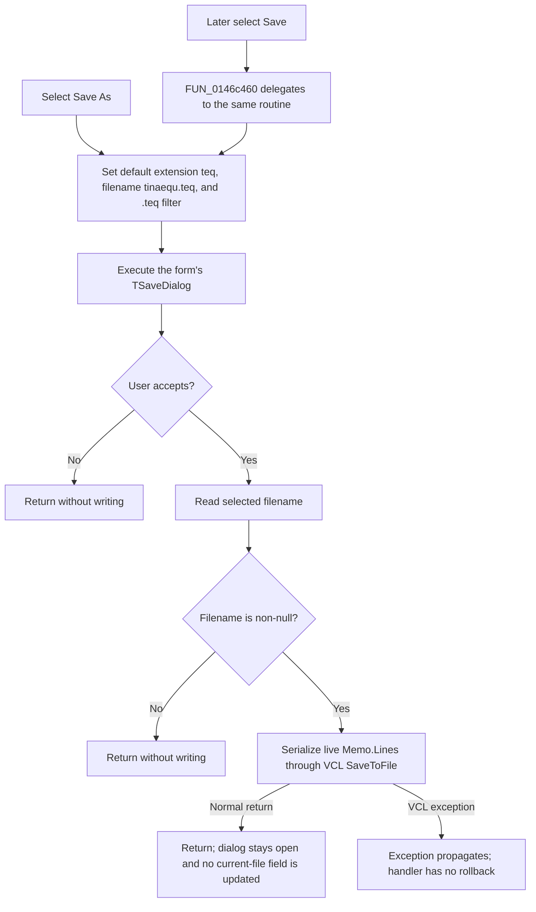

# Save the system-text Memo to a `.teq` file

> Analysis status: Source reviewed and behavior traced.

## Control

| Property | Recovered value |
| --- | --- |
| Form | CSysTextDlg |
| Component path | CSysTextDlg.TTPopupMnu.SaveAsMnu |
| Control class | TMenuItem |
| Parent popup | TTPopupMnu |
| Caption | Save &As... |
| Hint | Not present in the recovered resource. |
| Handler name | SaveAsMnuClick |
| Handler address | 0146c470 |
| Graph node | `resource:dfm:CSysTextDlg/CSysTextDlg.TTPopupMnu.SaveAsMnu` |
| Handler node | `function:0146c470` |
| Graph layer | UI |

## What happens when clicked

`FUN_0146c470` configures the form's `TSaveDialog` at offset `+0x7B0` before
showing it. It sets these values on every invocation:

| Dialog value | Recovered value |
| --- | --- |
| Default extension | `teq` |
| Initial filename | `tinaequ.teq` |
| Filter | `Tina equation (*.teq)|*.teq` |

The recovered data referenced as `DAT_0146c554` is the string `teq` and is
assigned to the dialog field at `+0x100`. `FUN_00724380` assigns
`tinaequ.teq` to the dialog filename field at `+0x108`. The filter is assigned
to the field at `+0xE0`. The handler does not set a dialog title, filter index,
or initial directory.

The handler then executes the Save dialog. If the user cancels, execution
returns immediately without reading a path or writing the Memo. If the user
accepts, `FUN_00724270` reads the selected filename. The handler also checks
that this recovered UnicodeString is non-null. A null filename after an
accepted result is therefore a no-op.

For a non-null filename, the handler obtains the live editor's `Memo.Lines`
collection from the Memo at form offset `+0x6E8`. It calls the collection's
one-argument VCL `SaveToFile` virtual method with the selected filename. This
writes the current line collection, not the dialog's staged system-text object.
Unsynchronized edits that are currently visible in the Memo are therefore the
input to this command.

## Text format and encoding

Only `Memo.Lines` is serialized. The command does not write the system-text
font, wrap option, dialog state, action-link metadata, or another object
header. Action links and other formatting commands remain as their literal
text markup in the saved lines.

The call uses the one-argument `TStrings.SaveToFile` path. The handler does not
pass a `TEncoding`, code page, byte-order mark option, or line-break option.
Encoding, byte-order-mark behavior, and line separators are therefore selected
by the recovered VCL runtime's default overload. The handler source alone does
not prove that the output is UTF-8, UTF-16, or another exact byte encoding.

The `.teq` extension and `Tina equation` filter identify the intended file
type. They do not change the in-memory text before serialization.

## Filename and later Save behavior

The selected filename remains in the `TSaveDialog` object after the dialog
returns, but this handler does not copy it to a form field, the staged
system-text object, or a document model. It also does not update a recovered
dirty or saved flag.

The adjacent `&Save...` menu item is bound to `FUN_0146c460`. That function
directly delegates to `FUN_0146c470`. Thus, **Save** and **Save As...** use the
same dialog path. Each command resets `FileName` to `tinaequ.teq`, applies the
same `.teq` filter, and asks the user for a path. There is no recovered branch
that silently writes to the last selected file.

The handler does not reset the dialog's initial-directory field at `+0xF0`.
The DFM also contains no recovered initial-directory property. The first shown
directory and any directory remembered by the dialog or operating system are
outside this handler's proven state.

## Save flow

## Overwrite, errors, and partial output

- The handler does not test whether the selected file exists. It does not set
  or inspect `TSaveDialog.Options`. The recovered DFM does not list those
  options. Therefore, this evidence does not prove whether the runtime dialog
  shows an overwrite confirmation.
- After the dialog accepts a filename, the handler calls `SaveToFile` directly.
  It has no separate overwrite decision, backup, temporary-file write, or
  rename step.
- The handler does not catch file-open, access, encoding, disk-full, or write
  exceptions. Such an exception propagates from the VCL save path. The handler
  has no recovered success message or error message of its own.
- Because this call path does not prove a temporary-file and atomic-rename
  strategy, it provides no atomic-output guarantee. The exact state of an
  existing destination after a failed write, including whether it is unchanged,
  truncated, or partial, belongs to the deeper VCL implementation and is not
  proven by this handler.
- Cancel and an accepted null filename are the only explicit no-write paths.
  The handler does not close `CSysTextDlg`, set its modal result, or commit its
  staged object after a successful file write.

## Evidence

- [Save As handler `FUN_0146c470`](../../../DecompiledSources/Tina16/functions/000000000146C470__FUN_0146c470.c)
  configures the dialog, tests its Boolean result, reads the accepted filename,
  and calls the Memo line collection's save virtual.
- [Save wrapper `FUN_0146c460`](../../../DecompiledSources/Tina16/functions/000000000146C460__FUN_0146c460.c)
  delegates the adjacent Save command to the same Save As implementation.
- [Dialog filename setter `FUN_00724380`](../../../DecompiledSources/Tina16/functions/0000000000724380__FUN_00724380.c)
  compares and assigns the dialog's Unicode filename field at `+0x108`.
- [Dialog filename getter `FUN_00724270`](../../../DecompiledSources/Tina16/functions/0000000000724270__FUN_00724270.c)
  returns the selected filename from the dialog state or active native dialog.
- [Memo exit `FUN_0146b040`](../../../DecompiledSources/Tina16/functions/000000000146B040__FUN_0146b040.c)
  shows that staging synchronization is a separate operation from this direct
  live-Memo save.
- [Form close `FUN_0146ab60`](../../../DecompiledSources/Tina16/functions/000000000146AB60__FUN_0146ab60.c)
  shows that font, wrapping, and staged-object updates occur at another
  boundary and are not serialized by this command.
- [Open command `FUN_0146c2d0`](../../../DecompiledSources/Tina16/functions/000000000146C2D0__FUN_0146c2d0.c)
  uses the corresponding line-collection load virtual and confirms that `.teq`
  files contain the editor's line text.

## Resource evidence

- `SaveAsMnu` is a `TMenuItem` under `TTPopupMnu` with caption
  `Save &As...`.
- Its sibling `SaveMnu` has caption `&Save...` and is bound to the forwarding
  handler at `0146c460`.
- `CSysTextDlg.SaveDlg` is a `TSaveDialog`. Its recovered DFM entry contains
  only layout coordinates, with no file filter, filename, initial directory,
  title, options, image, or event properties.
- The menu item has no recovered hint, action, image index, embedded glyph,
  checked state, or modal result.

## Analysis limits

- The original Delphi names of the generic dialog filename helpers and Memo
  line collection are not present in the recovered C source. Their roles are
  established by their fields and by the paired Open and Save call paths.
- The exact native Save dialog options are not recovered. An overwrite prompt
  must not be assumed from the `TSaveDialog` class alone.
- The exact VCL default encoding and failed-write behavior are below this
  handler. The source proves that no encoding is passed and no local rollback
  exists; it does not prove the resulting byte encoding or partial-file state.
- The dialog can retain directory state internally, but the handler does not
  establish which directory is shown first.
- Saving the Memo text to `.teq` does not accept or close the outer system-text
  dialog and does not prove that a circuit document was saved.
