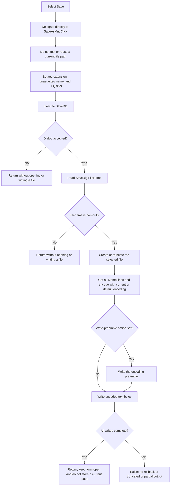

# Save the system-text Memo to a selected `.teq` file

> Analysis status: Source reviewed. Save As delegation, filename guards, live-Memo serialization, encoding, overwrite, partial-output, cancel, and form-state boundaries are documented.

## Control

| Property | Recovered value |
| --- | --- |
| Form | CSysTextDlg |
| Form caption | Text |
| Component path | CSysTextDlg.TTPopupMnu.SaveMnu |
| Parent menu | CSysTextDlg.TTPopupMnu |
| Control class | TMenuItem |
| Caption | &Save... |
| Hint | Not present in the recovered resource. |
| Shortcut | Not present in the recovered resource. |
| Handler name | SaveMnuClick |
| Handler address | 0146c460 |
| Graph node | `resource:dfm:CSysTextDlg/CSysTextDlg.TTPopupMnu.SaveMnu` |
| Handler node | `function:0146c460` |
| Handler graph layer | UI |
| Resource graph layer | tina.exe |

## What happens when clicked

`Save` does not have an in-place-save path. `FUN_0146c460` contains only a
call to `FUN_0146c470`, the handler also bound to `Save As...`, followed by a
return. It does not read a current filename, test whether a prior save path
exists, or choose between Save and Save As.

The shared routine configures the form's `SaveDlg` at offset `0x7B0` on every
call:

| Dialog value | Recovered value |
| --- | --- |
| Default extension | `teq` |
| Suggested filename | `tinaequ.teq` |
| Filter | `Tina equation (*.teq)|*.teq` |

It then executes the dialog. This gives the command two explicit no-write
branches:

- If the user cancels, the handler returns without reading a selected path.
- If the dialog reports acceptance but its `FileName` UnicodeString is null,
  the handler returns without opening a file.

A non-null accepted path is passed to the one-argument `SaveToFile` virtual on
the live `Memo.Lines` collection. The input is the text currently visible in
the Memo. The command does not first copy the Memo to the dialog's staged
system-text object, and it does not serialize the staged font, background,
border, popup-text mode, wrap option, geometry, or other object fields.

## No current-path branch

The form has no recovered current-document path for this command. The selected
path can remain in the `TSaveDialog.FileName` property after a dialog result,
but the shared handler overwrites that property with `tinaequ.teq` before the
next Save or Save As dialog. It does not copy the accepted path to another form
field or to the staged system-text object.

Therefore, a successful Save does not change later Save behavior. The next
Save again asks for a path. There is no recovered direct-write branch for a
last selected file, and cancel does not fall back to a prior path.

The routine does not set `InitialDir`. The DFM also has no initial-directory
property for `SaveDlg`. The dialog or operating system can retain directory
state below this handler, but that state is not a current-document path and is
not used as an application save guard.

## Text serialization and encoding

The virtual call from `FUN_0146c470` reaches the recovered one-argument
`TStrings.SaveToFile` path:

1. `FUN_004b4900` passes the line collection's current encoding object to the
   encoding-aware overload.
2. `FUN_004b4920` creates a file stream with mode `0xFF00`, the recovered
   create/truncate path, and then saves the collection to that stream.
3. `FUN_004b49c0` gets the complete line-collection text, converts that
   UnicodeString to one byte buffer, and falls back to the collection's
   default encoding object if the supplied current encoding is null.
4. If the collection's recovered write-preamble option is set, the routine
   gets the selected encoding's preamble and writes it first. It then writes
   the encoded text buffer.
5. `FUN_004b8aa0` repeats stream writes until the requested byte count is
   complete. A negative write or a later zero-byte write raises an exception.

This handler does not select UTF-8, UTF-16, an ANSI code page, a byte-order
mark, or a line separator. The output follows `Memo.Lines` current/default
encoding and write-preamble state. A prior `Open...` can update the collection's
current encoding through its BOM-detection path; Save then uses that current
encoding. If no current encoding is available, the deeper writer uses the
stored default. The recovered command therefore does not support a claim that
all `.teq` output uses one fixed encoding.

An empty Memo is not rejected. It still reaches the create/truncate path. The
result can be an empty file or only an encoding preamble, depending on the
line collection's recovered preamble option.

## Validation and overwrite

The application handler validates only the dialog result and the non-null
selected filename. It does not validate Memo content, filename characters,
extension, target existence, write access, or free space. Native dialog and
file-system checks remain below this source boundary.

The handler does not test whether the selected file already exists, and it
does not call an application overwrite-confirmation routine. `SaveDlg.Options`
is not present in the recovered DFM, so this evidence does not establish
whether the native dialog presents its own overwrite prompt. Once the dialog
returns an accepted path, the file-stream mode creates a new destination or
truncates an existing one. There is no backup, temporary file, or atomic rename.

## Errors and partial output

- The wrapper, shared handler, and recovered text-save path have no local
  exception handler, error message, success message, or rollback.
- A file-open failure raises before serialization. A successful create of an
  existing target truncates it before the line collection gets and encodes its
  text. A later text or encoding failure can therefore leave an already
  truncated file.
- The complete text is converted to a byte buffer before the preamble and
  payload writes start. A write failure can occur after the preamble or after
  part of the payload has reached the stream. The write helper then raises,
  but no code restores the old file or deletes the partial output.
- The handler does not update a current path, dirty flag, or staged model
  after a normal write. An exception also has no form-local recovery state to
  repair.
- Cancel and an accepted null path do not create, truncate, or write a file.
  They leave Memo text and staged system-text data unchanged. The dialog
  defaults were configured before cancellation and are not restored by this
  handler.

The command does not close `CSysTextDlg`, set its modal result, or accept its
staged object. File output and outer-dialog acceptance are separate boundaries.

## Click flow

## Handler evidence

- Source: [Save wrapper `FUN_0146c460`](../../../DecompiledSources/Tina16/functions/000000000146C460__FUN_0146c460.c)
- Recovered role: Route the CSysTextDlg Save menu command through the Save As
  dialog path.
- Current graph summary: Handles 1 Delphi UI event:
  `CSysTextDlg.TTPopupMnu.SaveMnu.OnClick`.
- Behavior: Calls the shared Save As handler without a current-path check or
  direct-write branch.
- Evidence: The function has one direct call to `FUN_0146c470` and then
  returns. The callee resets `SaveDlg.FileName` before every dialog execution.
- Complexity: simple
- Distinct outgoing calls: 1

## Direct and shared calls

- [Shared Save As handler `FUN_0146c470`](../../../DecompiledSources/Tina16/functions/000000000146C470__FUN_0146c470.c)
  configures and executes `SaveDlg`, checks its selected path, and calls the
  live Memo line collection's save virtual.
- [Dialog filename setter `FUN_00724380`](../../../DecompiledSources/Tina16/functions/0000000000724380__FUN_00724380.c)
  assigns `SaveDlg.FileName` at dialog offset `0x108`.
- [Dialog filename getter `FUN_00724270`](../../../DecompiledSources/Tina16/functions/0000000000724270__FUN_00724270.c)
  returns the selected filename.
- [One-argument SaveToFile `FUN_004b4900`](../../../DecompiledSources/Tina16/functions/00000000004B4900__FUN_004b4900.c)
  forwards the line collection's current encoding.
- [File-stream SaveToFile `FUN_004b4920`](../../../DecompiledSources/Tina16/functions/00000000004B4920__FUN_004b4920.c)
  creates or truncates the target and invokes the stream serializer.
- [Text stream serializer `FUN_004b49c0`](../../../DecompiledSources/Tina16/functions/00000000004B49C0__FUN_004b49c0.c)
  encodes the full line text, optionally writes the encoding preamble, and
  writes the encoded buffer.
- [Complete-write helper `FUN_004b8aa0`](../../../DecompiledSources/Tina16/functions/00000000004B8AA0__FUN_004b8aa0.c)
  continues short writes and raises when the stream cannot make progress.
- [Open command `FUN_0146c2d0`](../../../DecompiledSources/Tina16/functions/000000000146C2D0__FUN_0146c2d0.c)
  is the paired line-collection load path and supplies current-encoding context.

The graph records the direct `0146c460 -> 0146c470` call. The generic
`Memo.Lines.SaveToFile` dispatch is virtual, so its concrete VCL targets are
runtime evidence rather than direct call edges from the application handler.

## Resource evidence

- `SaveMnu` is a `TMenuItem` under `TTPopupMnu` with caption `&Save...`. The
  ampersand defines the menu accelerator; the ellipsis is consistent with the
  proven path-selection dialog.
- Its sibling `SaveAsMnu` has caption `Save &As...` and is bound to the shared
  handler at `0146c470`.
- `CSysTextDlg.SaveDlg` is a `TSaveDialog`. Its recovered DFM entry contains
  only layout coordinates. File defaults are assigned in code.
- Enabled, visible, checked, action, shortcut, hint, image reference, embedded
  glyph, and modal result properties are not present for this menu item.

## Nearby label candidates

Nearby labels are layout candidates only. They are not proof of behavior.

- No same-parent label candidate is available. Handler delegation and the
  `TSaveDialog` resource establish the command meaning.

## Analysis limits

- The exact native Save dialog options are not recovered. An overwrite prompt
  must not be assumed from the control class alone.
- The exact encoding, preamble, and line separator depend on live
  `Memo.Lines` runtime state. The handler does not set them.
- The ignored dashboard JSON export was absent during review. Read-only queries
  against the canonical DuckDB verified the Save and Save As event bindings,
  their graph layers, and the direct `0146c460 -> 0146c470` call edge.
- The coordinated Save As fragment owns the shared handler descriptions. The
  companion annotation fragment repeats its `FUN_0146c460` description exactly
  because the annotation loader requires a non-empty function list; it omits
  `FUN_0146c470`.
