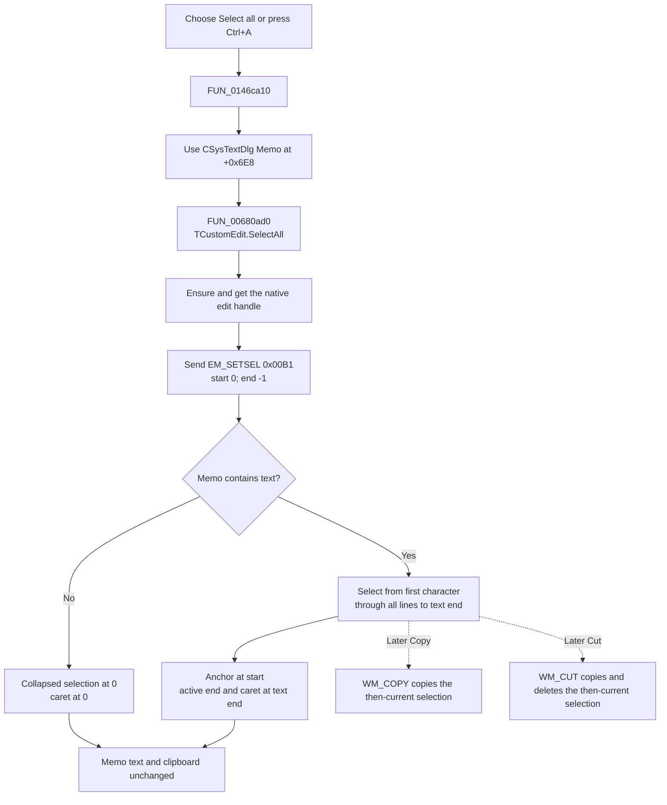

# Select all

> Analysis status: Complete. The recovered handler, VCL edit helper, native message values, Memo resource, and paired clipboard commands establish the selection behavior.

## Control

| Property | Recovered value |
| --- | --- |
| Form | CSysTextDlg |
| Form caption | Text |
| Component path | CSysTextDlg.TTPopupMnu.Selectall1 |
| Parent menu | TTPopupMnu |
| Control class | TMenuItem |
| Caption | Select all |
| Shortcut | Ctrl+A (`16449`) |
| Hint | Not present in the recovered resource. |
| Handler name | Selectall1Click |
| Handler address | 0146ca10 |
| Target control | CSysTextDlg.MainNB.TPage.Memo (`TMemo`, form field `+0x6E8`) |
| Graph node | `resource:dfm:CSysTextDlg/CSysTextDlg.TTPopupMnu.Selectall1` |
| Handler node | `function:0146ca10` |
| Graph layer | UI |

## What happens when selected

`FUN_0146ca10` passes the form's `Memo` control at `+0x6E8` to `FUN_00680ad0`. This helper is the recovered VCL `TCustomEdit.SelectAll` method. It ensures that the control has a native window handle, gets that handle, and synchronously sends `EM_SETSEL` (`0x00B1`) with start `0` and end `-1`.

The Windows edit-control contract defines `0, -1` as **select all text**. Start `0` is the anchor. End `-1` tells the native control to use the end of its current text as the active endpoint. The caret is at that active end. This replaces any earlier selection; it does not extend the old selection.

## Selection bounds and content cases

| Memo content | Result |
| --- | --- |
| Empty | There are no characters to select. The resulting range is collapsed at position `0`, which is also the caret position. This is a valid empty selection, not an error. |
| One line | The selection starts at the first character and ends after the final selectable character. The anchor is at the start and the active end and caret are at the end. |
| Multiple lines | One native selection spans all memo content from the start of the first line through the end of the final line. The handler does not calculate line offsets, split lines, or normalize line endings. A later Copy or Cut therefore operates on the complete selected multiline text, including its control-managed line separators. |

The handler does not send `EM_SCROLLCARET` and does not set keyboard focus. The source therefore proves the selection and caret endpoints, but it does not prove a viewport scroll or visible selection highlight after the popup closes. Standard edit controls can hide selection highlighting while they do not have focus.

## State and clipboard effects

- `Select all` changes only the native Memo selection and caret state.
- It does not change the Memo text, the dialog's staging text object, a modified flag, a modal result, or any saved file.
- It does not read or write the Windows clipboard. There is no `WM_COPY`, `WM_CUT`, or clipboard API call in this path.
- A repeated selection sends the same native message again. There is no application-side unchanged-state branch. The final selection, anchor, and caret remain the same.
- The native `EM_SETSEL` message has no return value. The helper and handler do not inspect a result, show an error, retry, or provide a fallback. Native-handle creation or message-dispatch exceptions have no local recovery in this click handler.

## Relationship to Copy and Cut

The neighboring commands use the selection that exists when they run:

- `CopyMnuClick` sends `WM_COPY` through `FUN_006809e0`. It copies the current selection without deleting it.
- `CutMnuClick` sends `WM_CUT` through `FUN_00680a10`. It copies and deletes the current selection by native edit-control rules.
- `TDCopyBtnClick`, whose button hint is **Copy to Clipboard**, explicitly calls `FUN_00680ad0` and then `FUN_006809e0`. That button selects the whole Memo and copies it in one command.

Thus, `Select all` prepares the complete selection but does not itself copy or cut anything. If the user changes the selection before a later Copy or Cut command, that later command uses the changed selection.

## Selection flow

## Handler and platform evidence

- [Selectall1Click source](../../../DecompiledSources/Tina16/functions/000000000146CA10__FUN_0146ca10.c) makes one call with form field `+0x6E8`.
- [TCustomEdit.SelectAll source](../../../DecompiledSources/Tina16/functions/0000000000680AD0__FUN_00680ad0.c) gets the native handle and dispatches message `0x00B1` with `wParam = 0` and `lParam = -1`.
- [Native-handle getter](../../../DecompiledSources/Tina16/functions/000000000065B870__FUN_0065b870.c) ensures the control handle and returns field `+0x468`.
- [Whole-Memo copy button source](../../../DecompiledSources/Tina16/functions/000000000146C5F0__FUN_0146c5f0.c) calls SelectAll and then CopyToClipboard in that order.
- [Copy menu handler and helper](../../../DecompiledSources/Tina16/functions/000000000146C6B0__FUN_0146c6b0.c), [FUN_006809e0](../../../DecompiledSources/Tina16/functions/00000000006809E0__FUN_006809e0.c).
- [Cut menu handler and helper](../../../DecompiledSources/Tina16/functions/000000000146C690__FUN_0146c690.c), [FUN_00680a10](../../../DecompiledSources/Tina16/functions/0000000000680A10__FUN_00680a10.c).
- [Microsoft EM_SETSEL documentation](https://learn.microsoft.com/en-us/windows/win32/controls/em-setsel) defines the selection bounds, anchor, active end, caret, and `0, -1` select-all case.
- [Microsoft edit-control text operations](https://learn.microsoft.com/en-us/windows/win32/controls/edit-controls-text-operations) documents selection and the separate Copy and Cut messages for single-line and multiline controls.
- [Embarcadero TCustomEdit.SelectAll documentation](https://docwiki.embarcadero.com/Libraries/Athens/en/Vcl.StdCtrls.TCustomEdit.SelectAll) identifies the VCL method and its select-all responsibility.
- The live read-only graph confirms the resource-to-handler `triggers` edge, the handler-to-`FUN_00680ad0` call, and the helper-to-`FUN_0065b870` call.
- Current graph summary: Handles `CSysTextDlg.TTPopupMnu.Selectall1.OnClick`.
- Complexity: simple; one distinct outgoing call.

## Direct calls

- `function:00680ad0` — Recovered `Vcl.StdCtrls.TCustomEdit.SelectAll`; selects the full native edit-control text with `EM_SETSEL(0, -1)`.

## Resource evidence

- `Selectall1` is a `TMenuItem` below `TTPopupMnu`, with caption `Select all` and shortcut Ctrl+A.
- Its recovered event is `OnClick = Selectall1Click` at `0146ca10`.
- The target is the form's client-aligned multiline `TMemo` named `Memo`.
- The item has no recovered hint, action, image reference, or glyph.

## Analysis limits

- The message path proves native selection state. The handler does not read the selection back, so the article does not claim a specific numeric end index for a particular Memo string.
- The handler makes no explicit focus or scroll call. Selection visibility and the final viewport position remain native-control behavior.
