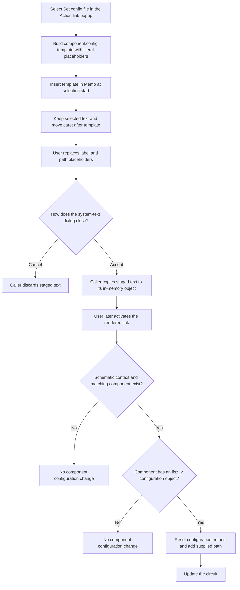

# Insert a component configuration-file action link

> Analysis status: Source reviewed and behavior traced.

## Control

| Property | Recovered value |
| --- | --- |
| Form | CSysTextDlg |
| Component path | CSysTextDlg.DeepLinkPopUpMnu.SetConfigFileMnu |
| Control class | TMenuItem |
| Popup context | Action link > Set config file |
| Caption | Set config file |
| Hint | Not present in the recovered resource. |
| Handler name | SetConfigFileMnuClick |
| Handler address | 01469e60 |
| Graph node | `resource:dfm:CSysTextDlg/CSysTextDlg.DeepLinkPopUpMnu.SetConfigFileMnu` |
| Handler node | `function:01469e60` |
| Graph layer | UI |

## What happens when clicked

`FUN_01469e60` reads the `SetConfigFileMnu` caption from the form field at
`+0x8C0`. It removes each Delphi accelerator marker (`&`) from the caption.
The recovered caption has no accelerator marker, so the visible label remains
**Set config file**.

The handler then builds this exact text:

```text
\a(Set config file,tdl://component.config:<label>:<cnf file path>)
```

`<label>` and `<cnf file path>` are literal placeholders. The menu click does
not ask the user to select a component or a file. It does not open the form's
Open or Save dialog. The user must replace both placeholders with a component
label and a configuration-file path before the link can identify useful input.

The handler passes the complete template to `FUN_014695a0`. This common
insertion routine reads the editor Memo's selection start, which is its caret
position. It walks `Memo.Lines` and counts each line length plus two characters
for the CRLF separator until it finds the line that contains the caret. It then
inserts the template at the corresponding one-based position and writes the
changed line back.

The routine sets the selection start to the old position plus the template
length. The caret is therefore after the inserted closing `)`. It does not read
the selection length and does not delete selected text. If text is selected,
the template is inserted at the selection start and the selected text remains.

## Later link interpretation

The menu click changes text only. The component configuration changes only
after a user activates the rendered link in a schematic context.

The rendered-link path extracts the link target in `FUN_01a5e850`. It sends a
target that contains `tdl://` to `FUN_01a62740`, the internal TDL dispatcher.
For the target created here, the dispatcher:

1. removes the `tdl://` prefix and recognizes the `component.config` command;
2. splits the command data into a component label and a configuration-file
   path at the colon separator;
3. calls `FUN_019ac5b0` to find a schematic component whose recovered label is
   an exact match for the supplied label;
4. calls `FUN_0160d750` to obtain that component's `ifsz_v` configuration
   object;
5. calls `FUN_017738b0` with the supplied path; and
6. calls `FUN_0199e310` to update the circuit after the configuration change.

`FUN_017738b0` resets the configuration object's prior entries, sets internal
flag `0x1000`, adds the supplied path, and restores its `flags` entry. This is
a direct path-based update. It does not show a file picker. The following
circuit update makes the changed component configuration effective in the
current schematic state.

## Click and activation flow



## State, persistence, and no-op paths

- The immediate state change is limited to the Memo line and its caret. The
  handler does not change the current component configuration, navigate to a
  file, close the form, or write a file.
- `MemoExit` (`FUN_0146b040`) copies the current Memo lines into the dialog's
  staged system-text object. `FormClose` (`FUN_0146ab60`) also copies the Memo
  lines and related text state into staging.
- The recovered existing-object caller `FUN_0149e8d0` copies the staged object
  back only when `ShowModal` returns 1. The new-object path in
  `FUN_01a7a4a0` rejects modal result 2 and also requires non-empty Memo lines.
  Thus, Cancel discards this insertion at the caller boundary; an accepted
  result commits it to the caller-owned in-memory object.
- The explicit system-text save command `FUN_0146c470` is separate. It opens a
  `Tina equation (*.teq)|*.teq` file dialog and writes Memo lines only after an
  accepted, non-empty file name. Neither dialog acceptance nor later link
  activation proves that a circuit document was saved to disk.
- The insertion handler has no conditional no-op, validation, cancellation,
  or error branch. Its template is non-empty, so it always calls the insertion
  helper in a valid form state.
- On later activation, a missing schematic context does nothing. A component
  label that is not found also does nothing. If the component has no matching
  configuration object, the dispatcher does not apply the path and does not
  request the circuit update.
- The dispatcher does not test a status result from the file-backed
  configuration update. File access and parse failures are owned by the deeper
  configuration path. The recovered menu handler does not prove a specific
  error message or recovery action.

## Evidence

- [Set config file handler `FUN_01469e60`](../../../DecompiledSources/Tina16/functions/0000000001469E60__FUN_01469e60.c)
  reads the menu caption, removes accelerator markers, constructs the fixed
  `component.config` template, and calls the Memo insertion helper.
- [String-replacement wrapper `FUN_005b84f0`](../../../DecompiledSources/Tina16/functions/00000000005B84F0__FUN_005b84f0.c)
  forwards the caption cleanup to the recovered Unicode string-replacement
  implementation.
- [Unicode string replacement `FUN_00450070`](../../../DecompiledSources/Tina16/functions/0000000000450070__FUN_00450070.c)
  proves that the handler's empty replacement removes the recovered `&` search
  token.
- [Memo insertion helper `FUN_014695a0`](../../../DecompiledSources/Tina16/functions/00000000014695A0__FUN_014695a0.c)
  maps the selection start to one line, inserts the template, writes the line
  back, and advances the selection start.
- [Rendered-link router `FUN_01a5e850`](../../../DecompiledSources/Tina16/functions/0000000001A5E850__FUN_01a5e850.c)
  sends internal `tdl://` targets to the application dispatcher.
- [TDL dispatcher `FUN_01a62740`](../../../DecompiledSources/Tina16/functions/0000000001A62740__FUN_01a62740.c)
  parses the `component.config` label and path, resolves the component and its
  configuration object, applies the path, and requests the circuit update.
- [Component lookup `FUN_019ac5b0`](../../../DecompiledSources/Tina16/functions/00000000019AC5B0__FUN_019ac5b0.c)
  walks the schematic components and returns the one with an exact non-empty
  label match.
- [Configuration-object lookup `FUN_0160d750`](../../../DecompiledSources/Tina16/functions/000000000160D750__FUN_0160d750.c)
  obtains the component's `ifsz_v` object when the component supports it.
- [File-backed configuration update `FUN_017738b0`](../../../DecompiledSources/Tina16/functions/00000000017738B0__FUN_017738b0.c)
  resets the configuration entries and installs the supplied path.
- [Circuit update `FUN_0199e310`](../../../DecompiledSources/Tina16/functions/000000000199E310__FUN_0199e310.c)
  updates circuit state and notifies active circuit views.
- [Memo exit `FUN_0146b040`](../../../DecompiledSources/Tina16/functions/000000000146B040__FUN_0146b040.c)
  copies Memo lines into the staged object.
- [Form close `FUN_0146ab60`](../../../DecompiledSources/Tina16/functions/000000000146AB60__FUN_0146ab60.c)
  synchronizes Memo and related text state into staging.
- [Existing-object caller `FUN_0149e8d0`](../../../DecompiledSources/Tina16/functions/000000000149E8D0__FUN_0149e8d0.c)
  copies staging back only for modal result 1.
- [New-object caller `FUN_01a7a4a0`](../../../DecompiledSources/Tina16/functions/0000000001A7A4A0__FUN_01a7a4a0.c)
  rejects result 2, requires non-empty Memo lines, and copies staging only on
  its accepted path.
- [Explicit `.teq` save path `FUN_0146c470`](../../../DecompiledSources/Tina16/functions/000000000146C470__FUN_0146c470.c)
  proves that file selection and disk persistence are separate commands.

## Resource evidence

- `SetConfigFileMnu` is a `TMenuItem` under `DeepLinkPopUpMnu` and has the
  recovered caption **Set config file**.
- `DeepLinkPopUpMnu` is opened by the `DeepLinkBtn` speed button. Its hint is
  **Action link**. The button's image supports the action-link context, but it
  does not establish the configuration semantics by itself.
- The menu item has no recovered hint, text, action, image index, embedded
  glyph, modal result, or checked state.
- The target editor is the client-aligned `TMemo` on the form's edit page.

## Analysis limits

- The recovered C source does not contain the original Delphi names for the
  insertion, routing, component-lookup, or configuration helpers.
- The displayed link label comes from the current menu caption. Runtime
  localization can change it, but the `tdl://component.config:` target and its
  two placeholders are fixed in the handler.
- The insertion helper assumes that the Memo selection start maps to a valid
  line. It has no local repair or exception handler.
- The file-backed configuration helper has no returned status that this
  dispatcher checks. This article therefore does not claim a specific result
  for a missing, unreadable, or invalid configuration file.
- A later document-save command, not this click or activation path, owns durable
  persistence of the edited system text and schematic configuration.
