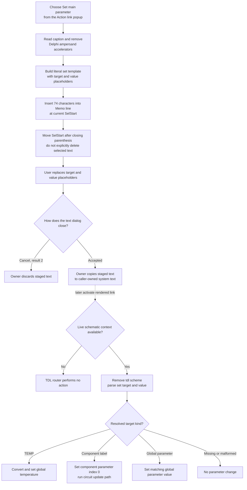

# Insert a main-parameter action-link template

> Analysis status: Source, resource, editor insertion, later TDL interpretation, and persistence boundaries reviewed.

## Control

| Property | Recovered value |
| --- | --- |
| Form | CSysTextDlg |
| Form caption | Text |
| Component path | CSysTextDlg.DeepLinkPopUpMnu.SetParameterMnu |
| Control class | TMenuItem |
| Caption | Set main parameter |
| Parent popup | DeepLinkPopUpMnu |
| Popup launcher | DeepLinkBtn, hint **Action link** |
| Handler name | SetParameterMnuClick |
| Handler address | 0146a010 |
| Graph node | `resource:dfm:CSysTextDlg/CSysTextDlg.DeepLinkPopUpMnu.SetParameterMnu` |
| Handler node | `function:0146a010` |
| Graph layer | UI |

## What happens when selected

`FUN_0146a010` reads the `SetParameterMnu` caption from the menu-item object at
form field `+0x8D0`. It removes Delphi menu accelerator markers (`&`) from
that caption. The recovered caption contains no ampersand, so the displayed
link label remains **Set main parameter**.

The handler joins the decoded prefix `\a(`, the cleaned caption, and the fixed
suffix `,tdl://set:{component_label|TEMP|global_par}:{value})`. The exact
74-character text inserted for the recovered resource is
`\a(Set main parameter,tdl://set:{component_label|TEMP|global_par}:{value})`.

The text between braces is not filled automatically. The complete strings
`{component_label|TEMP|global_par}` and `{value}` are inserted as literal
authoring placeholders. The first placeholder lists three supported target
kinds:

- a schematic component label, which selects that component's main parameter;
- `TEMP`, which selects the global temperature value; or
- a global-parameter name.

The second placeholder is the value to assign. The user must edit both
placeholders before the link can name the intended target and value. This menu
command does not inspect the current component, ask for a value, or open a
parameter dialog.

## Memo insertion and caret movement

The completed template goes to `FUN_014695a0`. That shared helper reads the
Memo's absolute `SelStart`, walks `Memo.Lines`, and counts each line length plus
two characters for its CR/LF separator. It uses this calculation to find the
line and the one-based position within that line.

The helper inserts the complete template at that position, writes the changed
line back, and sets `SelStart` to the old position plus the inserted text
length. With the recovered caption, the new selection start is 74 characters
after the old one and is immediately after the closing `)`.

The helper does not read `SelLength` and does not explicitly delete selected
text. A non-empty selection is therefore not an explicit replacement range.
The recovered source does not prove whether the Memo preserves or clears its
old selection length after the line and `SelStart` setters run.

## Later interpretation of the set target

The menu click changes editor text only. The set command runs only when a user
later activates the accepted and rendered action link in a live schematic.

`FUN_01a5e850` extracts the activated link target. A target with the `tdl://`
scheme goes to `FUN_01a62740` instead of the external shell-open path. The TDL
router requires a non-null schematic context. It removes the scheme, splits
semicolon-separated commands, recognizes `set:`, and splits its fields at
colon separators.

The generated target has two fields after `set:`: target and value. The router
handles them as follows:

1. If the target is exactly `TEMP`, it converts the value to a number and
   writes the recovered global temperature field.
2. Otherwise, it calls `FUN_019ac5b0` to find a schematic component with the
   supplied label. When found, the two-field form requests parameter index
   `0`, the component's main parameter, and assigns the value through the
   recovered type-aware setter `FUN_01d3a010`. The router then calls the
   recovered circuit geometry and update path.
3. If no component has that label, the router searches the schematic global-
   parameter collection for the supplied target name. It writes the value only
   when that name exists.

There is no parameter-selection or value-entry dialog in this later route.
The edited link text supplies both inputs directly.

## Click, commit, and activation flow

## Persistence, Cancel, and error boundaries

- The immediate state change is limited to one Memo line and `SelStart`. The
  insertion handler does not modify a component, global parameter, circuit
  file, or system-text file. It does not set a modal result or close the form.
- `MemoExit` (`FUN_0146b040`) copies current Memo lines into the dialog's
  private staged system-text object. `FormClose` (`FUN_0146ab60`) also copies
  the Memo lines and related text state into staging.
- The inspected existing-object owner `FUN_0149e8d0` copies that staged object
  back only when `ShowModal` returns `1`. The form's `bkCancel` button returns
  result `2`, so this owner destroys the dialog without copy-back. The staged
  edit can therefore be synchronized inside the dialog and still be discarded
  by Cancel.
- The recovered new-object owner `FUN_01a7a4a0` also rejects result `2` and
  requires non-empty Memo lines before it accepts the staged object.
- The separate **Save As** command `FUN_0146c470` opens the form's save dialog
  and writes Memo lines only after the user accepts a non-empty file name. This
  parameter-template click does not call that path. Dialog acceptance alone
  does not prove that a document was saved to disk.
- The insertion handler has no validation, confirmation, cancel, or intentional
  no-op branch. It always attempts to insert its non-empty fixed template.
- The handler and insertion helper have no local exception handler or rollback.
  A string-allocation, line-list, or Memo exception propagates through the
  Delphi runtime. The source does not prove a user-facing error message here.
- Later activation with no schematic context does nothing. Fewer than two
  `set:` fields also do nothing. If the target matches neither a component
  label nor a global-parameter name, no value is changed.
- If the literal placeholders are not replaced, the router treats them as
  literal target and value text. The insertion handler does not validate them.
- The later numeric conversion and type-aware assignment do not return a status
  that the router checks in this branch. This article does not claim a specific
  message or recovery action for an invalid value.

## Evidence

- [Set main parameter handler `FUN_0146a010`](../../../DecompiledSources/Tina16/functions/000000000146A010__FUN_0146a010.c) reads form field `+0x8D0`, removes ampersands from its caption, constructs the fixed `tdl://set` template, and calls the Memo insertion helper.
- [Unicode replacement wrapper `FUN_005b84f0`](../../../DecompiledSources/Tina16/functions/00000000005B84F0__FUN_005b84f0.c) forwards the caption cleanup to the recovered string-replacement implementation.
- [Unicode string replacement `FUN_00450070`](../../../DecompiledSources/Tina16/functions/0000000000450070__FUN_00450070.c) establishes the empty-replacement behavior used to remove accelerator markers.
- [Memo insertion helper `FUN_014695a0`](../../../DecompiledSources/Tina16/functions/00000000014695A0__FUN_014695a0.c) maps `SelStart` to a line, inserts the complete token, writes the line, and advances `SelStart`.
- [Delphi string insertion helper `FUN_00416ea0`](../../../DecompiledSources/Tina16/functions/0000000000416EA0__FUN_00416ea0.c) inserts text at the supplied one-based string position without deleting a selected range.
- [Action-link popup opener `FUN_0146bfe0`](../../../DecompiledSources/Tina16/functions/000000000146BFE0__FUN_0146bfe0.c) opens `DeepLinkPopUpMnu` next to the speed button whose hint is **Action link**.
- [Rendered-link dispatcher `FUN_01a5e850`](../../../DecompiledSources/Tina16/functions/0000000001A5E850__FUN_01a5e850.c) extracts activated targets and routes `tdl://` targets to the internal command router.
- [TDL command router `FUN_01a62740`](../../../DecompiledSources/Tina16/functions/0000000001A62740__FUN_01a62740.c) parses `set:` fields and handles `TEMP`, component labels, and global-parameter names.
- [Component lookup `FUN_019ac5b0`](../../../DecompiledSources/Tina16/functions/00000000019AC5B0__FUN_019ac5b0.c) finds a schematic component by its non-empty exact label.
- [Type-aware parameter assignment `FUN_01d3a010`](../../../DecompiledSources/Tina16/functions/0000000001D3A010__FUN_01d3a010.c) applies a converted value to the recovered parameter storage type.
- [Memo exit synchronization `FUN_0146b040`](../../../DecompiledSources/Tina16/functions/000000000146B040__FUN_0146b040.c) copies Memo lines into the dialog-local staged object.
- [Form close synchronization `FUN_0146ab60`](../../../DecompiledSources/Tina16/functions/000000000146AB60__FUN_0146ab60.c) copies Memo lines and related text state into staging.
- [Existing-object owner `FUN_0149e8d0`](../../../DecompiledSources/Tina16/functions/000000000149E8D0__FUN_0149e8d0.c) copies staging back only for modal result `1`.
- [New-object owner `FUN_01a7a4a0`](../../../DecompiledSources/Tina16/functions/0000000001A7A4A0__FUN_01a7a4a0.c) rejects result `2` and requires non-empty Memo text before it accepts staging.
- [Explicit `.teq` save path `FUN_0146c470`](../../../DecompiledSources/Tina16/functions/000000000146C470__FUN_0146c470.c) proves that file selection and disk persistence are separate commands.
- [Recovered form evidence](../../../DecompiledSources/Tina16/resources/dfm/ui-evidence.json) supplies the menu hierarchy, captions, control classes, and event binding.

## Direct calls

- `FUN_005b84f0` removes `&` accelerator markers from the runtime menu caption.
- `FUN_00416cd0` concatenates the decoded prefix, cleaned caption, and fixed target suffix.
- `FUN_014695a0` inserts the completed template and advances the Memo selection start.
- `FUN_00414b50`, `FUN_00414480`, and `FUN_00414560` manage temporary Delphi UnicodeString values.

## Resource evidence

- `SetParameterMnu` is a `TMenuItem` under `DeepLinkPopUpMnu` with caption
  **Set main parameter**.
- `DeepLinkBtn` is a `TSpeedButton` with hint **Action link** and opens the
  popup menu. This establishes the authoring context but does not by itself
  prove the inserted target or its parameter behavior.
- The menu item has no recovered hint, text, action, image index, embedded
  glyph, modal result, checked state, or same-parent label candidate.
- The target editor is the client-aligned `TMemo` on the form's edit page.

## Analysis limits

- The original Delphi names of the insertion and routing helpers are absent.
  Their roles are established by the editor accessors, string operations,
  exact command comparisons, and call-site data flow.
- Runtime localization can change the displayed caption and token length. The
  `tdl://set:{component_label|TEMP|global_par}:{value}` suffix is fixed in the
  handler.
- The source does not establish the Memo's internal `SelLength` result after a
  line write followed by `SetSelStart`. It proves only that this path does not
  read or explicitly delete the selection.
- The knowledge-graph JSON export was absent during review. Graph node, edge,
  layer, and resource checks used the canonical DuckDB database in read-only
  mode without changing it.
