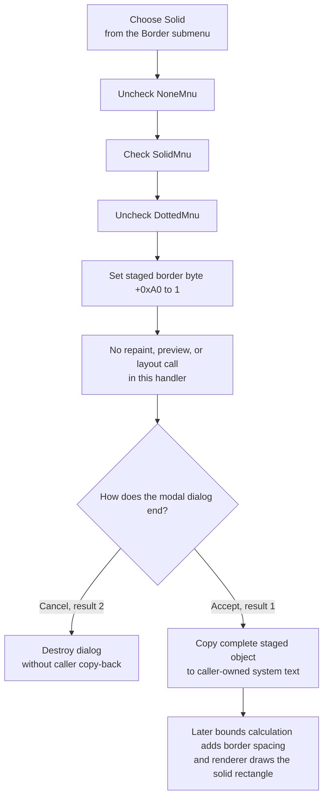

# Select a solid border for system text

> Analysis status: Complete. This command selects border value `1` on the
> dialog's staged system-text object. It does not save the object or request an
> immediate repaint.

## Control

| Property | Recovered value |
| --- | --- |
| Form | CSysTextDlg |
| Form caption | Text |
| Component path | CSysTextDlg.TTPopupMnu.Border1.SolidMnu |
| Control class | TMenuItem |
| Caption | Solid |
| Parent menu | Border (`B&order`) |
| Handler name | SolidMnuClick |
| Handler address | 0146be00 |
| Graph node | `resource:dfm:CSysTextDlg/CSysTextDlg.TTPopupMnu.Border1.SolidMnu` |
| Handler node | `function:0146be00` |
| Graph layer | UI |

## What happens when selected

`FUN_0146be00` performs four unconditional state updates:

1. Clear the checked state of `NoneMnu`, at form field `+0x770`.
2. Set the checked state of `SolidMnu`, at form field `+0x778`.
3. Clear the checked state of `DottedMnu`, at form field `+0x780`.
4. Write byte value `1` to offset `+0xA0` of the dialog's staged system-text
   object, which the form stores at `+0x8E0`.

The event handler does not inspect the event sender. The DFM binds this
function only to `SolidMnu.OnClick`, and the explicit menu-field accesses make
the command specific to the Solid item.

## Exact border value and sibling exclusivity

The three sibling handlers establish the recovered value mapping without
relying on their captions alone:

| Menu command | Checked item | Staged byte `+0xA0` |
| --- | --- | --- |
| None | `NoneMnu` | `0` |
| Solid | `SolidMnu` | `1` |
| Dotted | `DottedMnu` | `2` |

`FormCreate` and the dialog's object-loading routine use the same mapping to
restore exactly one checked item from the stored byte. The Solid handler also
sets all three check states explicitly. It therefore repairs an inconsistent
menu state instead of depending only on automatic radio-menu behavior.

## Preview, repaint, and layout

The click handler does not call the form's paint handler, invalidate a control,
resize the form, or recalculate layout. Its only callee is the recovered VCL
menu checked-state setter. Therefore, the recovered click path does not prove
an immediate border preview.

The form has a `DrawRectangle` paint-box handler. That handler synchronizes the
memo text and draws the staged object's inner formatted-text data, but it is
not called by `SolidMnuClick` and does not read the outer border byte at
`+0xA0`.

The normal system-text renderer does use this byte. `FUN_01a5daf0` takes its
value-`1` branch, configures the border pen with style code `0`, and draws the
object rectangle. Its value-`2` branch uses style code `2`, which separates the
recovered Solid and Dotted render paths. The width calculator
`FUN_01a5ee60` also adds an extra font-derived horizontal spacing term when
the border byte is nonzero. Thus later rendering and bounds calculation observe
the Solid selection, although this menu click does not trigger those operations
itself.

## Staged and committed state

The dialog owns a private staged system-text object at form field `+0x8E0`.
Before the modal dialog opens, `FUN_0146a9a0` copies the caller-owned object
into that staging object and initializes the menu checks from its border byte.
`SolidMnuClick` changes only the staged copy.

Closing the form synchronizes memo lines and font into the same staged object;
it does not overwrite the selected border byte. In the inspected existing-
object owner `FUN_0149e8d0`, modal result `1` copies the complete staging object
back to the caller-owned object. The adjacent `bkCancel` button returns result
`2`; that path destroys the dialog without the copy-back. Cancel therefore
discards the Solid selection for this owner.

The system-text serializer later writes the border field as part of the object
record. This click does not serialize the object, write `TINA.INI`, modify a
circuit, or close the dialog. Acceptance is the in-memory commit boundary;
normal owner persistence is a later operation.

## Selection and commit flow

## No-op and error behavior

- The handler has no validation, confirmation, or conditional rejection path.
- Selecting Solid when value `1` and the menu checks are already correct is
  idempotent. The VCL checked-state setter skips work for unchanged items, and
  the handler writes value `1` again.
- If the prior byte is outside the recovered `0` to `2` range, the click still
  replaces it with `1` and establishes the explicit Solid menu state.
- Cancel is not an error. It leaves the caller-owned object unchanged in the
  inspected modal owner.
- There is no local exception handler, status result, or rollback. The
  recovered source does not establish how a VCL menu-update exception would be
  presented. An exception before the final byte write can leave only some menu
  checks changed.
- No paint or serialization result can fail in this handler because neither
  operation is called here.

## Evidence

- [Solid handler `FUN_0146be00`](../../../DecompiledSources/Tina16/functions/000000000146BE00__FUN_0146be00.c) clears None, selects Solid, clears Dotted, and writes border value `1` to the staged object.
- [None handler `FUN_0146bdb0`](../../../DecompiledSources/Tina16/functions/000000000146BDB0__FUN_0146bdb0.c) selects only None and writes border value `0`.
- [Dotted handler `FUN_0146c1f0`](../../../DecompiledSources/Tina16/functions/000000000146C1F0__FUN_0146c1f0.c) selects only Dotted and writes border value `2`.
- [Menu checked-state setter `FUN_007e2d20`](../../../DecompiledSources/Tina16/functions/00000000007E2D20__FUN_007e2d20.c) updates a menu item's checked byte only when its value changes and forwards the new state to the native menu when applicable.
- [Form initialization `FUN_0146a2a0`](../../../DecompiledSources/Tina16/functions/000000000146A2A0__FUN_0146a2a0.c) creates the staged object and maps its border values `0`, `1`, and `2` to the three sibling check states.
- [Dialog object loader `FUN_0146a9a0`](../../../DecompiledSources/Tina16/functions/000000000146A9A0__FUN_0146a9a0.c) copies an input object into staging and applies the same border-to-menu mapping.
- [Paint-box handler `FUN_0146af40`](../../../DecompiledSources/Tina16/functions/000000000146AF40__FUN_0146af40.c) synchronizes memo text, sizes the paint box, and draws the staged inner formatted-text data; the Solid click does not call it.
- [System-text renderer `FUN_01a5daf0`](../../../DecompiledSources/Tina16/functions/0000000001A5DAF0__FUN_01a5daf0.c) draws the border rectangle through distinct value-`1` and value-`2` pen-style branches.
- [System-text width calculator `FUN_01a5ee60`](../../../DecompiledSources/Tina16/functions/0000000001A5EE60__FUN_01a5ee60.c) adds horizontal spacing when the border field is nonzero.
- [Form close synchronization `FUN_0146ab60`](../../../DecompiledSources/Tina16/functions/000000000146AB60__FUN_0146ab60.c) copies memo lines and font into staging without changing its border field.
- [Existing-object modal owner `FUN_0149e8d0`](../../../DecompiledSources/Tina16/functions/000000000149E8D0__FUN_0149e8d0.c) copies the full staged object back only for modal result `1`.
- [System-text copy routine `FUN_01a5eb60`](../../../DecompiledSources/Tina16/functions/0000000001A5EB60__FUN_01a5eb60.c) includes the border byte at `+0xA0` in object-to-object copies.
- [System-text serializer `FUN_01a61fe0`](../../../DecompiledSources/Tina16/functions/0000000001A61FE0__FUN_01a61fe0.c) writes the border field after background mode and background color in the object record.

## Direct calls

- `function:007e2d20` - applies the requested checked state to each of the three
  sibling menu items. Its canonical shared annotation is owned by the sibling
  Border-menu analysis.

## Resource evidence

- `SolidMnu` is a `TMenuItem` with caption **Solid** under the `B&order`
  submenu of `TTPopupMnu`.
- Its siblings are the **None** and **Dotted** menu items used by the two
  comparison handlers.
- The item has no recovered hint, text, glyph, image, shortcut, checked
  property, or nearby label candidate. The exact value and rendering role come
  from handler, initialization, copy, layout, and renderer evidence.

## Analysis limits

- Original Delphi field names are absent. This article refers to the recovered
  form and object offsets and uses the DFM component names only where resolved.
- The paint handler proves the available text-preview path, not an immediate
  border refresh after this click.
- The inspected owner proves the modal-result-`1` copy-back rule for an existing
  system-text object. Other owners can add their own acceptance checks.
- The graph JSON export was absent during review. Graph and resource checks used
  the canonical DuckDB database in read-only mode without changing it.
