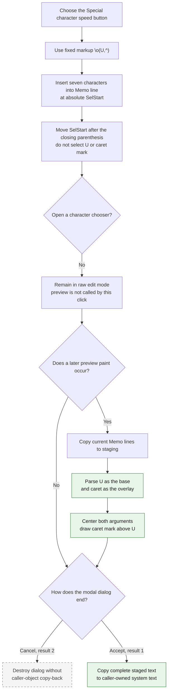

# Insert a special overlaid character template

> Analysis status: Complete. This button inserts the exact seven-character
> markup `\o(U,^)` into the text memo. It does not open a character chooser or
> insert one Unicode character.

## Control

| Property | Recovered value |
| --- | --- |
| Form | CSysTextDlg |
| Form caption | Text |
| Component path | CSysTextDlg.ToolsPanel.ToolsNB.Edit.SpecBtn |
| Control class | TSpeedButton |
| Caption | Not present |
| Hint | Special character |
| Handler name | SpecBtnClick |
| Handler address | 014697f0 |
| Graph node | `resource:dfm:CSysTextDlg/CSysTextDlg.ToolsPanel.ToolsNB.Edit.SpecBtn` |
| Handler node | `function:014697f0` |
| Graph layer | UI |

## What happens when selected

`FUN_014697f0` passes one fixed Unicode string to the common CSysTextDlg memo
insertion helper:

`\o(U,^)`

The `\o` command is a two-part formatted-text overlay. Its first argument is
`U`, and its second argument is `^`. The renderer centers both arguments in one
horizontal slot and places the caret mark above the U. This creates a composed
U with a circumflex-like mark in the rendered preview.

The click inserts the seven markup characters. It does not insert the Unicode
character `Û`. It also does not open a character map, popup menu, or modal
dialog. The user gets the fixed `U` and `^` arguments. A different base or mark
requires a later text edit.

The independent Equation Editor Special character button uses the identical
literal and an equivalent insertion helper. Its extracted glyph has the same
SHA-256 value as this button's glyph. This repeated path confirms that the
literal is TINA formatted-text markup and that the glyph shows its intended
rendered example.

## Memo insertion, selection, and caret

`FUN_014695a0` reads the memo's zero-based absolute `SelStart`. It walks
`Memo.Lines`, adding each preceding line length plus two characters for CR/LF,
until it finds the line that contains the insertion position. It converts that
position to the one-based index required by the Delphi string insertion
helper, inserts `\o(U,^)` into the line, and writes the line back.

The helper then sets `SelStart` to its old value plus the inserted length.
Because the token has seven characters, the new selection start is seven
positions after the old selection start. It is after the closing parenthesis.
The click does not select `U`, `^`, or the complete token for editing.

The insertion helper does not read `SelLength`, selected text, or a replacement
range. It does not explicitly delete a current selection. If text is selected,
the insertion index is its `SelStart`; the selected characters are not removed
by this recovered path. The source does not establish whether the memo keeps or
clears the old nonzero selection length after the line write and `SetSelStart`.

## Preview interpretation

The button does not call the preview paint handler or invalidate the preview.
When the `DrawRectangle` paint box is painted later, `FUN_0146af40` first
copies the current memo lines into the dialog's staged formatted-text object.
It measures the object, resizes the paint box with a ten-pixel allowance, and
calls the formatted-text renderer.

The recovered renderer recognizes command character `o` after a backslash.
`FUN_01d12460` splits the parenthesized token at its top-level comma and returns
`U` and `^` as two independent arguments. It tracks nested parentheses, so each
argument can also contain other formatted-text commands.

For `\o`, `FUN_01d166e0` measures both arguments and uses the larger width for
the composite. It centers each argument independently. It draws the first
argument at the normal text position and offsets the second argument upward,
over the first. The matching 21 by 21 glyph shows the resulting U with a caret
mark above it.

Preview is event-driven. A later View transition calls the paint path, but the
SpecBtn click returns no preview, measurement, or drawing result.

## Staged and committed state

The immediate change is to `Memo.Lines` and `SelStart`. The handler does not
directly modify the caller-owned system-text object.

The current memo lines enter the dialog's private staged object through these
recovered paths:

- `DrawRectangle.OnPaint`, before it measures and renders the preview;
- `Memo.OnExit`, when focus leaves the memo;
- `CSysTextDlg.OnClose`, which also copies the memo font and applies optional
  line wrapping.

In the inspected existing-object owner `FUN_0149e8d0`, modal result `1` copies
the complete staged object back to the caller-owned object. The adjacent
`bkCancel` button returns result `2`; that path destroys the dialog without the
copy-back. Thus Cancel discards this insertion for that owner even if preview
or close synchronization already put it in the private staged object.

The SpecBtn handler does not set a modal result, close the dialog, write a file,
or modify a circuit. Dialog acceptance is the recovered in-memory commit
boundary. Serialization, if required by an owner, occurs later.

## Insertion and preview flow

## No-op and error behavior

- The handler has no validation, confirmation, chooser, or intentional no-op
  branch. It always attempts to insert the fixed template.
- An empty selection is a normal insertion at the caret. A nonempty selection
  is not an explicit replacement because neither the handler nor the insertion
  helper reads `SelLength`.
- Repeated clicks insert another `\o(U,^)` token at the current selection start.
  There is no duplicate check.
- The fixed token contains the opening parenthesis, top-level comma, and closing
  parenthesis required by the recovered two-argument parser. Errors caused by
  later manual edits to malformed markup are outside this click path.
- The handler and insertion helper have no local exception handler, status
  result, or rollback. A string-allocation, line-list, or memo-operation
  exception propagates through the Delphi runtime and can leave the edit
  incomplete.
- No preview error occurs during this handler because it does not invoke the
  renderer. Later paint and layout routines own their failures.
- Cancel is not an error. It prevents caller-object copy-back in the inspected
  modal owner.

## Evidence

- [Special character handler `FUN_014697f0`](../../../DecompiledSources/Tina16/functions/00000000014697F0__FUN_014697f0.c) passes the exact literal `\o(U,^)` to the common memo insertion helper.
- [Memo insertion helper `FUN_014695a0`](../../../DecompiledSources/Tina16/functions/00000000014695A0__FUN_014695a0.c) maps absolute `SelStart` to a memo line, inserts the supplied text without reading `SelLength`, writes the line, and advances `SelStart` by the inserted length.
- [Delphi string insertion helper `FUN_00416ea0`](../../../DecompiledSources/Tina16/functions/0000000000416EA0__FUN_00416ea0.c) inserts source text at a one-based string index while it preserves the destination prefix and suffix.
- [Equation Editor special-character handler `FUN_014644e0`](../../../DecompiledSources/Tina16/functions/00000000014644E0__FUN_014644e0.c) uses the same `\o(U,^)` markup in an independent editor.
- [Paint-box handler `FUN_0146af40`](../../../DecompiledSources/Tina16/functions/000000000146AF40__FUN_0146af40.c) copies current memo lines into staging, updates preview dimensions, and invokes formatted-text drawing.
- [Two-argument format parser `FUN_01d12460`](../../../DecompiledSources/Tina16/functions/0000000001D12460__FUN_01d12460.c) finds a top-level comma while it tracks nested parentheses and returns the two argument strings.
- [Formatted-text renderer `FUN_01d166e0`](../../../DecompiledSources/Tina16/functions/0000000001D166E0__FUN_01d166e0.c) recognizes `\o`, centers its two arguments in one horizontal slot, and draws the second argument above the first.
- [Memo exit synchronization `FUN_0146b040`](../../../DecompiledSources/Tina16/functions/000000000146B040__FUN_0146b040.c) copies current memo lines into the private staged object.
- [Form close synchronization `FUN_0146ab60`](../../../DecompiledSources/Tina16/functions/000000000146AB60__FUN_0146ab60.c) copies memo lines and font into staging and performs optional line wrapping.
- [Existing-object modal owner `FUN_0149e8d0`](../../../DecompiledSources/Tina16/functions/000000000149E8D0__FUN_0149e8d0.c) copies the staged object back only for modal result `1`.
- [Extracted Special character glyph](../../../glyph/0046_CSysTextDlg_CSysTextDlg_ToolsPanel_ToolsNB_Edit_SpecBtn_Glyph_Data.png) shows a U with a caret mark above it.

## Direct calls

- `function:014695a0` - inserts the fixed overlay markup into the memo and
  advances the selection start. Its canonical shared annotation is owned by
  `TIARA-diz.6.7.131` and is not duplicated in this control fragment.

## Resource and glyph evidence

- `SpecBtn` is a 25 by 25 `TSpeedButton` with the hint **Special character** and
  no caption.
- Its embedded Delphi BMP was extracted as a 21 by 21 PNG. It shows a U with a
  centered caret mark above it.
- The independent Equation Editor **Special character** button uses the same
  handler literal. Its glyph has the same SHA-256 value,
  `f38ba8fe961100026a9ab1564e2e4937e765a4e9f1fc25a2cd16885d8754cfb0`.
- The exact token and its rendering come from handler and renderer code. The
  hint and glyph are supporting evidence only.

## Analysis limits

- The recovered source does not give an original Delphi name for the shared
  insertion helper. Its memo and selection behavior is established by the
  recovered line collection and `SelStart` accessors.
- The source does not establish the memo's internal `SelLength` behavior after
  a line replacement followed by `SetSelStart`. This article states only that
  no selected-text deletion or `SelLength` call is present.
- The renderer composes the U and caret as two arguments. This article does not
  identify the result as one Unicode code point.
- The parser and renderer support nested and other formatting commands. This
  article documents only the path required by the fixed `\o(U,^)` template.
- The inspected owner proves one accepted copy-back rule. Other dialog owners
  can add their own acceptance checks.
