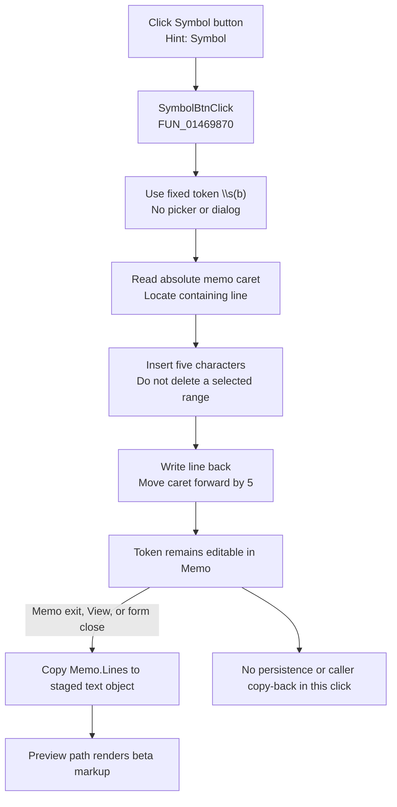

# Symbol

> Analysis status: Complete from recovered source, Delphi form evidence, and the extracted glyph.

## Control

| Property | Recovered value |
| --- | --- |
| Form | CSysTextDlg |
| Component path | CSysTextDlg.ToolsPanel.ToolsNB.Edit.SymbolBtn |
| Control class | TSpeedButton |
| Caption | Not present in the recovered resource. |
| Hint | Symbol |
| Text | Not present in the recovered resource. |
| Handler name | SymbolBtnClick |
| Handler address | 01469870 |
| Graph node | `resource:dfm:CSysTextDlg/CSysTextDlg.ToolsPanel.ToolsNB.Edit.SymbolBtn` |
| Handler node | `function:01469870` |
| Graph layer | UI |

## What happens when clicked

The button inserts the fixed five-character markup token `\s(b)` at the current position in the system-text memo. It does not open a symbol menu, popup, or selection dialog. The handler has no input other than its form instance, and it does not inspect the event sender.

The shared insertion helper reads the memo's absolute caret position. It walks `Memo.Lines` and counts two characters for each line break to find the containing line. It inserts `\s(b)` into that line, writes the changed line back, and moves the caret from its old absolute position to the old position plus five. The helper does not read a selection length or delete selected text. Therefore, this command inserts the token at the current position; it does not replace a selected range.

The token is an editable template, not an immediately selected Unicode character. The extracted 21 by 21 glyph shows `b-β`, which agrees with the fixed `b` argument and identifies this command as the beta symbol template. Other recovered application text uses the same `\s(...)` form for Greek-symbol markup, including `\s(w)` and `\s(f)`.

The click changes only the memo. The current memo lines are copied into the dialog's staged system-text object when the memo loses focus, when the View command refreshes the preview, or when the form closes. The preview paint path then measures and renders the staged text. A recovered modal caller copies the staged object back to its caller-owned object only when the dialog result is 1 (`mrOK`). This click does not save a file or cross that commit boundary.

There is no cancel or dismissal path because the click opens no transient UI. There is also no local validation, no no-op branch, no local error message, and no rollback. A failure in the memo or Unicode-string operations can propagate through the Delphi runtime after a partial state change, but the recovered handler has no explicit recovery path.

## Click flow

## Handler evidence

- Handler source: [FUN_01469870](../../../DecompiledSources/Tina16/functions/0000000001469870__FUN_01469870.c) contains one call, `FUN_014695a0(param_1, L"\\s(b)")`, and then returns.
- Insertion helper: [FUN_014695a0](../../../DecompiledSources/Tina16/functions/00000000014695A0__FUN_014695a0.c) reads the memo caret, maps it to one line, calls the Unicode insertion routine, replaces that line, and advances the caret by the inserted string length.
- Unicode insertion: [FUN_00416ea0](../../../DecompiledSources/Tina16/functions/0000000000416EA0__FUN_00416ea0.c) clamps the one-based insertion position, grows the string, shifts the suffix, and copies the supplied characters into the gap.
- Preview synchronization: [FUN_0146af40](../../../DecompiledSources/Tina16/functions/000000000146AF40__FUN_0146af40.c) copies `Memo.Lines` to the staged object, measures the text, resizes the preview surface, and renders it.
- Other synchronization boundaries: [FUN_0146b040](../../../DecompiledSources/Tina16/functions/000000000146B040__FUN_0146b040.c) copies memo lines on memo exit, and [FUN_0146ab60](../../../DecompiledSources/Tina16/functions/000000000146AB60__FUN_0146ab60.c) copies editor values on form close.
- Commit boundary: [FUN_0149e8d0](../../../DecompiledSources/Tina16/functions/000000000149E8D0__FUN_0149e8d0.c) executes the modal form and calls the staged-object copy routine only when the modal result equals 1.
- Complexity: simple.
- Distinct outgoing calls: 1.

## Resource and glyph evidence

- The recovered Delphi form binds `SymbolBtn.OnClick` to `SymbolBtnClick` at `01469870`.
- The control is a `TSpeedButton` with the hint `Symbol`. The resource has no caption, menu property, dialog property, modal result, or checked state for this control.
- Extracted glyph: [`0048_CSysTextDlg_CSysTextDlg_ToolsPanel_ToolsNB_Edit_SymbolBtn_Glyph_Data.png`](../../../glyph/0048_CSysTextDlg_CSysTextDlg_ToolsPanel_ToolsNB_Edit_SymbolBtn_Glyph_Data.png).
- The source resource is a 21 by 21 BMP stored in `Glyph.Data`; extraction preserved it as PNG. The image shows `b-β`, so it supports the beta interpretation established by the handler's fixed `\s(b)` token.

## Analysis limits

- The recovered names of the memo virtual methods are not available. Their call order and data flow establish caret reading, line replacement, and caret setting.
- The click path proves insertion of symbol markup. The exact font/parser table that maps `b` to beta is not named in the recovered source; the glyph and repeated `\s(...)` application markup supply the mapping evidence.
- Low-level allocation or memo failures are possible, but no explicit exception handling or rollback is present in this handler.
