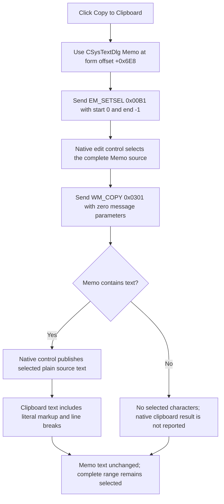

# Copy all system-text source to the clipboard

> Analysis status: Complete. This button selects the complete CSysTextDlg Memo and asks its native Windows edit control to copy that plain source text to the clipboard. It copies literal TINA markup and line breaks, not the rendered preview, bitmap data, or a metafile.

## Control

| Property | Recovered value |
| --- | --- |
| Form | CSysTextDlg |
| Form caption | Text |
| Component path | CSysTextDlg.ToolsPanel.ToolsNB.View.TDCopyBtn |
| Control class | TSpeedButton |
| Caption | Not present in the recovered resource. |
| Hint | Copy to Clipboard |
| Handler name | TDCopyBtnClick |
| Handler address | 0146c5f0 |
| Graph node | `resource:dfm:CSysTextDlg/CSysTextDlg.ToolsPanel.ToolsNB.View.TDCopyBtn` |
| Handler node | `function:0146c5f0` |
| Graph layer | UI |

## What happens when clicked

`FUN_0146c5f0` passes the control at form offset `+0x6E8` to two shared Delphi
edit-control helpers. Other CSysTextDlg functions and the DFM identify this
control as `MainNB.TPage.Memo`, a multiline `TMemo`.

The calls occur in this order:

1. `FUN_00680ad0` gets or creates the Memo's native window handle and sends
   message `0x00B1`, `EM_SETSEL`, with start `0` and end `-1`. The standard edit
   control interprets this range as Select all.
2. `FUN_006809e0` gets the same native handle and sends message `0x0301`,
   `WM_COPY`, with zero for both message parameters. The native edit control
   copies its current selection without deleting it.

The handler does not restore the selection that existed before the click.
After the normal path, all Memo text remains selected. Memo content itself is
unchanged.

## Exact copied representation

The source is the text held by the Memo, not the painted preview. CSysTextDlg
loads the system-text line collection into this Memo, and its preview paint
path later copies those lines into the staged rendering object. This button
acts on the Memo before any rendering call.

Therefore, a successful native copy contains the complete plain-text editor
representation:

- all Memo lines and their edit-control line breaks;
- ordinary visible characters; and
- literal TINA formatting and action-link markup such as `\a(...)` when those
  sequences are present in the Memo.

The copy does not contain rendered fonts, colors, opaque background, border,
layout geometry, hyperlink objects, raster pixels, bitmap headers, metafile
records, HTML, or rich-text formatting. The handler has no call to the preview
canvas, bitmap or metafile creation, or a TINA object serializer.

## Selection scope and current edits

The command always replaces the current Memo selection with a Select-all
range before copying. It is different from the popup **Copy** command, which
sends only `WM_COPY` and therefore uses the selection that already exists.

The copied text is the Memo's current editor state. It can include edits that
have not been accepted by the outer Text dialog. A later outer Cancel prevents
those edits from being copied back to the caller-owned system-text object, but
it does not retract data that this button already placed on the clipboard.

## Clipboard ownership and formats

The recovered application code does not call `OpenClipboard`,
`EmptyClipboard`, `SetClipboardData`, or a TINA clipboard manager. It delegates
the operation to the native edit control through `WM_COPY`. The native control
therefore controls the clipboard-open sequence, data allocation, ownership,
and published text formats.

The message proves a standard plain-text copy request. It does not prove which
text format is primary. The public `WM_COPY` contract describes `CF_TEXT`,
while compatible Unicode edit controls publish `CF_UNICODETEXT`. Because the
recovered handler does not select or inspect a format, this article does not
choose between them. Windows can also synthesize compatible text formats for a
later consumer. No code in this path publishes image or metafile formats.

## State changes and persistence

| State | Result |
| --- | --- |
| Memo text | Unchanged. |
| Memo selection | Replaced with the complete text range and left selected. |
| Clipboard | The native edit control receives a request to replace it with the selected plain text. Success is not reported to the handler. |
| Staged system-text object | Unchanged by this handler. |
| Caller-owned system-text object | Unchanged. |
| Dialog result and files | Unchanged; the handler does not close, accept, save, or persist the dialog. |

The clipboard write is an immediate external side effect. It is independent
of the outer CSysTextDlg staging and commit boundary.

## Click flow

## Empty content, no-op, and errors

- The handler has no selection-length or Memo-length check. For an empty Memo,
  it still sends both messages. There are no selected characters to copy, and
  the recovered code cannot establish whether the previous clipboard content
  is retained or cleared by the native control.
- For non-empty text, the Select-all step changes selection state even if the
  clipboard operation later fails. The handler does not restore the prior
  selection.
- The wrappers do not inspect a message result, and the handler provides no
  success notification. It cannot distinguish a successful copy, empty text,
  clipboard contention, or an allocation failure.
- The handler has no retry, fallback format, error dialog, exception handler,
  or rollback. An exception while creating the native handle or dispatching a
  message propagates through the Delphi runtime.
- Read-only editor state would not prevent the standard copy request because
  this path does not modify Memo text. The recovered resource does not mark the
  Memo as a password edit or apply a password-specific branch.

## Evidence

- [Toolbar handler `FUN_0146c5f0`](../../../DecompiledSources/Tina16/functions/000000000146C5F0__FUN_0146c5f0.c) calls the select-all helper and then the copy helper on the same form field.
- [Select-all helper `FUN_00680ad0`](../../../DecompiledSources/Tina16/functions/0000000000680AD0__FUN_00680ad0.c) sends message `0x00B1` with selection endpoints `0` and `-1`.
- [Copy helper `FUN_006809e0`](../../../DecompiledSources/Tina16/functions/00000000006809E0__FUN_006809e0.c) sends message `0x0301` with zero message parameters.
- [Native-handle getter `FUN_0065b870`](../../../DecompiledSources/Tina16/functions/000000000065B870__FUN_0065b870.c) ensures the control handle and returns it from control field `+0x468`.
- [Dialog load `FUN_0146a9a0`](../../../DecompiledSources/Tina16/functions/000000000146A9A0__FUN_0146a9a0.c) loads the source system-text lines into the Memo at form field `+0x6E8`.
- [Preview paint `FUN_0146af40`](../../../DecompiledSources/Tina16/functions/000000000146AF40__FUN_0146af40.c) later copies Memo lines to staging, measures, and renders them. This separate path confirms that the copy button acts on source text rather than rendered output.
- [Popup Copy handler `FUN_0146c6b0`](../../../DecompiledSources/Tina16/functions/000000000146C6B0__FUN_0146c6b0.c) calls only the shared `WM_COPY` helper, which proves the toolbar button's preceding Select-all call is intentional.

## Direct calls

- `function:00680ad0` - selects all native edit-control text through `EM_SETSEL`.
- `function:006809e0` - copies the resulting selection through `WM_COPY`.
- Native handle acquisition and message dispatch occur inside these shared VCL wrappers.

## Glyph and resource evidence

- `TDCopyBtn` is a `TSpeedButton` in the View tool page. It has no caption but
  has the hint **Copy to Clipboard**.
- Its recovered `Glyph.Data` is a 21 by 21 BMP resource converted to
  [`0043_CSysTextDlg_CSysTextDlg_ToolsPanel_ToolsNB_View_TDCopyBtn_Glyph_Data.png`](../../../glyph/0043_CSysTextDlg_CSysTextDlg_ToolsPanel_ToolsNB_View_TDCopyBtn_Glyph_Data.png).
  The glyph shows two overlapping document pages, a conventional copy symbol.
- The glyph and hint confirm copy intent. They do not establish Select all,
  plain text, clipboard formats, or the absence of rendered graphics. The two
  native messages establish those details.
- No same-parent label candidate provides additional evidence.

## Analysis limits

- The recovered C wrappers omit their original Delphi parameter declarations,
  but all call sites pass a Delphi edit control and the wrappers obtain that
  control's native handle.
- Clipboard format publication occurs inside the Windows edit control. The
  application source does not expose the primary text format or any synthesized
  formats later requested by consumers.
- The source has no clipboard readback or error result. It proves the request,
  selection scope, and source representation, not successful receipt by an
  external application.
