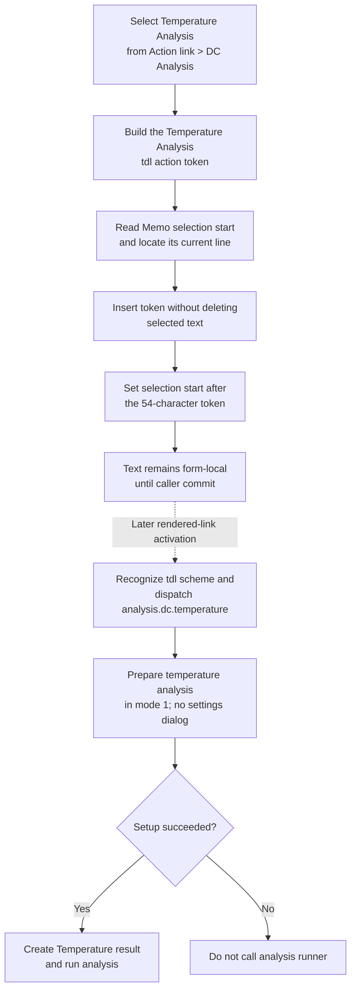

# Insert a Temperature Analysis action link

> Analysis status: Complete. This menu item inserts a `Temperature Analysis` action-link token at the current Memo selection start. It does not run the analysis during insertion.

## Control

| Property | Recovered value |
| --- | --- |
| Form | CSysTextDlg |
| Form caption | Text |
| Component path | CSysTextDlg.DeepLinkPopUpMnu.DCAnalysisMnu.TemperatureAnalysisMnu |
| Control class | TMenuItem |
| Menu context | Action link popup > DC Analysis |
| Caption | Temperature Analysis |
| Hint | Not present in the recovered resource. |
| Handler name | TemperatureAnalysisMnuClick |
| Handler address | 014698f0 |
| Graph node | `resource:dfm:CSysTextDlg/CSysTextDlg.DeepLinkPopUpMnu.DCAnalysisMnu.TemperatureAnalysisMnu` |
| Handler node | `function:014698f0` |
| Graph layer | UI |

## What happens when clicked

`FUN_014698f0` reads this menu item's caption and removes any Delphi menu
accelerator marker, `&`. It then builds this exact token from the recovered
caption: `\a(Temperature Analysis,tdl://analysis.dc.temperature)`.

The handler passes the token to `FUN_014695a0`. That helper reads the Memo's
absolute selection-start index, finds the line that contains that index, and
inserts the token at the corresponding position in that line. It writes only
the changed line back to `Memo.Lines`. For the recovered caption, the token is
54 UTF-16 characters long, so the helper sets the selection-start index to its
old value plus 54 after the insertion.

The helper does not read the selection length and does not delete selected
text. Therefore, a non-empty selection is not a replace target: insertion
starts at its recovered selection-start index. The source proves the new
selection-start value, but it does not expose whether the VCL setter preserves
or collapses the remaining selection length.

## Later action-link behavior

The menu click only edits the Memo. It does not navigate or start an analysis.
When the saved text is later rendered as an action link and the user activates
it, `FUN_01a5e850` recognizes the `tdl://` scheme and routes it to the internal
dispatcher `FUN_01a62740` instead of sending it to the operating-system URL
opener.

The dispatcher removes the scheme, recognizes `analysis.dc.temperature`, and
calls `FUN_01328250` with mode `1`. In the recovered setup function, mode `0`
opens the normal configuration dialog, while mode `1` skips that dialog. If
the setup call returns zero, the dispatcher calls `FUN_013d45f0`, which creates
a result named `Temperature` and runs the temperature analysis. A nonzero
setup result stops this activation path before the analysis call.

## Click and activation flow

## Persistence boundary

This click changes the Memo only. It does not write a file or copy text to the
caller-owned text object.

- `MemoExit` copies the current Memo lines to the dialog's private staging
  object.
- `FormClose` copies the Memo lines again, regardless of the modal result.
- The inspected existing-object caller copies that staging object to its own
  text object only when `ShowModal` returns the accepted result, `1`.
- On Cancel, `FormClose` can update the staging object, but the caller destroys
  the dialog without copying it back. The inserted token is therefore not
  committed to that caller-owned object.

The effective commit boundary is the caller's accepted-result copy, not this
menu handler and not the close-time staging update.

## Boundaries and errors

- The handler has no branch and always builds a non-empty token from a constant
  prefix and suffix. Its insertion helper has a no-op path for an empty token,
  but this handler cannot take that path.
- The insertion routine clamps the within-line insertion position to the
  recovered line boundaries. If the current line is empty, the Unicode helper
  can insert the token at position zero and make it the full line content.
- Neither the handler nor the insertion helper catches an exception or rolls
  back a partially completed edit. Allocation or Memo line-access failures
  propagate through the Delphi runtime.
- The menu click has no analysis-preflight failure path because it does not run
  the analysis. The nonzero setup result is a later action-link activation
  outcome.

## Evidence

- [Temperature menu handler `FUN_014698f0`](../../../DecompiledSources/Tina16/functions/00000000014698F0__FUN_014698f0.c) removes `&` from the menu caption, concatenates the `\a(` prefix and temperature-analysis URI suffix, and calls the shared Memo insertion helper.
- [Memo insertion helper `FUN_014695a0`](../../../DecompiledSources/Tina16/functions/00000000014695A0__FUN_014695a0.c) maps the absolute selection start to a line, writes the modified line, and advances the selection-start index by the inserted string length.
- [Unicode insertion helper `FUN_00416ea0`](../../../DecompiledSources/Tina16/functions/0000000000416EA0__FUN_00416ea0.c) inserts a non-empty UnicodeString at a clamped one-based position without deleting existing characters.
- [Action-link button handler `FUN_0146bfe0`](../../../DecompiledSources/Tina16/functions/000000000146BFE0__FUN_0146bfe0.c) positions the form's deep-link popup below the **Action link** speed button.
- [Link activation helper `FUN_01a5e850`](../../../DecompiledSources/Tina16/functions/0000000001A5E850__FUN_01a5e850.c) sends `tdl://` targets to the internal dispatcher and uses the operating-system opener only for other URL forms.
- [Internal deep-link dispatcher `FUN_01a62740`](../../../DecompiledSources/Tina16/functions/0000000001A62740__FUN_01a62740.c) recognizes `analysis.dc.temperature`, gates execution on `FUN_01328250`, and then calls `FUN_013d45f0`.
- [Temperature setup `FUN_01328250`](../../../DecompiledSources/Tina16/functions/0000000001328250__FUN_01328250.c) opens its extra settings dialog only in mode `0`; the deep-link dispatcher supplies mode `1`.
- [Temperature analysis runner `FUN_013d45f0`](../../../DecompiledSources/Tina16/functions/00000000013D45F0__FUN_013d45f0.c) creates a `Temperature` result and executes the analysis.
- [Memo exit handler `FUN_0146b040`](../../../DecompiledSources/Tina16/functions/000000000146B040__FUN_0146b040.c) copies Memo lines to the dialog-local staging object.
- [Form close handler `FUN_0146ab60`](../../../DecompiledSources/Tina16/functions/000000000146AB60__FUN_0146ab60.c) refreshes the staged lines and font at close time.
- [Existing-object caller `FUN_0149e8d0`](../../../DecompiledSources/Tina16/functions/000000000149E8D0__FUN_0149e8d0.c) copies the staged object back only after modal result `1`.

## Resource and image evidence

- The item is under **DC Analysis** in `DeepLinkPopUpMnu`. The popup also
  contains other analysis and state-changing `tdl://` actions.
- The popup is opened by a speed button with the hint **Action link**. Its
  [extracted runner glyph](../../../glyph/0050_CSysTextDlg_CSysTextDlg_ToolsPanel_ToolsNB_Edit_DeepLinkBtn_Glyph_Data.png)
  supports the general action-link context.
- This `TMenuItem` has no hint, glyph, image-list reference, or nearby label.
  The glyph does not identify temperature analysis; the menu caption, emitted
  token, and later dispatcher branch provide that identification.

## Analysis limits

- Original Delphi field names are not present in the recovered C. The DFM
  binding and consistent form offsets establish the menu item and Memo fields.
- The recovered source proves insertion at the selection-start index, but it
  does not expose the VCL setter's final selection-length behavior.
- The later activation trace establishes the internal temperature-analysis
  route. It does not prove which rendered document or view the user will open
  before activating the saved link.
