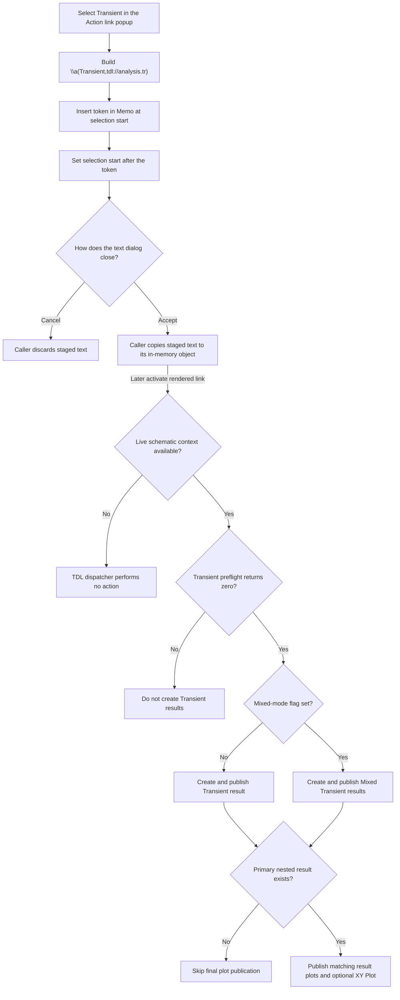

# Insert a Transient analysis action link

> Analysis status: Source reviewed and behavior traced.

## Control

| Property | Recovered value |
| --- | --- |
| Form | CSysTextDlg |
| Component path | CSysTextDlg.DeepLinkPopUpMnu.TransientMnu |
| Control class | TMenuItem |
| Popup context | Action link > Transient |
| Caption | Transient |
| Hint | Not present in the recovered resource. |
| Handler name | TransientMnuClick |
| Handler address | 0146b840 |
| Graph node | `resource:dfm:CSysTextDlg/CSysTextDlg.DeepLinkPopUpMnu.TransientMnu` |
| Handler node | `function:0146b840` |
| Graph layer | UI |

## What happens when clicked

`FUN_0146b840` reads the current `TransientMnu` caption through the form field
at `+0x878`. It removes all `&` characters, which Delphi uses for menu
accelerators. The recovered caption has no ampersand, so the cleaned label is
still `Transient`.

The handler joins the cleaned label with the recovered `\a(` prefix and the
fixed `,tdl://analysis.tr)` suffix. The exact inserted text is:

```text
\a(Transient,tdl://analysis.tr)
```

`Transient` is the displayed action-link label. `tdl://analysis.tr` is the
internal target. The click does not run an analysis, inspect a schematic,
change analysis settings, or open another dialog. It only passes the completed
token to the common Memo insertion routine.

## Memo selection and caret changes

`FUN_014695a0` reads the Memo's zero-based selection start. It walks
`Memo.Lines` and adds each line length plus two characters for its CR/LF
separator until it finds the line that contains this position. It converts the
position in that line to the one-based index used by the Delphi string insert
routine, inserts the complete token, and writes the changed line back.

The routine then sets the selection start to the original position plus the
token length. The new caret start is immediately after the closing `)`. It does
not read the selection length or explicitly delete a selected range. If a
selection exists, insertion starts at its selection start. The recovered code
does not prove the Memo's final nonzero selection length after the line and
selection-start setters run.

## Later Transient dispatch

The Transient target is interpreted only when a user later activates the
rendered link. `FUN_01a5e850` extracts the target and routes an internal
`tdl://` target to `FUN_01a62740` instead of the shell-open path.

The TDL dispatcher requires a non-null schematic context. It removes the
`tdl://` prefix, recognizes the `analysis.` namespace, and matches the exact
`tr` command. It calls `FUN_01a624c0` first to process optional Transient
arguments. This fixed token has no argument suffix. The dispatcher then calls
`FUN_01349310` with the recovered Transient selector values.

The return value from `FUN_01349310` is a gate:

- A nonzero value stops the Transient branch. No result builder or plot builder
  runs.
- A zero value continues. When the recovered mixed-mode flag at schematic
  offset `+0xE28` is clear, the dispatcher calls `FUN_013d2f60` with the
  primary simulation data at `+0xE00`. When the flag is set, it calls
  `FUN_013e5a30` with the primary and secondary data at `+0xE00` and `+0xE10`.

`FUN_013d2f60` creates a result set titled `Transient`, adds an `Analysis
Result 1`, publishes it through the result manager, and refreshes the result
UI. `FUN_013e5a30` follows the corresponding path for a result set titled
`Mixed Transient`; it can add results for both supplied data sets.

After either result path, the dispatcher checks that the primary simulation
object and its nested result object exist. If they do, it passes the recovered
analysis-type byte at nested offset `+0x434` to `FUN_013c7550`. That routine
collects matching result entries, publishes their plot data, and requests an
`XY Plot` view when its recovered XY list is non-empty. If either object is
null, this final plot-publication step is skipped.

## Click and activation flow



## State, persistence, cancellation, and errors

- The immediate state change is limited to one Memo line and its selection
  start. The handler does not set a modal result or modify the live schematic.
- `MemoExit` (`FUN_0146b040`) copies current Memo lines into the dialog's staged
  system-text object. `FormClose` (`FUN_0146ab60`) also synchronizes Memo and
  related text state into staging.
- The existing-object caller `FUN_0149e8d0` copies staging back only when
  `ShowModal` returns 1. The new-object path in `FUN_01a7a4a0` rejects result 2
  and also requires non-empty Memo lines. Thus, Cancel discards this insertion
  at the caller boundary; acceptance commits it to the caller-owned in-memory
  object.
- Neither the click nor dialog acceptance writes a file. The separate
  `FUN_0146c470` command opens the `.teq` save dialog and writes Memo lines only
  after an accepted, non-empty file name. A later circuit or document save is
  outside the Transient activation path.
- The insertion handler has no validation, confirmation, or intentional no-op
  branch. It has no local exception handler or rollback for string, line-list,
  or Memo errors.
- Later activation without a schematic context is a no-op. A nonzero analysis
  preflight result prevents both Transient result creation and plot
  publication. The preflight and analysis routines own any analysis messages
  or errors; the insertion handler does not receive their results.
- The ordinary result builder returns without work when its input data is
  null. The mixed result builder returns without work only when both supplied
  data values are null. The final plot step also requires the primary nested
  result object.

## Evidence

- [Transient menu handler `FUN_0146b840`](../../../DecompiledSources/Tina16/functions/000000000146B840__FUN_0146b840.c)
  reads the caption, removes ampersands, constructs the fixed
  `tdl://analysis.tr` token, and calls the Memo insertion helper.
- [String-replacement wrapper `FUN_005b84f0`](../../../DecompiledSources/Tina16/functions/00000000005B84F0__FUN_005b84f0.c)
  forwards caption cleanup to the recovered Unicode string replacement.
- [Memo insertion helper `FUN_014695a0`](../../../DecompiledSources/Tina16/functions/00000000014695A0__FUN_014695a0.c)
  maps selection start to one line, inserts the token, writes the line, and
  advances selection start by the inserted length.
- [Rendered-link router `FUN_01a5e850`](../../../DecompiledSources/Tina16/functions/0000000001A5E850__FUN_01a5e850.c)
  sends an activated `tdl://` target to the internal dispatcher.
- [TDL dispatcher `FUN_01a62740`](../../../DecompiledSources/Tina16/functions/0000000001A62740__FUN_01a62740.c)
  recognizes `analysis.tr`, gates it on preflight, selects ordinary or mixed
  Transient result creation, and conditionally publishes result plots.
- [Optional Transient-argument parser `FUN_01a624c0`](../../../DecompiledSources/Tina16/functions/0000000001A624C0__FUN_01a624c0.c)
  can update recovered Transient options when a command supplies its supported
  argument form.
- [Analysis preflight `FUN_01349310`](../../../DecompiledSources/Tina16/functions/0000000001349310__FUN_01349310.c)
  prepares and validates the analysis state; the dispatcher continues only for
  its zero result.
- [Transient result builder `FUN_013d2f60`](../../../DecompiledSources/Tina16/functions/00000000013D2F60__FUN_013d2f60.c)
  creates and publishes the recovered `Transient` result set.
- [Mixed Transient result builder `FUN_013e5a30`](../../../DecompiledSources/Tina16/functions/00000000013E5A30__FUN_013e5a30.c)
  creates and publishes the recovered `Mixed Transient` result set.
- [Result-plot publisher `FUN_013c7550`](../../../DecompiledSources/Tina16/functions/00000000013C7550__FUN_013c7550.c)
  collects results that match the supplied analysis type and publishes plot
  lists, including the conditional `XY Plot` view.
- [Direct Transient command `FUN_01533570`](../../../DecompiledSources/Tina16/functions/0000000001533570__FUN_01533570.c)
  independently uses the same preflight and ordinary-versus-mixed result
  selection, which confirms the TDL branch's Transient role.
- [Memo exit `FUN_0146b040`](../../../DecompiledSources/Tina16/functions/000000000146B040__FUN_0146b040.c)
  copies Memo lines into the staged object.
- [Form close `FUN_0146ab60`](../../../DecompiledSources/Tina16/functions/000000000146AB60__FUN_0146ab60.c)
  synchronizes Memo and related state into staging.
- [Existing-object caller `FUN_0149e8d0`](../../../DecompiledSources/Tina16/functions/000000000149E8D0__FUN_0149e8d0.c)
  copies staging back only for modal result 1.
- [New-object caller `FUN_01a7a4a0`](../../../DecompiledSources/Tina16/functions/0000000001A7A4A0__FUN_01a7a4a0.c)
  rejects result 2 and requires non-empty Memo lines on its accepted path.
- [Explicit `.teq` save command `FUN_0146c470`](../../../DecompiledSources/Tina16/functions/000000000146C470__FUN_0146c470.c)
  proves that file selection and disk persistence are separate operations.

## Resource evidence

- `TransientMnu` is a `TMenuItem` directly under `DeepLinkPopUpMnu` and has the
  recovered caption `Transient`.
- `DeepLinkPopUpMnu` is opened by the `DeepLinkBtn` speed button. Its hint is
  `Action link`. This proves the editor-menu context but not the target by
  itself.
- `TransientMnu` has no recovered hint, text, action, image index, embedded
  glyph, checked state, or modal result.
- The editor is the client-aligned `TMemo` on the form's edit page.

## Analysis limits

- The recovered C source does not contain the original Delphi names for the
  insertion, routing, preflight, result, or plot helpers.
- The displayed label comes from the current menu caption. Runtime changes to
  that caption change the label, but the `tdl://analysis.tr` target is fixed.
- The source does not establish the Memo's final selection length after the
  insertion routine writes the line and changes selection start.
- The exact optional argument syntax handled by `FUN_01a624c0` is not required
  by this fixed target and is not recovered well enough to document here.
- `FUN_01349310` is a broad analysis setup routine. This article documents only
  its role as the zero/nonzero gate in the exact Transient TDL branch.
- No durable circuit-document save occurs in the insertion or later analysis
  route described here.
