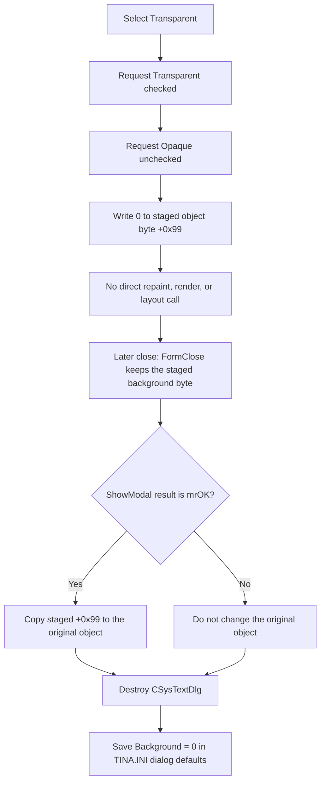

# Use a transparent system-text background

> Analysis status: Complete. The recovered handler, paired Opaque handler, staged-object loader, modal owner, and form-destruction path establish the menu state, transparency flag, commit boundary, and saved dialog default.

## Control

| Property | Recovered value |
| --- | --- |
| Form | CSysTextDlg |
| Component path | CSysTextDlg.TTPopupMnu.Background1.TransparentMnu |
| Control class | TMenuItem |
| Parent menu | Background |
| Caption | Transparent |
| Hint | Not present in the recovered resource. |
| Handler name | TransparentMnuClick |
| Handler address | 0146b9c0 |
| Graph node | `resource:dfm:CSysTextDlg/CSysTextDlg.TTPopupMnu.Background1.TransparentMnu` |
| Handler node | `function:0146b9c0` |
| Graph layer | UI |

## What happens when clicked

`FUN_0146b9c0` selects the transparent background mode for the dialog's staged system-text object. It performs three operations in this order:

1. It passes `1` to `FUN_007e2d20` for the menu item at form field `+0x760`. This checks `TransparentMnu`.
2. It passes `0` to the same setter for the item at `+0x768`. This unchecks the sibling `OpaqueMnu` item.
3. It writes `0` to byte `+0x99` of the staged system-text object referenced by form field `+0x8e0`.

The paired `OpaqueMnuClick` handler proves the opposite mapping: it unchecks the item at `+0x760`, checks the item at `+0x768`, writes `1` to the same staged-object byte, and then opens a color dialog for the background color at `+0x9c`. The dialog loader also maps object value `0` to Transparent checked and Opaque unchecked, and maps value `1` to the opposite state. These independent paths establish that `+0x99 = 0` means transparent and `+0x99 = 1` means opaque.

Transparent selection is immediate. This handler does not open a color dialog, ask for confirmation, or test another option.

## Menu check and repeated-click behavior

The recovered DFM does not declare `RadioItem`, `GroupIndex`, or an initial `Checked` property for either background item. The application still provides an exclusive two-item selection by setting both checks explicitly.

`FUN_007e2d20` changes its menu-item state only when the requested Boolean differs from the current byte at item offset `+0x80`. Therefore, if Transparent is already selected, both check-state calls take their unchanged-state path. The handler still writes `0` to the staged object's transparency byte. A repeated click is idempotent: it leaves the same menu selection and the same staged mode.

## Preview, repaint, and layout

This click has no direct preview or layout call. `FUN_0146b9c0` does not invalidate a control, invoke `DrawRectanglePaint`, resize the paint box, or call a rendering function.

The form's recovered preview path is `FUN_0146af40`, registered as `DrawRectangle.OnPaint`. That function copies `Memo.Lines` to the nested rendered-text record at staged-object offset `+0x90`, measures the text, sets the paint-box width and height to the measured values plus 10 pixels, resets cached measurements, and draws the text. It receives the nested record, not the outer object's transparency byte at `+0x99`, and the recovered function does not read that byte. The source therefore does not establish an immediate transparent-background change in this dialog's preview, and this menu click does not itself cause a preview resize.

The transparency setting is used after the object leaves the dialog. For example, `FUN_0149e460` reads `+0x99` together with background color `+0x9c` and border mode `+0xa0`, and forwards the three style values to later display setup on its applicable paths. This supports the background-style meaning without implying that the menu handler renders anything itself.

## Staged state, OK, Cancel, and saved default

The handler changes the internal object at form field `+0x8e0`; it does not write directly to the caller's original system-text object.

`FUN_0146a9a0` initializes the dialog by copying the caller's object into this staged object and then sets the Transparent and Opaque checks from the source value at `+0x99`. `FUN_0146ab60`, the form's `OnClose` handler, synchronizes memo text, font, and another text-mode option into the staged object. It does not replace the background byte, so the value written by this click remains staged through close.

A recovered modal owner, `FUN_0149e8d0`, copies the staged object back to the original only when `ShowModal` returns `1` (`mrOK`). The copy helper `FUN_01a5eb60` explicitly copies byte `+0x99`. Thus:

- OK commits transparent mode to the original object.
- Cancel destroys the dialog without copying the staged object back, so the original object's background mode is unchanged.

There is one separate persistence effect. `CSysTextDlg.OnDestroy`, recovered as `FUN_0146a540`, writes the current staged `+0x99` value under the `Background` key in the `Text Dialog Setup` section of `TINA.INI`. `FUN_0146a1d0` reads the same key when the form creates its initial staged object. The owner destroys the dialog after both OK and Cancel results. Therefore, Cancel discards the edited system-text object but can still save Transparent as the dialog's future background default. This preference write is separate from committing the caller's object.

## Click and persistence flow

## Handler evidence

- Menu handler: [FUN_0146b9c0](../../../DecompiledSources/Tina16/functions/000000000146B9C0__FUN_0146b9c0.c)
- Paired Opaque handler: [FUN_0146ba00](../../../DecompiledSources/Tina16/functions/000000000146BA00__FUN_0146ba00.c)
- Menu checked-state setter: [FUN_007e2d20](../../../DecompiledSources/Tina16/functions/00000000007E2D20__FUN_007e2d20.c)
- Dialog loader: [FUN_0146a9a0](../../../DecompiledSources/Tina16/functions/000000000146A9A0__FUN_0146a9a0.c)
- Preview paint handler: [FUN_0146af40](../../../DecompiledSources/Tina16/functions/000000000146AF40__FUN_0146af40.c)
- Form close synchronization: [FUN_0146ab60](../../../DecompiledSources/Tina16/functions/000000000146AB60__FUN_0146ab60.c)
- Staged-object copy: [FUN_01a5eb60](../../../DecompiledSources/Tina16/functions/0000000001A5EB60__FUN_01a5eb60.c)
- Accepted-dialog owner: [FUN_0149e8d0](../../../DecompiledSources/Tina16/functions/000000000149E8D0__FUN_0149e8d0.c)
- Form destroy preference save: [FUN_0146a540](../../../DecompiledSources/Tina16/functions/000000000146A540__FUN_0146a540.c)
- Dialog preference writer: [FUN_01469b20](../../../DecompiledSources/Tina16/functions/0000000001469B20__FUN_01469b20.c)
- Dialog preference loader: [FUN_0146a1d0](../../../DecompiledSources/Tina16/functions/000000000146A1D0__FUN_0146a1d0.c)
- Background-style consumer: [FUN_0149e460](../../../DecompiledSources/Tina16/functions/000000000149E460__FUN_0149e460.c)
- Recovered role: Selects transparent background mode for the staged system-text object.
- Input: The CSysTextDlg instance, its Transparent and Opaque menu items, and its staged object at form field `+0x8e0`.
- Decision: There is no control-specific branch. The menu setter independently skips an update when an item already has the requested checked state.
- State change: Checks Transparent, unchecks Opaque, and sets staged-object byte `+0x99` to `0`.
- Direct output: Updated menu checks and staged model state. There is no direct preview, layout, dialog, or owner-object update.
- Complexity: simple
- Distinct outgoing calls: 1

## Direct calls

- `function:007e2d20` - Applies a requested checked state to a Delphi menu item and skips the update when that state is unchanged. The handler calls it once for each background menu item.

## Resource evidence

- The item caption is `Transparent` under the `Background` submenu.
- Its sibling caption is `Opaque...`; the ellipsis agrees with the paired handler's color-dialog path.
- Neither item has a recovered hint, image, shortcut, glyph, `Checked`, `RadioItem`, or `GroupIndex` property.
- No same-parent label candidate is available.

## Error and evidence limits

- The handler has no validation, warning, confirmation, or local exception handler.
- The two menu updates and staged-byte write occur sequentially. If a VCL setter raises an exception, the handler has no rollback and later operations do not run.
- The recovered source proves no direct preview update for this click. It does not prove how every later renderer visually combines the transparency flag, color, and border values.
- The `TINA.INI` write saves a dialog default. It is not a commit to the caller's original system-text object.
