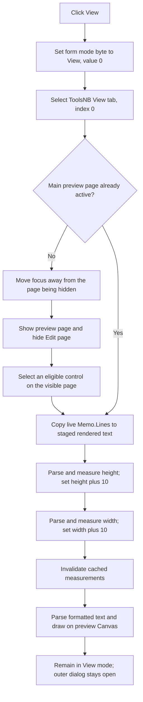

# Switch from system-text editing to rendered preview

> Analysis status: Source reviewed and behavior traced.

## Control

| Property | Recovered value |
| --- | --- |
| Form | CSysTextDlg |
| Component path | CSysTextDlg.ToolsPanel.ViewBtn |
| Control class | TSpeedButton |
| Hint | View |
| Group index | 1 |
| Handler name | ViewBtnClick |
| Handler address | 0146a6e0 |
| Graph node | `resource:dfm:CSysTextDlg/CSysTextDlg.ToolsPanel.ViewBtn` |
| Handler node | `function:0146a6e0` |
| Graph layer | UI |

## What happens when clicked

`FUN_0146a6e0` performs the Edit-to-View transition in this order:

1. Write zero to the form mode byte at `+0x8D8`. The paired Edit handler writes
   one to this same byte, which proves that zero is View and one is Edit.
2. Call `FUN_006d8180` with index 0 on the page control at `+0x7F0`. Index 0 is
   the recovered `ToolsNB.View` tab; index 1 is `ToolsNB.Edit`.
3. Call `FUN_0074a520` with index 0 on the notebook at `+0x6E0`. The recovered
   DFM starts `MainNB` on page index 1, which contains the editable `TMemo`.
   Index 0 is the preview page containing the scroll box and paint control.
4. Call `FUN_0146af40` to synchronize and render the preview.

The View button does not close the dialog, set a modal result, save a file, or
commit the caller-owned system-text object. It switches the dialog's local mode
and rebuilds its staged preview.

## Edit-to-view synchronization and rendering

`FUN_0146af40` first assigns the complete live `Memo.Lines` collection to the
text collection in the dialog's staged system-text object at form offset
`+0x8E0`. This is the edit-to-view synchronization boundary. The editable text
becomes the input for preview measurement and drawing before the outer dialog
is accepted.

The renderer then uses the preview paint control's Canvas to perform two
separate layout passes:

- `FUN_01d1bfb0` measures the rendered height. The paint control height is set
  to the measured value plus 10 pixels.
- `FUN_01d1b660` measures the rendered width. The paint control width is set to
  the measured value plus 10 pixels.

Both passes read the staged lines, join physical lines that end in a backslash,
apply the recovered text formatting commands, and measure text with the staged
font. They also stop when a line begins one of the recovered hidden-section
markers: `@ Configuration begin`, `# Hide from here`, or `{ Hide from here`.
These markers are intentional render boundaries; the hidden lines remain in
the Memo and staged text collection.

After the two size changes, `FUN_01d1c9b0` invalidates the cached width and
height values by setting both to `-1`. `FUN_01d1c9d0` then parses the same
formatted text and draws it directly on the preview Canvas. This final draw
handles the recovered format commands for fractions, exponents, font styles,
colors, links, and action links. The preview page therefore shows rendered
system text rather than the literal backslash markup displayed in Edit mode.

## Page visibility and focus

`FUN_0074a520` changes the main notebook only when the requested page index is
different from the current index. During an Edit-to-View switch it makes the
new page visible and hides the former page. If the form's active control is a
descendant of this notebook, it temporarily moves the active-control state to
the notebook before hiding the Edit page. After the switch, it searches for an
eligible child on the visible page and makes that child active when one exists.

The handler does not explicitly focus a named preview control. Focus selection
is left to this notebook helper. The separate page-control helper selects the
`ToolsNB.View` tab and notifies the page control through its normal active-page
path. The paired speed buttons share group index 1, so VCL manages their visual
group state; the handler itself does not write a `Down` property.

## Repeated clicks

There is no early return when the form is already in View mode. On a repeated
View click:

- the mode byte is written with zero again;
- the main notebook helper sees that page 0 is already active and does not
  repeat its visibility or focus transition;
- the tool tab remains on index 0; and
- `FUN_0146af40` still recopies `Memo.Lines`, remeasures both dimensions,
  invalidates the cached measurements, and redraws the Canvas.

Thus, a repeated click is a forced preview refresh, not a complete no-op.

## View flow

## Malformed markup and error boundaries

- The View handler has no validation branch, error dialog, exception handler,
  or rollback. Page and mode changes occur before synchronization and rendering.
- Recognized formatting commands use recovered helpers that search for required
  parentheses and commas. When a required delimiter is missing, those helpers
  call `FUN_01d120b0`. The recovered body of that function is an immediate
  return, so this path does not report a user-visible syntax error or reject the
  View transition.
- The parser continues after that no-op callback. Depending on the malformed
  command and its derived positions, the preview can render literal or
  incomplete content, stop processing useful markup, or fail in a deeper
  string, Canvas, or allocation operation. The recovered source does not define
  one safe fallback result for all malformed input.
- If line assignment succeeds but measurement or drawing raises an exception,
  the staged text and View page are already selected. The height can also be
  changed before a later width or draw failure. There is no transaction that
  restores the prior Edit page, staged text, control size, or preview image.
- Hidden-section markers are not errors. Measurement and drawing stop at the
  first matching marker by design.

## Staging and persistence

The View click updates the dialog's internal staged text object, but not the
caller-owned source object. `FormClose` (`FUN_0146ab60`) synchronizes the final
Memo lines, font, and other recovered text state into staging again. A recovered
existing-object caller (`FUN_0149e8d0`) copies staging back only when
`ShowModal` returns 1. Other recovered creation paths reject result 2 and can
also require non-empty text.

Therefore, a later outer Cancel can discard text that was successfully shown
in this preview. Outer acceptance commits it to the caller-owned in-memory
object. Neither View nor that copy-back is a disk-persistence operation.

## Evidence

- [View handler `FUN_0146a6e0`](../../../DecompiledSources/Tina16/functions/000000000146A6E0__FUN_0146a6e0.c)
  writes the View-mode byte, selects index 0 in both page controls, and calls
  the preview renderer.
- [Edit handler `FUN_0146a730`](../../../DecompiledSources/Tina16/functions/000000000146A730__FUN_0146a730.c)
  provides the inverse evidence: it writes mode 1 and selects index 1 in both
  controls.
- [Page-control selector `FUN_006d8180`](../../../DecompiledSources/Tina16/functions/00000000006D8180__FUN_006d8180.c)
  validates the tab index and assigns the matching active page.
- [Notebook page selector `FUN_0074a520`](../../../DecompiledSources/Tina16/functions/000000000074A520__FUN_0074a520.c)
  manages active-control transfer, new-page visibility, old-page hiding,
  selected-page `alClient` alignment, and the page-change callback.
- [Focusable-child selector `FUN_0065c230`](../../../DecompiledSources/Tina16/functions/000000000065C230__FUN_0065c230.c)
  searches the switched notebook for an eligible child and assigns it as the
  form's active control.
- [Canonical preview renderer `FUN_0146af40`](../../../DecompiledSources/Tina16/functions/000000000146AF40__FUN_0146af40.c)
  copies Memo lines, measures, resizes, invalidates caches, and draws.
- [Height measurement `FUN_01d1bfb0`](../../../DecompiledSources/Tina16/functions/0000000001D1BFB0__FUN_01d1bfb0.c)
  processes visible formatted lines and calculates the preview height.
- [Width measurement `FUN_01d1b660`](../../../DecompiledSources/Tina16/functions/0000000001D1B660__FUN_01d1b660.c)
  processes the same visible lines and calculates maximum rendered width.
- [Cache invalidation `FUN_01d1c9b0`](../../../DecompiledSources/Tina16/functions/0000000001D1C9B0__FUN_01d1c9b0.c)
  resets the two cached measurement fields to `-1`.
- [Formatted-text draw `FUN_01d1c9d0`](../../../DecompiledSources/Tina16/functions/0000000001D1C9D0__FUN_01d1c9d0.c)
  parses and draws visible staged lines on the supplied Canvas.
- [Render-boundary test `FUN_01d120c0`](../../../DecompiledSources/Tina16/functions/0000000001D120C0__FUN_01d120c0.c)
  stops rendering at the three recovered hidden-section markers.
- [Single-argument markup parser `FUN_01d12360`](../../../DecompiledSources/Tina16/functions/0000000001D12360__FUN_01d12360.c)
  locates nested parentheses and calls the recovered syntax callback when a
  closing delimiter is absent.
- [Two-argument markup parser `FUN_01d12460`](../../../DecompiledSources/Tina16/functions/0000000001D12460__FUN_01d12460.c)
  locates the top-level comma and closing parenthesis for two-part commands.
- [Recovered syntax callback `FUN_01d120b0`](../../../DecompiledSources/Tina16/functions/0000000001D120B0__FUN_01d120b0.c)
  is an immediate return and supplies no local error message or rejection.
- [Form close synchronization `FUN_0146ab60`](../../../DecompiledSources/Tina16/functions/000000000146AB60__FUN_0146ab60.c)
  performs the final staged-state synchronization.
- [Existing-object caller `FUN_0149e8d0`](../../../DecompiledSources/Tina16/functions/000000000149E8D0__FUN_0149e8d0.c)
  commits staging to its source object only for accepted modal result 1.

## Resource evidence

- `ViewBtn` is a `TSpeedButton` with hint `View` and group index 1. `EditBtn`
  is its paired group member with hint `Edit`.
- The [extracted View glyph](../../../glyph/0041_CSysTextDlg_CSysTextDlg_ToolsPanel_ViewBtn_Glyph_Data.png)
  is a small document-style image. It supports a document-preview context, but
  it does not prove the render path by itself.
- `ToolsNB` has recovered `View` and `Edit` tabs. Its initial active page is
  `Edit`.
- `MainNB` starts at page index 1. The second recovered page contains the
  client-aligned `TMemo`; the other page contains the preview scroll box and
  paint control used by the renderer.
- The View button has no caption, text, action, modal result, or image index in
  the recovered resource.

## Analysis limits

- The original Delphi names of the generic page-switch and formatted-text
  parser helpers are absent. Their roles are established from paired handlers,
  component structure, page indexes, control visibility, and Canvas use.
- The page helper searches for a focusable child, but the recovered source does
  not prove which named preview control receives focus for every runtime state.
- The markup parser supports many command letters. This article documents the
  common measurement and drawing path, not every formatting command's syntax.
- Malformed markup has no one documented fallback result. The recovered no-op
  callback proves only that this layer does not show or return a syntax error.
- `FUN_0146af40` already has a canonical shared annotation in
  `TIARA-diz.6.7.123`; this control's annotation fragment does not duplicate it.
