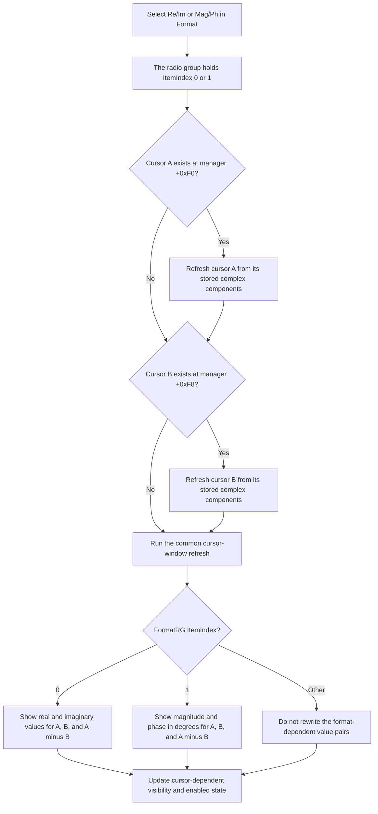

# Choose the Nyquist cursor value format

> Analysis status: Source reviewed and behavior traced.

## Control

| Property | Recovered value |
| --- | --- |
| Form | CursorWindow |
| Form page | Nyquist |
| Component path | CursorWindow.Notebook1.TPage.FormatRG |
| Control class | TRadioGroup |
| Caption | Format |
| Items | `Re/Im`, `Mag/Ph (°)` |
| Hint | Not present in the recovered resource. |
| Handler name | FormatRGClick |
| Handler address | 00f10240 |
| Graph node | `resource:dfm:CursorWindow/CursorWindow.Notebook1.TPage.FormatRG` |
| Handler node | `function:00f10240` |
| Graph layer | UI |

This radio group changes how complex Nyquist cursor values appear. It does not
move a cursor and does not change the sampled complex values.

## Item index mapping

The DFM item order and the numeric conversion branches give this exact mapping:

| ItemIndex | Item | First displayed value | Second displayed value |
| ---: | --- | --- | --- |
| 0 | Re/Im | Real component | Imaginary component |
| 1 | Mag/Ph (°) | Magnitude | Phase in degrees |

For item 1, the refresh builds a complex number from the two stored cursor
components. It writes the magnitude to the first value position. It converts
the recovered phase from radians to degrees with the factor
`57.29577951308232` and writes it to the second value position.

When the active cursor-data path supplies the recovered complex components, the
same mapping applies to the visible Nyquist groups:

- `A`: `AXPos` and `AYPos` show cursor A.
- `B`: `BXPos` and `BYPos` show cursor B.
- `A - B`: `ABXDif` and `ABYDif` show the complex difference.

For `Re/Im`, the difference pair shows the component differences. For
`Mag/Ph (°)`, it first forms the complex A-minus-B value and then shows its
magnitude and phase. The control changes the numbers in these fixed value
positions. It does not create new columns or change the stored cursor samples.

## What the click handler does

`FUN_00f10240` uses the global CursorWindow instance to reach the cursor manager
at offset `+0x798`. It performs these actions in order:

1. Read cursor A from manager offset `+0xF0`.
2. If cursor A exists, call `FUN_01abfbd0` to refresh its displayed values.
3. Read cursor B from manager offset `+0xF8`.
4. If cursor B exists, call `FUN_01abfbd0` to refresh its displayed values.
5. Call `FUN_01ae4310` for the manager even when neither cursor exists.

The per-cursor refresh reads `FormatRG.ItemIndex` from the radio group at the
global form offset `+0xCF0`. The handler does not receive an item number and
does not copy the item number to a separate model field. The VCL control has
already changed its `ItemIndex` when the click handler runs.

The final common refresh updates cursor-dependent visibility and enabled state.
It also calls `FUN_01ad1740`, which recalculates the A-minus-B display from both
cursor objects and reads the same `FormatRG.ItemIndex` for the result pair.

## Click flow

## Immediate refresh and repeated clicks

The control applies immediately. There is no OK or Apply button in this path.
The handler requests a refresh for each existing cursor, and the common refresh
then recalculates the A-minus-B values and related UI state when both cursor
objects are active.

The per-cursor formatter also requires its recovered global display state and
the cursor's active flag at `+0x91`. If either condition is false, the call does
not write the format-dependent value pair. Thus, a non-null but inactive cursor
can produce no visible numeric change even though the handler calls the shared
formatter.

The handler has no check for an unchanged `ItemIndex`. If the user clicks the
selected item again and the VCL emits `OnClick`, the handler repeats the cursor
and common refresh. The calculated text is normally the same, but the call path
is not a no-op.

If cursor A or B is absent, the corresponding `FUN_01abfbd0` call is skipped.
If both are absent, both per-cursor calls are skipped. `FUN_01ae4310` still runs
its recovered no-cursor path to update or disable cursor-dependent UI. The
handler does not invent a value for an absent cursor.

## State and persistence boundary

The selected format is the `ItemIndex` in the global CursorWindow radio-group
component. Other recovered code reads this same property when it refreshes
cursor values, calculates the displayed A-minus-B value, and builds formatted
cursor text. There is no second Boolean or enumeration written by this click
handler.

The click path contains no file, registry, configuration, or database write.
The recovered form-create and form-destroy handlers do not save or restore this
selection. Thus, the selection remains available while the live form component
exists, but persistence across form destruction or application restart is not
established.

The common refresh can programmatically force `FormatRG.ItemIndex` to 0 for one
recovered special cursor-data subtype and flag. This makes `Re/Im` mandatory in
that state. The click handler has no logic that protects item 1 from this
override.

## Relationship to SmFormatRG

`SmFormatRG` is a separate radio group on the Smith page. It has the same two
visible items, but its handler `FUN_00f102b0` has a different implementation:

- it reads `SmFormatRG.ItemIndex`;
- it applies that index to the `SmANB`, `SmBNB`, and `SmABNB` notebooks;
- index 0 selects their `RealImag` pages;
- index 1 selects their `AbsPhase` pages.

`FormatRG` does not call the Smith handler or change those notebook page
indexes. `SmFormatRG` does not call `FUN_00f10240` or refresh the Nyquist A, B,
and A-minus-B value pairs. The two controls use separate component state even
though their item captions match.

## Invalid index and error behavior

- The DFM supplies exactly two items, so a normal user click gives index 0 or
  1.
- The recovered numeric format consumers have explicit branches only for 0 and
  1. For any other index, they do not rewrite the format-dependent A, B, or
  A-minus-B pairs. Other common cursor-window updates still run.
- The special cursor-data state described above can replace an unsupported or
  disallowed selection with index 0 during the common refresh.
- The handler checks each cursor pointer before it calls the per-cursor refresh.
  It does not check the global CursorWindow pointer or its `+0x798` manager
  pointer because a live form event is expected to supply that application
  state.
- There is no local exception handler, rollback, or error dialog. An exception
  from number formatting, label update, or the common refresh propagates to the
  surrounding Delphi/VCL exception path. Earlier labels can already contain
  their new representation when this happens.

## Evidence

- [Format click handler `FUN_00f10240`](../../../DecompiledSources/Tina16/functions/0000000000F10240__FUN_00f10240.c)
  null-checks the two manager cursor objects, refreshes each existing cursor,
  and then runs the common cursor-window refresh.
- [Per-cursor value refresh `FUN_01abfbd0`](../../../DecompiledSources/Tina16/functions/0000000001ABFBD0__FUN_01abfbd0.c)
  reads `FormatRG.ItemIndex`; index 0 writes the two stored components, while
  index 1 writes magnitude and phase converted to degrees.
- [A-minus-B refresh `FUN_01ad1740`](../../../DecompiledSources/Tina16/functions/0000000001AD1740__FUN_01ad1740.c)
  computes the two cursor-component differences and applies the same index 0
  or 1 representation to the Nyquist difference pair.
- [Common cursor-window refresh `FUN_01ae4310`](../../../DecompiledSources/Tina16/functions/0000000001AE4310__FUN_01ae4310.c)
  handles absent cursors, updates cursor-dependent UI state, can force index 0
  for a special data state, and invokes the A-minus-B refresh.
- [Formatted cursor-text helper `FUN_01ae86b0`](../../../DecompiledSources/Tina16/functions/0000000001AE86B0__FUN_01ae86b0.c)
  reads the same `FormatRG.ItemIndex` when it emits two complex-value fields.
- [Smith format handler `FUN_00f102b0`](../../../DecompiledSources/Tina16/functions/0000000000F102B0__FUN_00f102b0.c)
  copies `SmFormatRG.ItemIndex` to the three Smith display notebooks.
- [Notebook page setter `FUN_0074a520`](../../../DecompiledSources/Tina16/functions/000000000074A520__FUN_0074a520.c)
  validates a requested page index and changes the visible notebook page.
- [Recovered UI evidence](../../../DecompiledSources/Tina16/resources/dfm/ui-evidence.json)
  places `FormatRG` on the Nyquist page, supplies the two item captions, and
  identifies the A, B, and A-minus-B value controls. It also places
  `SmFormatRG` above the Smith page's `RealImag` and `AbsPhase` notebooks.

## Resource evidence and limits

- The radio group has no hint, action, image, or extracted glyph. Its caption
  and items identify the user choices, while the conversion source proves the
  numerical meaning.
- The recovered symbols do not give semantic names to the cursor-manager and
  cursor-object offsets. The A and B mapping is established by the normal-page
  and Nyquist-page input handlers: their A controls update manager `+0xF0`, and
  their B controls update manager `+0xF8`.
- The special data subtype that forces index 0 does not have a recovered Delphi
  class name. This article records the observed constraint without assigning an
  unproved domain name.

## Annotation scope

The annotation fragment owns only the unique `FormatRGClick` handler
`FUN_00f10240`. The cursor-value, A-minus-B, common UI, formatted-text, and
Smith-notebook helpers have wider shared responsibilities. They remain cited
without duplicate function annotations.
