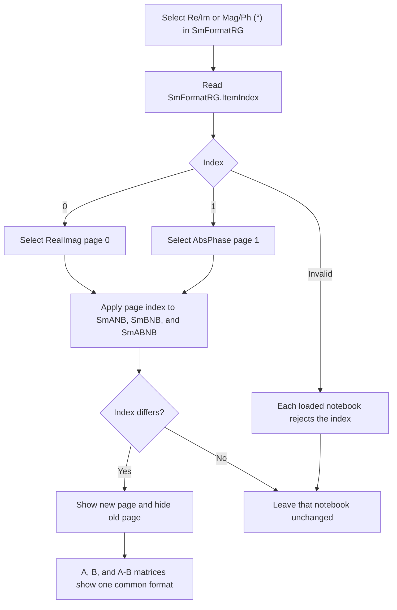

# Smith cursor matrix format

> Analysis status: Complete. The recovered handler, notebook page order, matrix labels, and shared cursor update path establish the control behavior.

## Control

| Property | Recovered value |
| --- | --- |
| Form | CursorWindow |
| Parent page | Smith |
| Component path | CursorWindow.Notebook1.TPage.SmFormatRG |
| Control class | TRadioGroup |
| Caption | Format |
| Items | `Re/Im`, `Mag/Ph (°)` |
| Handler name | SmFormatRGClick |
| Handler address | 00f102b0 |
| Graph node | `resource:dfm:CursorWindow/CursorWindow.Notebook1.TPage.SmFormatRG` |
| Handler node | `function:00f102b0` |
| Graph layer | UI |

## What happens when clicked

`FUN_00f102b0` reads `SmFormatRG.ItemIndex` from the radio group at form offset `+0x850`. It passes the same index to the page-index setter `FUN_0074a520` for three form-owned `TNotebook` controls:

- `SmANB` at `+0x858`, which shows the cursor A matrix.
- `SmBNB` at `+0x8a0`, which shows the cursor B matrix.
- `SmABNB` at `+0x8e8`, which shows the A-B matrix.

Each notebook has the same two pages in the same order. Therefore, the mapping is exact:

| `SmFormatRG.ItemIndex` | Notebook page index | Visible fields for each 11, 12, 21, and 22 matrix element |
| --- | --- | --- |
| 0, `Re/Im` | 0, `RealImag` | Real part and imaginary part |
| 1, `Mag/Ph (°)` | 1, `AbsPhase` | Magnitude and phase in degrees |

One click keeps all three matrix groups in the same format. It does not change the selected A or B cursor, its frequency, or any matrix value.

## Display update

`FUN_0074a520` is the shared `TNotebook` page-index setter. For a valid new index, it shows and enables the requested page, hides the previous page, stores the new page index, and updates focus if required. This makes the selected representation visible immediately. The three notebooks have no recovered `OnChange` event, so this click causes no additional control-specific callback.

The click handler does not calculate, convert, format, or rewrite the label text. The cursor data update path in `FUN_01abfbd0` proves that the real and imaginary labels and the magnitude and phase labels are populated as separate values. It formats phase as radians multiplied by `57.29577951308232`, which converts the phase to degrees. Thus, the radio click only selects which already-populated label page is visible.

## State, no-op, and error behavior

The handler changes only the three notebook page indices in the current `CursorWindow` instance. It does not write a global variable, configuration value, file, or model object. The recovered `FormCreate`, `FormClose`, and `FormDestroy` handlers do not save this radio choice. The DFM gives each target notebook a default page index of 1 (`AbsPhase`), but it does not expose a separate persistent setting for `SmFormatRG`.

For an ordinary user click, the only available indices are 0 and 1, and each target notebook has two pages. If a notebook already has the requested index, `FUN_0074a520` does nothing for that notebook. If an invalid negative or out-of-range index reaches the setter after component loading, the setter also leaves that notebook unchanged. The handler has no message, exception handler, retry, or rollback branch.

The nearby `FormatRG` control has the same two item captions, but it is a different control on the `Nyquist` page. Its handler, `FUN_00f10240`, refreshes scalar complex cursor output through the cursor-update path. `SmFormatRG` does not call that handler or its refresh functions. It controls only the three 2 by 2 matrix notebooks on the `Smith` page.

## Click flow

## Evidence

- [Click handler `FUN_00f102b0`](../../../DecompiledSources/Tina16/functions/0000000000F102B0__FUN_00f102b0.c) reads one radio-group index and passes it to the A, B, and A-B notebooks.
- [Notebook page-index setter `FUN_0074a520`](../../../DecompiledSources/Tina16/functions/000000000074A520__FUN_0074a520.c) validates a changed index and performs the page visibility change.
- [Cursor value update `FUN_01abfbd0`](../../../DecompiledSources/Tina16/functions/0000000001ABFBD0__FUN_01abfbd0.c) populates the matrix real, imaginary, magnitude, and degree-phase labels.
- [Form creation `FUN_00f0ff80`](../../../DecompiledSources/Tina16/functions/0000000000F0FF80__FUN_00f0ff80.c), [form close `FUN_00f0fe10`](../../../DecompiledSources/Tina16/functions/0000000000F0FE10__FUN_00f0fe10.c), and [form destroy `FUN_00f0fe00`](../../../DecompiledSources/Tina16/functions/0000000000F0FE00__FUN_00f0fe00.c) contain no save of the selected matrix format.
- The recovered form resource binds `SmFormatRG.OnClick` to `SmFormatRGClick` at `00f102b0`. It places the control on the `Smith` page and defines the matching `RealImag` and `AbsPhase` pages and the 11, 12, 21, and 22 labels in all three notebooks.
- Recovered role: Synchronize the visible numeric representation of the three Smith cursor matrices.
- Complexity: simple.
- Distinct outgoing calls: 1.

## Evidence limits

- The recovered code does not prove that another process outside this form preserves the page index after the form is destroyed. No such persistence path appears in this handler or the form lifecycle handlers.
- The invalid-index branch belongs to the shared notebook setter. A normal click cannot select an index outside the two recovered radio items.
- The handler does not report an error. Any exception from VCL page switching would leave the normal control flow; no control-specific recovery is present.
