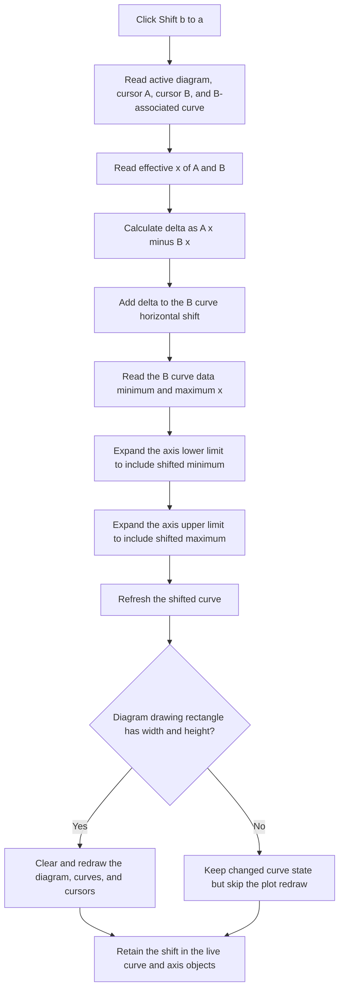

# Shift cursor B's curve to cursor A

> Analysis status: Reviewed from recovered source, the parallel embedded cursor panel, cursor-coordinate helpers, curve-range handling, plot redraw code, and extracted glyph evidence.

## Control

| Property | Recovered value |
| --- | --- |
| Form | CursorWindow |
| Component path | CursorWindow.Notebook1.TPage.nBGB.SynchBtn |
| Control class | TSpeedButton |
| Caption | Not present in the recovered resource. |
| Hint | `Shift b to a` |
| Handler name | SynchBtnClick |
| Handler address | 00f10310 |
| Graph node | `resource:dfm:CursorWindow/CursorWindow.Notebook1.TPage.nBGB.SynchBtn` |
| Handler node | `function:00f10310` |
| Graph layer | UI |

## What happens when clicked

The button horizontally shifts the plotted curve attached to cursor B so that B's effective x position moves to cursor A's effective x position as measured at the start of the click. It does not copy cursor A's record into cursor B, and it does not change either cursor's y value.

The handler uses the active diagram at global application field `+0x798`. That diagram stores cursor A at `+0xf0` and cursor B at `+0xf8`. The nearby A and B group boxes and their x and y controls confirm this mapping: the A x editor calls the cursor-position helper with selector `1`, which selects `+0xf0`; the B x editor uses selector `0`, which selects `+0xf8`.

The click performs these operations in order:

1. It gets the plotted curve from cursor B's associated-object field `+0x58`.
2. It reads A's and B's effective x positions. For a cursor attached to this curve type, the effective position is the cursor-local x at `+0x78` plus the curve's horizontal shift at `+0xf0`.
3. It adds `effective A - effective B` to the B curve's horizontal shift.
4. It gets the unshifted minimum and maximum x values from the B curve's data source.
5. It expands the target x-axis allowed range to include the shifted curve: the lower limit becomes `min(old lower limit, data minimum + new shift)`, and the upper limit becomes `max(old upper limit, data maximum + new shift)`.
6. It invokes the B curve's refresh method and then requests a full redraw of the active diagram and its child plot objects.

In the normal case where A is not attached to the curve being shifted, B's new effective x equals A's sampled effective x after step 3.

## Synchronization flow

## What is copied and what changes

The source value is only cursor A's effective x coordinate. The target is the horizontal shift of the complete curve associated with cursor B. All x samples rendered from that curve use the updated shift, so the operation moves the curve rather than only moving a cursor marker.

These live objects change:

- B curve field `+0xf0` receives the adjusted horizontal shift.
- The B curve's x-axis object at `+0xf8` can receive a lower allowed limit at axis field `+0xc8` and an upper allowed limit at `+0xd0`.
- The curve and active diagram are asked to redraw.

These values are not copied or directly assigned by the handler:

- cursor A or B local x fields;
- either cursor's y value, sampled y result, style, visibility, or selected curve reference;
- the current visible x-axis interval at axis fields `+0xb8` and `+0xc0`;
- CursorWindow's x, y, difference, frequency, or slope controls;
- the active notebook page, window position, focus, or selection.

The full diagram redraw includes the curve and cursor drawing paths. The handler itself has no edit-text or label assignment, so the recovered source does not establish when the separate numeric CursorWindow controls refresh after this command.

## Hint and glyph evidence

The `TSpeedButton` has no caption. Its recovered hint is `Shift b to a`. The extracted 20-by-20 PNG came from a Delphi BMP resource and shows a red lowercase `a` with a blue arrow pointing left toward it. The hint, glyph, A/B group boxes, and handler data flow agree on the direction: A supplies the reference position and the curve associated with B is shifted.

The glyph supports the direction only. The handler source proves that the moved object is B's complete plotted curve and that the operation affects x, not y.

## Enable guards and required state

The DFM does not set `Enabled = false`, so the speed button uses the normal enabled default. The recovered handler has no null check, type check, same-curve check, selected-page check, or control-enabled check before it follows the active-diagram, cursor B, curve, and axis pointers.

The effective-coordinate helper can return a cursor's local x when that cursor has no recognized curve association. This fallback can apply to A. It does not make the B path safe because the handler dereferences B's associated object before it calls the coordinate helper.

The recovered source therefore requires a valid active diagram, both cursor objects, a B-associated curve of the expected layout, its data source, and its x axis. No separate runtime function that disables this standalone CursorWindow button when those requirements fail was established. The application can enforce those requirements through the context in which it shows the window, but that mechanism is not proven here.

The final redraw helper has its own guard. It skips drawing when the diagram rectangle has zero width or zero height. This guard occurs after the curve shift and axis-limit updates, so it is not a command-enable guard and does not undo the state change.

## Repeated clicks and no-op cases

- If A's effective x already equals B's effective x, the calculated delta is zero. The shift stays unchanged. The axis-limit writes are idempotent once the limits already include the shifted curve, but the curve refresh and diagram redraw still run.
- When A is attached to a different, unaffected curve, the first click aligns B to A. A repeated click then calculates a zero delta unless another action moved a cursor or curve.
- There is no same-curve guard. If A and B are attached to the same shifted curve, the click moves that shared curve. B lands at A's pre-click effective x, but A moves by the same delta. Repeated clicks can therefore add the same cursor-local difference again instead of becoming a no-op.
- A degenerate diagram rectangle skips only the final redraw. The live curve shift and expanded axis limits remain changed.

## Errors and partial state

The handler has no local exception handler, validation message, retry, undo snapshot, or rollback.

- A missing active diagram, cursor B, B curve, axis, or required data object can cause an invalid dereference instead of a controlled no-op.
- A failure after the shift assignment can leave the curve moved without adjusted axis limits or without a redraw.
- A failure after the lower-limit write but before the upper-limit write can leave only one allowed bound expanded.
- A curve-refresh or redraw failure occurs after all direct shift and axis writes, so those changes can remain even when the display is stale.
- The recovered source does not establish how the application reports these object, rendering, or floating-point failures.

## Persistence boundary

This command writes directly to the live curve and axis objects. It does not call a file writer, settings service, document-save command, or explicit dirty-state setter. The shift therefore lasts at least for the lifetime of those in-memory diagram objects.

The recovered click path does not prove whether a later diagram or document save serializes the curve's shift or expanded axis limits. It also does not provide an independent undo command.

## Handler and call-path evidence

- Synchronize handler: [FUN_00f10310](../../../DecompiledSources/Tina16/functions/0000000000F10310__FUN_00f10310.c) selects B's associated curve, calculates the effective A-to-B x delta, changes the curve shift, expands x-axis limits, refreshes the curve, and redraws the diagram.
- Parallel embedded-panel handler: [FUN_01a7fb90](../../../DecompiledSources/Tina16/functions/0000000001A7FB90__FUN_01a7fb90.c) performs the same operation for the `DFWindow` cursor panel using that form's active diagram.
- Effective cursor x: [FUN_01abfb00](../../../DecompiledSources/Tina16/functions/0000000001ABFB00__FUN_01abfb00.c) returns cursor-local x plus the associated curve shift for the recognized curve type, or cursor-local x otherwise.
- Effective cursor x setter: [FUN_01abfb40](../../../DecompiledSources/Tina16/functions/0000000001ABFB40__FUN_01abfb40.c) applies the inverse relationship by subtracting the associated curve shift before it stores cursor-local x.
- Curve data bounds: [FUN_01ab2a30](../../../DecompiledSources/Tina16/functions/0000000001AB2A30__FUN_01ab2a30.c) and [FUN_01ab2a60](../../../DecompiledSources/Tina16/functions/0000000001AB2A60__FUN_01ab2a60.c) ask the curve's data source for its minimum and maximum x values.
- Curve rendering: [FUN_01ab2f90](../../../DecompiledSources/Tina16/functions/0000000001AB2F90__FUN_01ab2f90.c) adds curve field `+0xf0` to each source x value before x-axis conversion, which establishes that this field is a horizontal curve shift.
- Axis-limit behavior: [FUN_01cd3cd0](../../../DecompiledSources/Tina16/functions/0000000001CD3CD0__FUN_01cd3cd0.c), [FUN_01cd3950](../../../DecompiledSources/Tina16/functions/0000000001CD3950__FUN_01cd3950.c), and [FUN_01cd4050](../../../DecompiledSources/Tina16/functions/0000000001CD4050__FUN_01cd4050.c) use axis fields `+0xc8` and `+0xd0` as the lower and upper allowed limits for the visible range.
- Diagram redraw: [FUN_01aceb90](../../../DecompiledSources/Tina16/functions/0000000001ACEB90__FUN_01aceb90.c) checks the diagram bounds, optionally clears the drawing area, and redraws registered plot children including both cursor objects.
- A x-entry path: [FUN_00f0ffe0](../../../DecompiledSources/Tina16/functions/0000000000F0FFE0__FUN_00f0ffe0.c) selects cursor A when the user confirms an x value.
- B x-entry path: [FUN_00f10030](../../../DecompiledSources/Tina16/functions/0000000000F10030__FUN_00f10030.c) selects cursor B when the user confirms an x value.

## Resource evidence

- The control is inside the `Normal` notebook page and the ` B ` group box. That group also contains B x and y editors.
- The adjacent ` A ` group contains the corresponding A x and y editors. The ` A - B ` group displays x and y differences.
- The button has hint `Shift b to a`, `ShowHint = true`, and `ParentShowHint = false`.
- It has no recovered caption, action, built-in button kind, modal result, checked state, or separate image-list reference.
- Its embedded `Glyph.Data` was a 1,482-byte BMP resource. Extraction produced [the 20-by-20 PNG](../../../glyph/0053_CursorWindow_CursorWindow_Notebook1_TPage_nBGB_SynchBtn_Glyph_Data.png).
- The nearby `x:` and `y:` labels identify the B coordinate editors, but the source proves that this command changes only the curve's x shift.

## Analysis limits

- The original Delphi class and field names for the diagram, cursor, curve, data source, and axis objects are not recovered. Their responsibilities are established from selector use, repeated field access, coordinate conversion, rendering, and the parallel handler.
- No runtime button-enable update was identified for this standalone form. The DFM default and missing handler guards are proven; broader UI-state enforcement is not.
- The curve's virtual refresh method is not named, so this article does not claim a more specific cache or data-rebuild policy.
- The handler does not directly refresh CursorWindow's numeric controls, and the timing of any indirect observer update is not recovered.
- The click path has no persistence call. Later serialization of the shifted curve or axis limits is not established.
