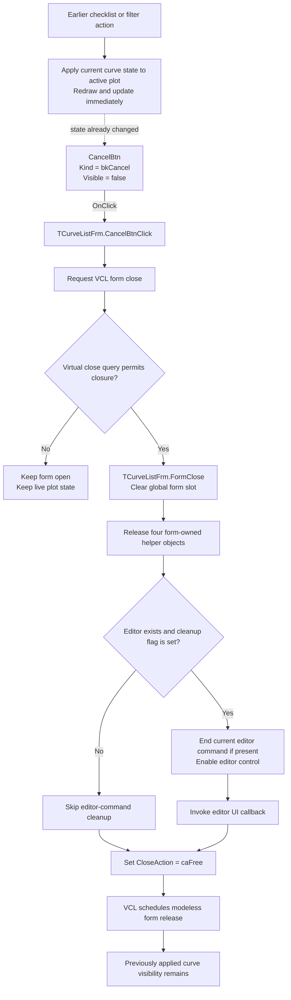

# CancelBtn

> Analysis status: Recovered control, modeless opener, live curve synchronization, VCL close path, and form cleanup reviewed.

## Control

| Property | Recovered value |
| --- | --- |
| Form | CurveListFrm |
| Form caption | Show/hide curves |
| Component path | CurveListFrm.CancelBtn |
| Control class | TBitBtn |
| Button kind | bkCancel |
| Visible | false |
| Explicit DFM caption | Not present |
| Explicit DFM `ModalResult` | Not present |
| Handler name | CancelBtnClick |
| Handler address | 0135ef80 |
| Form close handler | FormClose at `0135ef50` |
| Graph node | `resource:dfm:CurveListFrm/CurveListFrm.CancelBtn` |
| Handler node | `function:0135ef80` |
| Graph layer | UI |

## What happens when clicked

`TCurveListFrm.CancelBtnClick` contains one direct call. It requests closure
through the common VCL form-close routine. The decompiler omits the implicit
form argument, but the DFM event binding and the close routine's receiver show
that the target is `CurveListFrm`.

The recovered opener creates one global `TCurveListFrm` instance only when an
active plot object exists and no curve-list form is already open. It copies the
available curve inventory into the form and calls the recovered modeless
`Show` wrapper. Thus, the normal Cancel path enters the nonmodal branch of the
VCL close routine. This branch first calls the form's virtual close query. If
the query rejects closure, it returns without running `FormClose`.

If closure is allowed, VCL dispatches `TCurveListFrm.FormClose`.
`FormClose` clears the global form-instance slot, runs the form-specific
cleanup, and writes `2` to the `TCloseAction` output. Recovered Delphi RTTI
lists the values as `caNone, caHide, caFree, caMinimize`, so value `2` is
`caFree`. The common close routine therefore schedules the modeless form for
release.

## Curve state is live, not staged

Cancel does not own a transaction. The curve checklist and filter controls
update the active plot while the form is open:

- `CurvesLBClick`, Check all, and Check only first call `FUN_0135ed00` after
  they change check states.
- Every category-filter click rebuilds the displayed checklist with
  `FUN_0135e310` and then calls `FUN_0135ed00`.
- The filter editor's key-up handler forwards to the same filter-change path.
- `FUN_0135ed00` gathers the current checklist state, applies it to the active
  plot at the recovered application plot field, redraws the plot, and requests
  the subsequent plot update.

These operations happen before Cancel is clicked. Neither `CancelBtnClick`,
`FormClose`, nor the cleanup routine copies an old selection back to the plot.
The curve visibility that was already applied therefore remains in the active
plot. Cancel does not commit a second copy and does not roll the live changes
back. The visible OK button uses `Kind = bkClose`; its handler also contains
only the same VCL close call. There is no recovered OK-versus-Cancel commit
branch in this form.

The filter text, filter-checkbox state, and the form's private curve-inventory
helpers are form-local. The close path does not copy them to a caller. They are
discarded when the form is freed. A later open creates a new form and
`FormShow` initializes its filter checkboxes from the then-available curve
categories before it rebuilds the checklist.

## Ownership and cleanup

`FormCreate` allocates four form-owned helper objects at offsets `+0x728`,
`+0x730`, `+0x738`, and `+0x740`. `FUN_0135daa0` releases all four during
`FormClose`. It does not free the active plot object that received the live
curve-selection update.

`FormCreate` also sets cleanup flag `+0x758`. On normal Cancel, if the global
Schematic Editor exists and this flag is set, cleanup ends the editor's current
interactive command. The shared command cleanup destroys a current controller
when one exists, clears its owner field, and enables the editor control. The
curve-list opener installs such a controller for the applicable schematic
context.

The controller's own destruction path first clears flag `+0x758` and then
closes an open CurveListFrm. This prevents the form cleanup from trying to end
the controller a second time. After the conditional command cleanup,
`FUN_0135daa0` invokes the recovered editor UI callback at virtual slot
`+0x188`.

The global slot and `caFree` close action make the form responsible for its own
lifetime after modeless `Show`. There is no modal caller waiting for a result,
no caller-owned parameter copy-back, and no Cancel-specific file or registry
operation in the recovered path.

## No-op and error boundaries

- The button is created with `Visible = false`. The normal recovered form
  presents the visible `bkClose` OK button instead. The Cancel handler can run
  only if code makes the control visible or invokes its event programmatically.
- If the virtual close query rejects closure, the form, global instance slot,
  helper objects, and already-applied plot state remain unchanged.
- If no Schematic Editor exists, form cleanup skips the editor-command and UI
  callback branches. It still releases the form-owned helpers and returns
  `caFree`.
- If the editor exists but has no current command, the shared cleanup skips
  controller destruction, clears no owner, and still enables the editor
  control.
- The click handler has no validation, retry, error message, allocation, or
  exception-specific recovery. The recovered close path does not restore curve
  state when cleanup fails.
- Before the control can exist, the opener is a no-op when a CurveListFrm is
  already open or the active plot pointer is null.

## Click flow

## Handler and lifecycle evidence

- Cancel handler: [FUN_0135ef80](../../../DecompiledSources/Tina16/functions/000000000135EF80__FUN_0135ef80.c)
- Common VCL close routine: [FUN_00805200](../../../DecompiledSources/Tina16/functions/0000000000805200__FUN_00805200.c)
- Form `OnClose`: [FUN_0135ef50](../../../DecompiledSources/Tina16/functions/000000000135EF50__FUN_0135ef50.c)
- Form-specific cleanup: [FUN_0135daa0](../../../DecompiledSources/Tina16/functions/000000000135DAA0__FUN_0135daa0.c)
- Form `OnCreate`: [FUN_0135d9d0](../../../DecompiledSources/Tina16/functions/000000000135D9D0__FUN_0135d9d0.c)
- Form `OnShow`: [FUN_0135edf0](../../../DecompiledSources/Tina16/functions/000000000135EDF0__FUN_0135edf0.c)
- Modeless curve-list opener: [FUN_01a8aa10](../../../DecompiledSources/Tina16/functions/0000000001A8AA10__FUN_01a8aa10.c)
- Recovered modeless `Show` wrapper: [FUN_008059a0](../../../DecompiledSources/Tina16/functions/00000000008059A0__FUN_008059a0.c)
- Live curve synchronization: [FUN_0135ed00](../../../DecompiledSources/Tina16/functions/000000000135ED00__FUN_0135ed00.c)
- Checklist rebuild and filtering: [FUN_0135e310](../../../DecompiledSources/Tina16/functions/000000000135E310__FUN_0135e310.c)
- Controller-owned close guard: [FUN_0136b4a0](../../../DecompiledSources/Tina16/functions/000000000136B4A0__FUN_0136b4a0.c)
- Schematic Editor command cleanup: [FUN_01c6cf20](../../../DecompiledSources/Tina16/functions/0000000001C6CF20__FUN_01c6cf20.c)
- Recovered form evidence: [ui-evidence.json](../../../DecompiledSources/Tina16/resources/dfm/ui-evidence.json)

## Direct calls

- `FUN_00805200` — Runs the shared VCL close-query and close-action pipeline.

## Resource evidence

- `CurveListFrm` has caption `Show/hide curves` and binds `OnCreate`, `OnShow`,
  and `OnClose` handlers.
- `CancelBtn` is a hidden `TBitBtn` with `Kind = bkCancel`, `NumGlyphs = 2`,
  and `TabOrder = 2`.
- The button has no explicit DFM caption, hint, text, action, `ModalResult`,
  image reference, or embedded glyph.
- The visible `OKBtn` has `Kind = bkClose` and a separate handler at
  `0135edc0`, but that handler makes the same direct call as Cancel.
- The nearby `Curves:` label describes the checklist area. It is not evidence
  for a different Cancel action.

## Analysis limits

- `Kind = bkCancel` establishes the standard VCL button kind, but the DFM does
  not expose the run-time property values supplied by that built-in kind. This
  article does not claim that the handler explicitly writes a modal result.
- The virtual close-query target is unresolved. No form-specific
  `OnCloseQuery` event is present, so an application-specific veto rule is not
  known.
- The active plot update is proven to happen before close. Its later document
  persistence is outside this handler and is not treated as a Cancel action.
