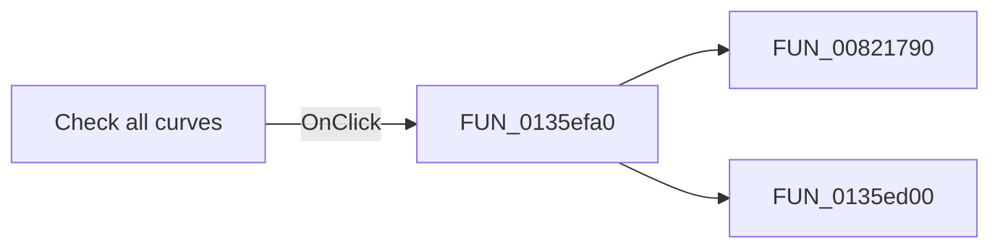

# Check all curves

> Analysis status: Pending individual source review.

## Control

| Property | Recovered value |
| --- | --- |
| Form | CurveListFrm |
| Component path | CurveListFrm.CheckAllImg |
| Control class | TImage |
| Caption | Not present in the recovered resource. |
| Hint | Check all curves |
| Text | Not present in the recovered resource. |
| Handler name | CheckAllImgClick |
| Handler address | 0135efa0 |
| Graph node | `resource:dfm:CurveListFrm/CurveListFrm.CheckAllImg` |
| Handler node | `function:0135efa0` |
| Graph layer | UI |

## What happens when clicked

Pending individual analysis. An agent must read the recovered handler source and its relevant callees before it replaces this text.

## Click flow

## Handler evidence

- Source: [DecompiledSources/Tina16/functions/000000000135EFA0__FUN_0135efa0.c](../../../DecompiledSources/Tina16/functions/000000000135EFA0__FUN_0135efa0.c)
- Recovered role: Not present in the recovered resource.
- Current graph summary: Handles 1 Delphi UI event: CurveListFrm.CheckAllImg.OnClick.
- Current graph behavior: Not present in the recovered resource.
- Current graph evidence: Not present in the recovered resource.
- Complexity: moderate
- Distinct outgoing calls: 2

## Direct calls

- `function:00821790` — FUN_00821790
- `function:0135ed00` — FUN_0135ed00

## Resource evidence

- Kind: Not present in the recovered resource.
- Modal result: Not present in the recovered resource.
- Checked state: Not present in the recovered resource.
- List items: Not present in the recovered resource.
- Image reference: Not present in the recovered resource.
- Extracted glyph: [`0055_CurveListFrm_CurveListFrm_CheckAllImg_Picture_Data.png`](../../../glyph/0055_CurveListFrm_CurveListFrm_CheckAllImg_Picture_Data.png)

## Nearby label candidates

Nearby labels are layout candidates only. They are not proof of behavior.

- Rank 1: Curves: at distance 229.

## Analysis limits

- Do not infer behavior from the control class, caption, hint, glyph, or nearby label alone.
- Do not replace the pending status until the handler source and relevant call path provide enough evidence.
