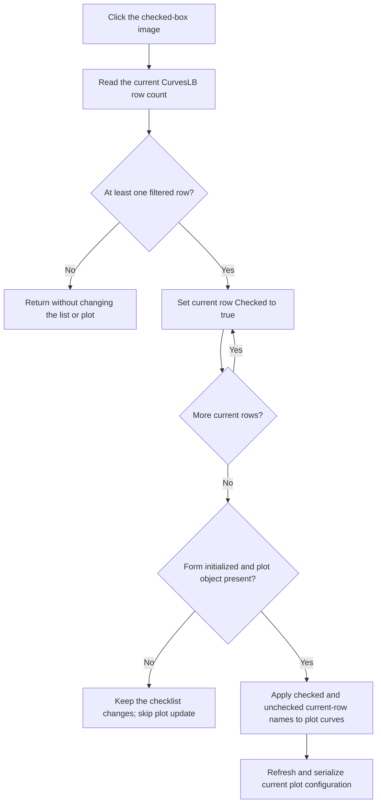

# Check all currently listed curves

> Analysis status: Evidence-backed source review complete.

## Control

| Property | Recovered value |
| --- | --- |
| Form | CurveListFrm (`Show/hide curves`) |
| Component path | CurveListFrm.CheckAllImg |
| Control class | TImage |
| Caption | Not present in the recovered resource. |
| Hint | `Check all curves` |
| Handler name | CheckAllImgClick |
| Handler address | 0135efa0 |
| Graph node | `resource:dfm:CurveListFrm/CurveListFrm.CheckAllImg` |
| Handler node | `function:0135efa0` |
| Graph layer | UI |

## What happens when clicked

The handler gets the number of rows in `CurvesLB`, the form's `TCheckListBox`. If at least one row exists, it walks from row zero to the last row and sets each row's checked state to true. It then calls the shared CurveList visibility synchronizer with its immediate-update flag set.

This command is one-way. It does not invert or toggle the rows. A row that is already checked stays checked. A second click therefore leaves all listed rows checked, although the handler still runs the shared plot synchronization when the list is not empty.

The checklist setter changes the row's check-state byte only when the requested state differs. It then invalidates that row for repaint. The click handler does not change the list's selected row, current index, scroll position, or text.

## Filter scope

`CurvesLB` contains the current filtered subset, not the complete backing curve catalog. The list-rebuild function clears the checklist, walks the catalog at form offset `+0x728`, applies the type check boxes and the text filter, and adds only matching curves. It restores a row's check mark when that curve is already present in the current plot.

Check All loops only over the rows that are currently in this filtered checklist. It does not walk the full catalog. The shared synchronizer also receives the current checklist items and the names of unchecked current rows. It adds or keeps the checked current rows in the plot and marks unchecked current rows as hidden. Curves that the filter excluded are not passed as checked or unchecked rows, so this command does not change their prior plot state.

## Plot update

After the row loop, the shared synchronizer builds a temporary list of unchecked current rows and applies the checked and unchecked names across the supported plot-curve categories. It then requests a main display refresh. Because Check All passes the update flag as true, the synchronizer also calls the routine that serializes the current plot and curve configuration. The recovered path does not establish whether that serialized state is written to a file at this point.

The form uses an initialization guard at offset `+0x748`. Form creation sets this guard, and FormShow clears it after it builds the list. The synchronizer also requires the global plot object. If the guard is still set or the plot object is absent, the checklist rows can become checked, but the plot synchronization is skipped.

## Click flow

## Empty, repeated, and error paths

- If the filtered checklist has zero rows, the handler does not call the row setter or the plot synchronizer.
- If all current rows are already checked, the setter does not rewrite or repaint those rows. The plot synchronizer still runs once.
- The handler has no local exception handler, transaction, or rollback. An exception from a row update, allocation, or plot helper propagates after any earlier row changes.
- A lower plot-insertion helper can reject a curve that is incompatible with a coordinate system. This call path suppresses that helper's optional compatibility message and continues the shared update.

## OK and Cancel

The row and plot changes are immediate. They are not staged until OK.

- `OKBtn` is a `bkClose` button. Its handler only calls the shared VCL form-close routine. It does not reapply or commit the curve checks.
- `CancelBtn` is a hidden `bkCancel` button, but its recovered click handler calls the same VCL close routine. It has no code that restores the old checks or plot state.
- FormClose clears the form's singleton pointer, releases its private objects, and selects the close action that releases the form. Closing the window does not undo a prior Check All operation.

## Image and resource evidence

The DFM stores a 586-byte embedded BMP in `Picture.Data`. The extractor converted it to this 13 by 13 PNG:

- [Check All glyph](../../../glyph/0055_CurveListFrm_CurveListFrm_CheckAllImg_Picture_Data.png)

The image shows a small checked box. Together with the `Check all curves` hint, it supports the one-way check direction. The handler's constant true argument and row loop prove the behavior and its scope.

## Source evidence

- Handler: [FUN_0135efa0](../../../DecompiledSources/Tina16/functions/000000000135EFA0__FUN_0135efa0.c)
- Checklist checked-state setter: [FUN_00821790](../../../DecompiledSources/Tina16/functions/0000000000821790__FUN_00821790.c)
- Shared CurveList synchronizer: [FUN_0135ed00](../../../DecompiledSources/Tina16/functions/000000000135ED00__FUN_0135ed00.c)
- Unchecked-current-row collector: [FUN_0135ea90](../../../DecompiledSources/Tina16/functions/000000000135EA90__FUN_0135ea90.c)
- Filtered-list rebuild: [FUN_0135e310](../../../DecompiledSources/Tina16/functions/000000000135E310__FUN_0135e310.c)
- Plot visibility application: [FUN_01ada5a0](../../../DecompiledSources/Tina16/functions/0000000001ADA5A0__FUN_01ada5a0.c)
- Unchecked-name application: [FUN_01ad1010](../../../DecompiledSources/Tina16/functions/0000000001AD1010__FUN_01ad1010.c)
- Checked-list row lookup: [FUN_01adb7a0](../../../DecompiledSources/Tina16/functions/0000000001ADB7A0__FUN_01adb7a0.c)
- OK close handler: [FUN_0135edc0](../../../DecompiledSources/Tina16/functions/000000000135EDC0__FUN_0135edc0.c)
- Cancel close handler: [FUN_0135ef80](../../../DecompiledSources/Tina16/functions/000000000135EF80__FUN_0135ef80.c)
- VCL close routine: [FUN_00805200](../../../DecompiledSources/Tina16/functions/0000000000805200__FUN_00805200.c)
- FormClose cleanup: [FUN_0135ef50](../../../DecompiledSources/Tina16/functions/000000000135EF50__FUN_0135ef50.c)

In `FUN_0135efa0`, form offset `+0x6b0` is `CurvesLB`. The handler reads its `Items.Count`, calls `FUN_00821790(CurvesLB, index, 1)` for each current row, and calls `FUN_0135ed00(form, 1)` once after the loop. The outer count test proves the empty-list no-op. No source statement reads the full catalog at `+0x728` or changes list selection.

## Direct calls

- `function:00821790` - Sets one checklist row's checked state and invalidates it when the state changes.
- `function:0135ed00` - Applies current CurveList check states to the plot, refreshes the display, and runs the flagged configuration update.

## Evidence limits

- The glyph confirms a check command, but the image alone does not establish the filtered-row scope.
- The plot code uses unrecovered curve-category objects. This document does not assign domain names to those categories.
- The plot-configuration routine serializes the current state, but the recovered click path does not prove its final storage destination.
