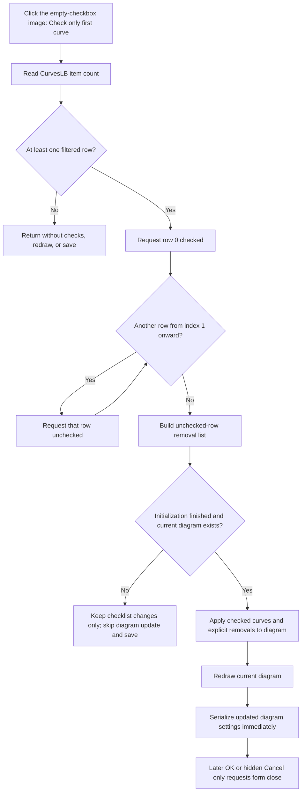

# Check only the first row in the filtered curve list

> Analysis status: Reviewed from recovered source, component-resource, glyph, and call-graph evidence.

## Control

| Property | Recovered value |
| --- | --- |
| Form | CurveListFrm |
| Form caption | Show/hide curves |
| Component path | CurveListFrm.CheckFirstImg |
| Control class | TImage |
| Hint | Check only first curve |
| Handler name | CheckFirstImgClick |
| Handler address | 0135f020 |
| Graph node | `resource:dfm:CurveListFrm/CurveListFrm.CheckFirstImg` |
| Handler node | `function:0135f020` |
| Graph layer | UI |

## What happens when clicked

`TCurveListFrm.CheckFirstImgClick` changes the checked state of the current `CurvesLB` rows to a fixed pattern:

- row `0` becomes checked;
- every row from `1` through `Count - 1` becomes unchecked.

This is not a toggle. Existing checks do not affect the requested result. The shared checklist setter first compares each current state, so a row is written and invalidated only when its check must change.

The handler does not change `CurvesLB.ItemIndex`, the highlighted row, the scroll position, or the order of the rows. “First” means checklist index `0`, not the currently selected row.

## Which curve is first

The form rebuilds `CurvesLB` from its master curve list when the form is shown and whenever a category checkbox or the text filter changes. It iterates the master list in order and adds only entries that pass the active category and text filters. Therefore, index `0` is the first curve in the current filtered list. It is not necessarily the first curve in the unfiltered master list.

The command changes only rows that are present in this filtered list. The synchronization path collects unchecked current rows as the explicit removal list and inserts checked current rows. Curves that the current filters omit are in neither list, so this command does not explicitly remove or re-check them. A user can therefore still have a filtered-out curve displayed while this command leaves only the first currently listed row checked among the visible filter results.

Filter changes can later rebuild the checklist again from the diagram's current displayed-curve state. Thus, changing filters after this click can expose other curves with their live checked state.

## Immediate diagram update

When `CurvesLB` contains at least one row, the handler always calls the shared CurveList synchronization routine after it applies the checkbox pattern. This happens even when row `0` was already the only checked current row.

The synchronization routine:

1. builds a keyed list of unchecked current rows;
2. synchronizes checked curves and explicit removals with the current diagram's coordinate systems;
3. redraws the current diagram window;
4. calls the diagram-settings writer, which serializes the updated diagram state, including its `AllCurves` entry.

The command is therefore immediate. It is not staged until OK.

## Click flow

## Guards and existing state

- If `CurvesLB.Count` is zero, the handler returns before it changes a row or calls synchronization. This is a complete no-op for the diagram and settings writer.
- With one row, it checks row `0`, skips the uncheck loop, and synchronizes.
- With multiple rows, all current rows after row `0` are unchecked, including a highlighted row elsewhere in the list.
- If the checklist already has the target pattern, individual setters skip redundant row writes, but the handler still synchronizes, redraws, and saves when its downstream guards pass.
- Form field `+0x748` is an initialization guard. `FormCreate` sets it, and `FormShow` clears it only after it initializes filters and rebuilds the list. If the click handler runs while this byte is set, the checklist pattern changes but diagram synchronization and saving are skipped.
- Synchronization is also skipped when the application has no current diagram at global application offset `+0x798`. The checklist pattern can still change in that case.

## OK, Cancel, and persistence

The click does not wait for either close button. Its normal synchronized path updates the diagram, redraws it, and invokes the diagram-settings writer before the user closes the form.

`OKBtnClick` and `CancelBtnClick` both call the same generic VCL close-request helper. Neither handler copies staged data, commits this checklist pattern, or restores the previous curve set. The DFM marks OK as `bkClose`. It marks Cancel as `bkCancel`, but also makes Cancel invisible. `FormClose` frees the form's helper lists and forces the close action; it contains no curve-state rollback.

Consequently, closing through OK does not perform an additional Check-first commit, and invoking the hidden Cancel path does not undo a successful immediate update.

## Image evidence

The control contains a 13-by-13 embedded BMP, extracted as [0056_CurveListFrm_CurveListFrm_CheckFirstImg_Picture_Data.png](../../../glyph/0056_CurveListFrm_CurveListFrm_CheckFirstImg_Picture_Data.png). It shows an empty blue checkbox outline. The adjacent `CheckAllImg` resource shows the same square with a check mark and has the hint `Check all curves`.

These paired images and hints explain the two shortcuts visually. The source, not the glyph alone, proves that this image checks only row `0` and clears the later current rows.

## Error and partial-state behavior

- The handler has no validation, confirmation, local exception handler, or rollback branch.
- A failure during the row loop can leave a partial checkbox pattern and prevent the synchronization call.
- The diagram update performs type and coordinate-system compatibility work for checked curves. The shared updater can skip an incompatible insertion; this click handler does not inspect a result or change the requested checklist check back.
- A failure after the checkbox loop can leave checklist state changed while diagram synchronization, redraw, or settings serialization is incomplete. No later OK action repairs or commits that partial state.
- The handler uses list bounds derived from the current item count, so its normal zero-, one-, and many-row branches do not request an out-of-range index.

## Handler evidence

- Primary handler: [FUN_0135f020](../../../DecompiledSources/Tina16/functions/000000000135F020__FUN_0135f020.c) guards on item count, checks index `0`, unchecks indexes `1..Count-1`, and calls the shared synchronization routine once.
- Checklist setter: [FUN_00821790](../../../DecompiledSources/Tina16/functions/0000000000821790__FUN_00821790.c) reads the current check, changes only a different state, and invalidates the affected item.
- Checked-state reader: [FUN_00821920](../../../DecompiledSources/Tina16/functions/0000000000821920__FUN_00821920.c) reads one checklist item's stored check byte.
- List rebuild and filter: [FUN_0135e310](../../../DecompiledSources/Tina16/functions/000000000135E310__FUN_0135e310.c) clears `CurvesLB`, scans the master list in order, applies category and text filters, appends matching rows, and restores checks from the live diagram.
- Unchecked-row collector: [FUN_0135ea90](../../../DecompiledSources/Tina16/functions/000000000135EA90__FUN_0135ea90.c) copies each unchecked current row and its curve object into the explicit removal list.
- Shared live synchronization: [FUN_0135ed00](../../../DecompiledSources/Tina16/functions/000000000135ED00__FUN_0135ed00.c) checks the initialization and current-diagram guards, applies the list to the diagram, redraws, and invokes the settings writer. Its canonical graph annotation belongs to a separate CurveList control task.
- Diagram updater: [FUN_01ada5a0](../../../DecompiledSources/Tina16/functions/0000000001ADA5A0__FUN_01ada5a0.c) partitions checked rows by curve category, updates coordinate systems, removes explicitly unchecked names, and refreshes diagram structures.
- Explicit removal: [FUN_01ad1010](../../../DecompiledSources/Tina16/functions/0000000001AD1010__FUN_01ad1010.c) passes the unchecked-row list to each coordinate system.
- Form show: [FUN_0135edf0](../../../DecompiledSources/Tina16/functions/000000000135EDF0__FUN_0135edf0.c) initializes filter controls, rebuilds `CurvesLB`, and then clears the initialization guard.
- Close handlers: [FUN_0135edc0](../../../DecompiledSources/Tina16/functions/000000000135EDC0__FUN_0135edc0.c) and [FUN_0135ef80](../../../DecompiledSources/Tina16/functions/000000000135EF80__FUN_0135ef80.c) both call the generic close helper.
- Recovered component tree: [ui-evidence.json](../../../DecompiledSources/Tina16/resources/dfm/ui-evidence.json) provides the form caption, hint, TImage type, event binding, checklist, filters, and button kinds.
- Glyph manifest: [manifest.json](../../../glyph/manifest.json) records the source BMP, extracted PNG, 13-by-13 dimensions, source byte count, and hash.
- Complexity: moderate; the graph records two distinct outgoing calls.

## Resource evidence

- The form caption is `Show/hide curves`.
- `CheckFirstImg` has no caption. Its direct text evidence is the hint `Check only first curve`.
- The control is a 13-by-13 auto-sized `TImage` anchored at the top right, next to `CheckAllImg`.
- `CurvesLB` is a `TCheckListBox`. Its runtime rebuild replaces the four design-time placeholder strings before normal interaction.
- The filter group contains category checks for nodal voltages, other voltages, currents, user-defined curves, measurements, and outputs, plus a text filter.

## Analysis limits

- The handler operates on the current list order. It does not identify a curve as semantically primary, selected, or preferred.
- The glyph confirms a checkbox shortcut but does not encode which row the source changes.
- The recovered source proves that the diagram-settings writer runs on the normal path. It does not establish a separate file path or user-visible save notification for this click.
- Shared helper annotations are intentionally omitted from this task to avoid conflicts with their canonical CurveList owners.
