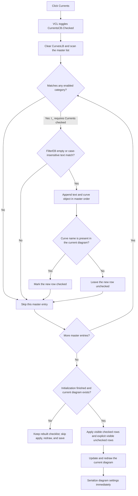

# Filter the curve checklist for currents

> Analysis status: Reviewed from recovered source, component-resource, and call-graph evidence.

## Control

| Property | Recovered value |
| --- | --- |
| Form | CurveListFrm |
| Form caption | Show/hide curves |
| Component path | CurveListFrm.FilterGB.CurrentsCB |
| Control class | TCheckBox |
| Caption | Currents |
| Hint | Not present in the recovered resource. |
| Handler name | FilterChanged |
| Handler address | 0135edd0 |
| Graph node | `resource:dfm:CurveListFrm/CurveListFrm.FilterGB.CurrentsCB` |
| Handler node | `function:0135edd0` |
| Graph layer | UI |

## What happens when clicked

The VCL changes `CurrentsCB.Checked` before it invokes `TCurveListFrm.FilterChanged`. The shared handler then performs two calls in order:

1. `FUN_0135e310` clears and rebuilds `CurvesLB` from the form's master curve list.
2. `FUN_0135ed00` synchronizes the rebuilt checklist with the current diagram, redraws it, and requests diagram-settings serialization.

For this control, a curve is a current-category match when its display name starts with `I_` and `CurrentsCB.Checked` is true. The source uses a one-based substring search and accepts `I_` only when its result is `1`. This is a prefix test, not a search for `I_` anywhere in the name.

Clearing `Currents` therefore removes `I_` rows from the checklist. Setting it adds matching `I_` rows back. The checkbox filters the rows that the user can manage; it does not directly uncheck or remove current curves that become hidden by this filter.

## Combination with the other filters

The category tests form a union. A master-list curve is eligible when it matches any enabled category:

- `Currents` accepts names that start with `I_`.
- `Nodal Voltages` accepts names whose first two UTF-16 characters are `VP`.
- `Other Voltages` accepts names that start with `V_`.
- `User defined`, `Outputs`, and `Measurement` use membership tests against recovered application curve groups.

A curve that matches more than one category stays eligible while at least one matching category is enabled. Thus, clearing `Currents` does not guarantee that an attached curve object cannot enter through a separate active object-category test.

The DFM marks `Currents`, `Nodal Voltages`, `Other Voltages`, `User defined`, and the hidden `Outputs` check box as initially checked. `Measurement` is initially clear. `FormShow` replaces relevant runtime states from application state before it performs the first rebuild, so the DFM default is not proof that `Currents` is always checked when the user opens the form.

## Text filter and list order

After a curve passes the category union, the rebuild reads `FilterEB.Text`:

- empty text accepts the category match;
- nonempty text requires a case-insensitive substring match in the curve's display text.

The text filter is not a wildcard or regular-expression parser. `FilterEB.OnKeyUp` reaches the same shared handler through `FUN_0135e210`, so a Currents click keeps the current text filter in effect.

Accepted entries are appended in master-list order. The row keeps the master entry's display text and attached curve object. The rebuild does not sort the result.

## Checked-state reconstruction

The rebuild clears all existing rows before it scans the master list. For each accepted curve, it searches a temporary list of curves that are currently present in the diagram. A name match checks the new row. This restores check marks by curve display name, not by the old visible row index.

The source has no matching restoration for the highlighted item, item index, or scroll position. Only the check marks have an explicit reconstruction path.

Filtered-out curves are absent from both the visible checked set and the visible unchecked set. The apply routine therefore does not explicitly remove them. This distinction lets a displayed current curve remain in the diagram while `Currents` is clear and its row is hidden. If the user enables `Currents` again, the rebuild can show that curve as checked because it reads the live diagram state.

## Immediate diagram update

After every shared filter rebuild, `FUN_0135ed00` calls the immediate CurveList synchronization path with its persistence flag set. On the normal path, it:

1. collects unchecked visible rows as explicit removal requests;
2. groups checked visible rows by the recovered curve categories and synchronizes them with the current diagram;
3. applies the explicit visible-row removals;
4. updates and redraws the diagram window;
5. invokes the diagram-settings writer, which serializes diagram state including the `AllCurves` entry.

The filter click is therefore not staged until OK. However, changing only `Currents` normally preserves the diagram's curve choices because rebuilt visible rows receive their checks from the same live diagram state, and hidden current rows are not removal requests. The downstream refresh and settings write can still run even when this filter change produces no curve-selection difference.

## Click flow

## Empty, guarded, and repeated cases

- If no category is active, or no eligible name passes the text filter, `CurvesLB` remains empty after the clear. There is no special empty-result message.
- An empty rebuilt list is not an early return from the handler. When the synchronization guards pass, the downstream refresh and settings writer can still run with empty visible checked and unchecked sets.
- Form field `+0x748` is an initialization guard. `FormCreate` sets it, and `FormShow` clears it after the initial filter setup and rebuild. If it is still set, `FUN_0135ed00` skips diagram synchronization, redraw, and serialization.
- Synchronization is also skipped when the application has no current diagram at global application offset `+0x798`.
- The handler does not compare the new filter state with an earlier value. A programmatic call with no state difference still rebuilds the list and reaches synchronization.

## OK, Cancel, and persistence

`OKBtnClick` and the hidden `CancelBtnClick` both call the same generic VCL close-request helper. Neither handler commits a staged filter result or restores the prior list or diagram state. The DFM gives OK kind `bkClose`; it gives the invisible Cancel button kind `bkCancel`.

`FormClose` destroys the form's private lists and forces the close action. It has no curve-filter rollback. Consequently, OK does not perform an extra Currents commit, and the hidden Cancel path does not undo a completed immediate synchronization or settings write.

## Error and partial-state behavior

- The handler has no confirmation, validation, local exception handler, status message, or rollback branch.
- `FUN_0135e310` clears the visible list before it scans the master list. A failure during that scan can leave a partially rebuilt list and prevent the apply call.
- A later failure can leave the filter state and rebuilt checklist in place while diagram synchronization, redraw, or settings serialization is incomplete.
- The downstream diagram updater performs curve-type and coordinate-system compatibility work. A checked curve can fail that deeper insertion path; the filter handler does not inspect a result or restore the previous checkbox and list state.

## Handler evidence

- Shared filter handler: [FUN_0135edd0](../../../DecompiledSources/Tina16/functions/000000000135EDD0__FUN_0135edd0.c) calls the rebuild and then the immediate synchronization routine.
- Filter rebuild: [FUN_0135e310](../../../DecompiledSources/Tina16/functions/000000000135E310__FUN_0135e310.c) clears the checklist, evaluates the category union, applies the text filter, appends master entries, and restores checks from current diagram curves.
- Text matching: [FUN_005b83d0](../../../DecompiledSources/Tina16/functions/00000000005B83D0__FUN_005b83d0.c) supplies the case-insensitive substring test used after category matching.
- Current diagram curve enumeration: [FUN_01ad0d80](../../../DecompiledSources/Tina16/functions/0000000001AD0D80__FUN_01ad0d80.c) collects curve names from the current diagram's coordinate systems for checked-state reconstruction.
- Immediate synchronization: [FUN_0135ed00](../../../DecompiledSources/Tina16/functions/000000000135ED00__FUN_0135ed00.c) checks the initialization and current-diagram guards, applies visible checklist state, redraws, and invokes the settings writer.
- Unchecked-row collector: [FUN_0135ea90](../../../DecompiledSources/Tina16/functions/000000000135EA90__FUN_0135ea90.c) copies only unchecked current rows into the explicit removal list. Its canonical graph annotation belongs to the CurveList checklist task.
- Diagram updater: [FUN_01ada5a0](../../../DecompiledSources/Tina16/functions/0000000001ADA5A0__FUN_01ada5a0.c) groups checked visible curves, synchronizes coordinate systems, applies explicit removals, and refreshes diagram structures.
- Form initialization: [FUN_0135edf0](../../../DecompiledSources/Tina16/functions/000000000135EDF0__FUN_0135edf0.c) initializes runtime filter state, rebuilds the list, and clears the update guard.
- Close cleanup: [FUN_0135ef50](../../../DecompiledSources/Tina16/functions/000000000135EF50__FUN_0135ef50.c) invokes [FUN_0135daa0](../../../DecompiledSources/Tina16/functions/000000000135DAA0__FUN_0135daa0.c) to destroy private lists and perform form cleanup; it does not roll back curve state.
- Close handlers: [FUN_0135edc0](../../../DecompiledSources/Tina16/functions/000000000135EDC0__FUN_0135edc0.c) and [FUN_0135ef80](../../../DecompiledSources/Tina16/functions/000000000135EF80__FUN_0135ef80.c) both call the generic close helper.
- Recovered component tree: [ui-evidence.json](../../../DecompiledSources/Tina16/resources/dfm/ui-evidence.json) supplies the form caption, checkbox captions and initial states, event bindings, text editor, checklist, and button kinds.
- Complexity: moderate; the graph records two distinct outgoing calls from `FUN_0135edd0`.

## Resource evidence

- The form caption is `Show/hide curves`.
- `CurrentsCB` has caption `Currents`, no hint, no text, and no image or glyph.
- The same `FilterChanged` handler serves `Nodal Voltages`, `Currents`, `Other Voltages`, `User defined`, `Outputs`, and `Measurement`.
- `Outputs` is hidden in the recovered resource. This does not change the shared handler's category-union logic.
- `FilterEB.OnKeyUp` calls the same rebuild path through its one-call wrapper.

## Analysis limits

- The `I_` prefix is direct recovered string and branch evidence. The recovered source does not provide a stronger domain name for each individual current curve.
- Object-group membership establishes the other category branches, but the recovered global pointers do not provide reliable Delphi field names.
- The filter has no direct glyph evidence. Its caption identifies the resource; the handler and rebuild source prove the behavior.
- The source proves that the settings writer runs on the normal path. It does not establish a separate file path or user-visible save notification for this click.
