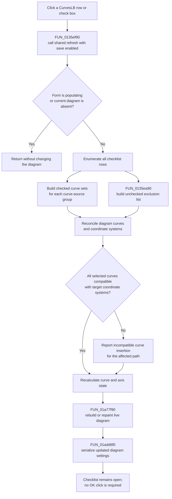

# Apply the curve check states to the live diagram

> Analysis status: Complete. The recovered click handler, checklist rebuild, checked and unchecked list builders, diagram reconciler, redraw path, and configuration writer agree on this behavior.

## Control

| Property | Recovered value |
| --- | --- |
| Form | CurveListFrm (`Show/hide curves`) |
| Component path | CurveListFrm.CurvesLB |
| Control class | TCheckListBox |
| Caption | Not present in the recovered resource. |
| Nearby label | `Curves:` |
| Hint or image | Not present in the recovered resource. |
| Handler name | CurvesLBClick |
| Handler address | 0135ef90 |
| Graph node | `resource:dfm:CurveListFrm/CurveListFrm.CurvesLB` |
| Handler node | `function:0135ef90` |
| Graph layer | UI |

## What happens when clicked

`CurvesLBClick` applies the complete state of the currently visible checklist rows to the current diagram. The handler does not toggle one row itself. It calls the shared curve-list refresh routine with its persistence flag enabled. That routine reads all checked visible rows for the curves that must remain in the diagram and uses `FUN_0135ea90` to collect all unchecked visible rows as an exclusion list. It then reconciles the diagram's curve collections, recalculates its curve and axis state, redraws the diagram window, and serializes the updated diagram configuration. Curves omitted by the current category or text filter are in neither set and are left unchanged.

The effect is immediate. It is not a staged choice that waits for **OK**. A checked row represents a curve that is shown in the diagram; an unchecked row represents a curve that is removed or hidden by the reconciliation path. This mapping is established by the form rebuild: `FUN_0135e310` reads the names of curves that are currently present in the diagram and checks the matching list rows. The image actions reinforce the mapping: **Check all curves** checks every row, while **Check only first curve** checks row zero and clears the other checks before they call the same refresh routine.

## Selection and check behavior

The native `TCheckListBox` updates its current row and check state before the application handler processes the resulting click. `FUN_0135ef90` does not read `ItemIndex`, mouse coordinates, or one selected object. The shared path enumerates the whole list and its check states.

Consequences of this design are:

- Clicking a checkbox applies the new shown or hidden state for all currently visible rows. Filtered-out curves are not explicit changes.
- A click that changes only the highlighted row, without changing a check, still calls the same refresh and save path.
- No current row is required. A direct handler call with `ItemIndex = -1` still uses all existing checks.
- An empty checklist still enters the shared refresh when the form is active and a diagram exists. Its checked and unchecked visible-row sets are empty, so it makes no explicit curve-selection change; the redraw and serialization path can still run.
- The handler does not force the clicked row to checked or unchecked. Keyboard and mouse behavior for changing the check mark belongs to the VCL control.

## Diagram refresh and visible feedback

The shared routine updates eight recovered curve-source groups. For each group, it derives the checked curve objects that belong to that source, reconciles them with the current diagram, applies the unchecked-name list, recalculates curve and coordinate-system state, and requests a diagram rebuild. It then calls `FUN_01a77f90` for the diagram window, which rebuilds or repaints the live diagram surface.

There is no status label, preview pane, hint update, selection summary, or success message in `CurveListFrm`. The changed live diagram is the visible feedback. The control itself has no recovered hint or glyph. Its only nearby label is **Curves:**.

The deeper insertion path can produce an incompatibility message when a selected curve cannot be inserted into the current coordinate system. The recovered text ends with `Please select another diagram!`. The click handler has no local error label or focus movement after this message.

## Click flow

## Handler and call-path evidence

- Click handler: [FUN_0135ef90](../../../DecompiledSources/Tina16/functions/000000000135EF90__FUN_0135ef90.c)
- Shared checklist-to-diagram refresh: [FUN_0135ed00](../../../DecompiledSources/Tina16/functions/000000000135ED00__FUN_0135ed00.c)
- Unchecked-curve list builder: [FUN_0135ea90](../../../DecompiledSources/Tina16/functions/000000000135EA90__FUN_0135ea90.c)
- Filtered checklist rebuild: [FUN_0135e310](../../../DecompiledSources/Tina16/functions/000000000135E310__FUN_0135e310.c)
- Checked-curve subset builder: [FUN_0135eb90](../../../DecompiledSources/Tina16/functions/000000000135EB90__FUN_0135eb90.c)
- Diagram curve reconciliation: [FUN_01ada5a0](../../../DecompiledSources/Tina16/functions/0000000001ADA5A0__FUN_01ada5a0.c)
- Curve insertion and compatibility path: [FUN_01adb8e0](../../../DecompiledSources/Tina16/functions/0000000001ADB8E0__FUN_01adb8e0.c)
- Current diagram-curve name collector: [FUN_01ad0d80](../../../DecompiledSources/Tina16/functions/0000000001AD0D80__FUN_01ad0d80.c)
- Diagram-window redraw path: [FUN_01a77f90](../../../DecompiledSources/Tina16/functions/0000000001A77F90__FUN_01a77f90.c)
- Diagram configuration writer: [FUN_01add6f0](../../../DecompiledSources/Tina16/functions/0000000001ADD6F0__FUN_01add6f0.c)
- Check-all action: [FUN_0135efa0](../../../DecompiledSources/Tina16/functions/000000000135EFA0__FUN_0135efa0.c)
- Check-first action: [FUN_0135f020](../../../DecompiledSources/Tina16/functions/000000000135F020__FUN_0135f020.c)
- OK close handler: [FUN_0135edc0](../../../DecompiledSources/Tina16/functions/000000000135EDC0__FUN_0135edc0.c)
- Cancel close handler: [FUN_0135ef80](../../../DecompiledSources/Tina16/functions/000000000135EF80__FUN_0135ef80.c)

`FUN_0135ef90` contains only `FUN_0135ed00(form, 1)` and a return. The second argument enables the configuration-write call after the diagram update. The shared function skips all work while form field `+0x748` is nonzero or when the global current-diagram pointer is null.

`FUN_0135ea90` loops from zero to `CurvesLB.Items.Count - 1`. For each row whose recovered Checked getter returns false, it reads the row text and associated `Items.Objects` pointer and adds both to the supplied string list. It does not change the row, selected index, or curve object.

## Direct calls

- `function:0135ed00` - Applies all checklist states to the current diagram, redraws it, and writes the changed diagram configuration when requested.

## Filter rebuild and state preservation

`FUN_0135e310` rebuilds `CurvesLB` when the category checkboxes or text filter change and when the form is shown. It clears the current UI list, iterates a form-owned master list at `+0x728`, applies the category and text filters, and adds matching text and object references to `CurvesLB.Items`.

Before it assigns checks, the rebuild asks the current diagram for the names of curves that are already present. Each newly added row is checked when its name is in that diagram list. Therefore, rows that remain after a filter rebuild preserve their shown state by name. The rebuild does not copy or restore `ItemIndex`, the highlighted row, scroll position, or keyboard focus. Filtered-out rows are absent from both the visible checked set and the visible unchecked exclusion set, so the next shared reconciliation leaves them unchanged. If a row becomes visible again, its check is reconstructed from the live diagram by name.

The four design-time list values `elso`, `masodik`, `harmadik`, and `negyedik` are placeholders. The rebuild clears them before it adds live curve names. They are not evidence of curve identities at run time.

## Object ownership

The checklist stores an object reference beside each live curve name. The rebuild copies those references from the master list into `CurvesLB.Items`; it does not clone the curve objects. A normal click reads these references but does not free, replace, or transfer ownership of them.

Form close destroys the form-owned list containers at `+0x728`, `+0x730`, `+0x738`, and `+0x740`. The plotted curve objects remain associated with the global analysis and diagram collections. The recovered code does not prove that `CurvesLB.Items` owns the referenced objects, and the click path contains no object destructor.

## OK, Cancel, and persistence boundary

- **OK** is a `bkClose` button. Its handler calls the common VCL close routine and performs no additional curve commit.
- The recovered **Cancel** button is `bkCancel` but has `Visible = false`. Its handler calls the same close routine as OK. It has no rollback path.
- A checklist click already changes the live diagram and calls `FUN_01add6f0`. Closing through OK, the hidden Cancel button, the window close action, or another route does not undo that click.
- The configuration writer serializes the current curve list, coordinate systems, axes, and figure settings. It uses `DiagOpt.tmp` as temporary configuration storage and imports the result into the owning diagram or analysis configuration object. This occurs during the click refresh, not during OK.

## No-op, error, and partial-update cases

- During form creation and initial list population, field `+0x748` is set. A click or callback that reaches the shared refresh in this state is ignored.
- If the global current-diagram pointer is null, the shared refresh returns without allocating its temporary list, changing the diagram, redrawing, or saving.
- A missing current row is not an error because the handler does not use `ItemIndex`.
- Repeated clicks with unchanged checks still repeat reconciliation, redraw, and serialization. There is no unchanged-state comparison in the handler.
- Incompatible curves can be skipped or reported by the deeper coordinate-system insertion path. The handler does not restore the prior checklist or diagram after that report.
- The update is not transactional. Curve reconciliation occurs before redraw and serialization. An exception or allocation, collection, rendering, or configuration-write failure can therefore leave part of the live diagram update applied. There is no local catch, retry, or rollback in `FUN_0135ef90` or `FUN_0135ed00`.

## Resource evidence and limits

- The form caption is **Show/hide curves** and the checklist's direct label is **Curves:**.
- The checklist has no hint, action, image reference, extracted glyph, initial checked-state property, or modal result.
- **Check all curves** and **Check only first curve** are direct hints on the two sibling image controls. Their source confirms the exact check-state changes before the shared refresh.
- Function and field names for the current diagram, curve-source groups, and master curve list are not recovered. Their roles follow from form initialization, filter rebuilding, checklist object references, diagram reconciliation, redraw, and serialized `AllCurves` data.
- The recovered C does not prove the exact final message-box caption for an incompatible curve or the visual row that retains keyboard focus after a click.
