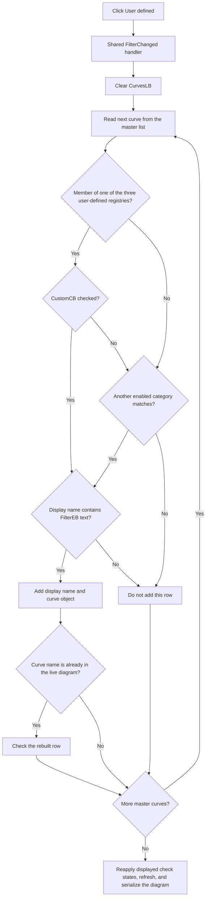

# User defined

> Analysis status: Reviewed from recovered source, form-resource, registry-membership, and live-plot synchronization evidence.

## Control

| Property | Recovered value |
| --- | --- |
| Form | CurveListFrm |
| Form caption | Show/hide curves |
| Component path | CurveListFrm.FilterGB.CustomCB |
| Control class | TCheckBox |
| Group caption | Show |
| Caption | User defined |
| Initial checked state | True (`cbChecked`) |
| Hint | Not present in the recovered resource. |
| Handler name | FilterChanged |
| Handler address | 0135edd0 |
| Graph node | `resource:dfm:CurveListFrm/CurveListFrm.FilterGB.CustomCB` |
| Handler node | `function:0135edd0` |
| Graph layer | UI |

## What happens when clicked

`CustomCB` controls whether the curve check list admits members of the recovered user-defined category. The common `FilterChanged` handler rebuilds `CurvesLB` and then synchronizes the rebuilt check states with the live diagram.

The user-defined category is not inferred from the caption alone. The rebuild tests each master curve object against three application-wide registry objects at `PTR_DAT_02005188`, `PTR_DAT_02004fb8`, and `PTR_DAT_02003118`. `CustomCB.Checked` gates the union of those three memberships. The first two membership tests appear twice in the recovered control flow, but the repeated tests do not add a fourth category.

- When checked, membership in any of the three registries can admit a curve.
- When clear, those three membership tests cannot admit it.
- A curve can still appear when another enabled category matches it. The category checkboxes are combined as an OR union, not as an intersection.

The click does not add or remove an object from a registry. It changes only which master curves are shown in this form's check list.

## Master list, name filter, and rebuild order

The form's master list at `+0x728` is populated before the form opens. `FUN_00f1e090` combines the available application curve registries into a temporary collection, and `FUN_0135e230` copies the display names and attached curve-object references into this form-owned master list.

On each filter change, the rebuild:

1. clears all rows from `CurvesLB`;
2. scans the complete master list in its existing order;
3. admits a curve when any enabled category matches;
4. reads `FilterEB`;
5. if the filter text is nonempty, uppercases both strings and requires the filter to occur in the curve display name;
6. appends the accepted display name and its original curve-object reference to `CurvesLB`.

`CustomCB` therefore combines with all other category checkboxes and the optional case-insensitive substring filter. It does not bypass `FilterEB`.

## Checked-state and selection preservation

Rebuilding the rows does not preserve list state by row index. After it adds one accepted curve, the code reads the curves that are already present in the live diagram, searches that temporary name list for the new row's display name, and checks the row when it finds a match.

This preserves visible-curve check marks by display name across category changes. It does not preserve the current row, focus, keyboard anchor, top row, scroll position, or an object-identity selection. Duplicate display names cannot be distinguished by this name-based check restoration.

After the rebuild, `FUN_0135ed00(form, true)` collects the unchecked rows, reapplies the displayed checked and unchecked sets to the diagram registries, refreshes the graph, and serializes the current diagram configuration. Because the row check marks were reconstructed from the live diagram, a normal category-only click replays the existing show/hide state. A curve that disappears only because it fails the filter is not put in the unchecked-row list, so the source does not show the category toggle hiding that curve in the diagram.

## Empty and unchanged results

The rebuilt list can be empty when:

- all category checkboxes are clear;
- the three user-defined registries are absent or contain no master-list object;
- `CustomCB` is the only matching category and it is clear; or
- `FilterEB` rejects every admitted display name.

An empty result is accepted silently. The handler still runs the synchronization and refresh route. It does not show an error or automatically re-enable a category.

There is no application-level unchanged-state guard. If VCL delivers the event without a changed Boolean, the form still clears, scans, rebuilds, restores checks, and refreshes. The final rows can be identical to the initial rows.

## OK, Cancel, and persistence

This form is a live show/hide editor, not a staged modal transaction:

- `CurvesLB` check changes call the same synchronization route immediately. The route writes the current diagram configuration, including its curve and coordinate-system data.
- The category checkboxes are view filters. Their states are not written to the curve registries or a recovered settings object.
- `FormShow` explicitly checks `CustomCB` each time this form is shown.
- The visible `OKBtn` has built-in kind `bkClose`; its handler only calls the common form-close routine.
- `CancelBtn` is hidden by the resource. Its handler calls the same close routine and has no rollback path.
- `FormClose` frees the form-owned collections and requests form destruction.

Closing with OK or the hidden Cancel therefore does not commit or discard the Custom filter. The filter has already affected only the list view, while any separate curve check-state changes have already been applied live and are not rolled back.

## Click flow

## Handler evidence

- Shared event handler: [FUN_0135edd0](../../../DecompiledSources/Tina16/functions/000000000135EDD0__FUN_0135edd0.c) calls the rebuild and then the live synchronization route with a true refresh argument.
- List rebuild: [FUN_0135e310](../../../DecompiledSources/Tina16/functions/000000000135E310__FUN_0135e310.c) clears `CurvesLB`, applies all category gates, tests the three Custom registries through `CustomCB`, applies `FilterEB`, adds accepted objects, and restores checks from the live-curve name list.
- Live synchronization: [FUN_0135ed00](../../../DecompiledSources/Tina16/functions/000000000135ED00__FUN_0135ed00.c) skips work during guarded initialization or without an active diagram; otherwise it collects unchecked rows, applies the visible check states, refreshes the graph, and selects diagram serialization because the caller passes true.
- Master-registry union: [FUN_00f1e090](../../../DecompiledSources/Tina16/functions/0000000000F1E090__FUN_00f1e090.c) combines the available registry collections used to build the form's master curve list.
- Master-list copy: [FUN_0135e230](../../../DecompiledSources/Tina16/functions/000000000135E230__FUN_0135e230.c) copies curve names and attached object references into the form-owned master list.
- Registry membership: [FUN_00f1e290](../../../DecompiledSources/Tina16/functions/0000000000F1E290__FUN_00f1e290.c) tests whether a curve object occurs in one registry.
- Text match: [FUN_005b83d0](../../../DecompiledSources/Tina16/functions/00000000005B83D0__FUN_005b83d0.c) normalizes both strings to uppercase and performs the substring search.
- Check restoration: [FUN_01ad0d80](../../../DecompiledSources/Tina16/functions/0000000001AD0D80__FUN_01ad0d80.c) gathers curve names from the live diagram for the rebuild's name-based check lookup.
- Diagram serialization: [FUN_01add6f0](../../../DecompiledSources/Tina16/functions/0000000001ADD6F0__FUN_01add6f0.c) writes the current `AllCurves`, coordinate-system, axis, and figure configuration. It does not read the category checkboxes.
- Form initialization: [FUN_0135edf0](../../../DecompiledSources/Tina16/functions/000000000135EDF0__FUN_0135edf0.c) checks and enables `CustomCB`, builds the initial list, and ends the synchronization guard.
- Close handlers: [FUN_0135edc0](../../../DecompiledSources/Tina16/functions/000000000135EDC0__FUN_0135edc0.c) and [FUN_0135ef80](../../../DecompiledSources/Tina16/functions/000000000135EF80__FUN_0135ef80.c) both call the same VCL close route.
- Complexity: moderate; the shared handler has two distinct outgoing calls.

## Resource evidence

- The checkbox caption is `User defined`, and the DFM initializes it as checked.
- It is in the `Show` group with `Nodal Voltages`, `Other Voltages`, `Currents`, `Measurement`, and a hidden `Outputs` filter.
- `FilterEB` is in the same group and has a key-up event that delegates to the same filter handler.
- `CurvesLB` is a `TCheckListBox`; its checked state controls the live curve visibility independently of this category filter.
- This checkbox has no hint, action, image reference, or extracted glyph.

## No-op, error, and partial-state behavior

- The synchronization helper is a no-op while the form's initialization guard at `+0x748` is set or when no active diagram object exists. The list rebuild still occurs before that guard is tested.
- A category-only click normally restores and reapplies the current live checked state. It can therefore perform a full rebuild, refresh, and diagram serialization with no final curve-visibility change.
- There is no local exception handler or rollback. The list is cleared before the master scan. A string, registry, allocation, or VCL exception can leave a partially rebuilt list.
- If rebuilding fails before synchronization, the live diagram remains unchanged by this handler. If synchronization fails after it starts, the source provides no transaction or rollback for a partial live update.

## Analysis limits

- The three user-defined registry objects do not have recovered Delphi class or field names. Their shared `CustomCB` gate and the parallel Add Curve implementation establish their category role.
- Checked rows are restored by display name. The source does not establish unique display names.
- The source proves that filtered-out curves are not collected as unchecked rows. It does not expose every side effect inside the downstream diagram refresh implementation.
