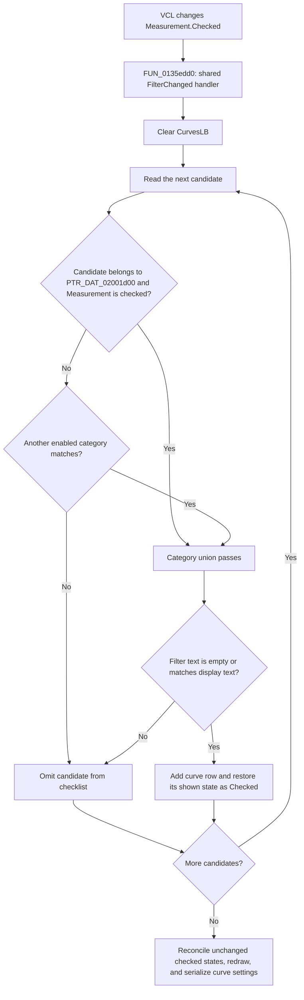

# Measurement

> Analysis status: Evidence-backed source review complete.

## Control

| Property | Recovered value |
| --- | --- |
| Form | CurveListFrm |
| Form caption | Show/hide curves |
| Component path | CurveListFrm.FilterGB.MeasCB |
| Control class | TCheckBox |
| Caption | Measurement |
| Hint | Not present in the recovered resource. |
| Handler name | FilterChanged |
| Handler address | 0135edd0 |
| Graph node | `resource:dfm:CurveListFrm/CurveListFrm.FilterGB.MeasCB` |
| Handler node | `function:0135edd0` |
| Graph layer | UI |

## What happens when clicked

This checkbox controls the measurement category in the **Show/hide curves** list filter. Delphi changes `MeasCB.Checked` before it calls the shared `FilterChanged` handler. The handler does not toggle the control itself and does not identify which of the six category checkboxes sent the event.

`FUN_0135edd0` first calls `FUN_0135e310`, which clears `CurvesLB` and scans the form's complete curve-candidate list at `+0x728`. The recovered form-field order maps `MeasCB` to `+0x700`. For each candidate:

1. Membership in the collection referenced by `PTR_DAT_02001d00` passes the measurement branch only when `MeasCB.Checked` is true.
2. The category tests form an inclusive union. A candidate that also matches another enabled category can remain in the list when **Measurement** is cleared.
3. A candidate that passes a category must also pass `FilterEB` at `+0x720`. Empty filter text accepts it. Non-empty text must occur in the display string under the recovered case-insensitive match.
4. The function adds the accepted display string and its associated curve object to `CurvesLB` at `+0x6b0`.
5. It reconstructs the row's checked state from the current diagram's curve set. A curve that is already shown becomes checked. A candidate that is not shown becomes unchecked.

Therefore, checking **Measurement** makes eligible measurement candidates available in the checklist. Clearing it removes candidates that depend only on the measurement branch. It does not delete curve objects.

## Union and exclusion rules

| Rule | Proven result |
| --- | --- |
| Measurement membership and checkbox checked | The candidate passes the measurement category branch. |
| Measurement checkbox cleared | Measurement membership alone does not pass. Another enabled category can still include the same candidate. |
| No enabled category matches | The candidate is omitted. |
| Non-empty text does not match | The candidate is omitted after the category union passes. |
| Candidate is currently shown | An accepted row is rebuilt as checked. |
| Candidate is currently hidden | An accepted row is rebuilt as unchecked. |
| Candidate is excluded by the filters | It has no row and is not put in the explicit removal list. Its existing shown/hidden model state is preserved. |

The original Delphi name of the measurement collection is not recovered. Its repeated use by this form and the Add Curve form proves the category source, but not a more specific domain name.

## Click flow

## Live visibility, selection, and persistence

- A filter click is not a show/hide command. The rebuild gets each accepted row's checked value from the current diagram before the shared apply function runs.
- A shown curve that becomes filtered out is absent from both the checked-row input and the explicit unchecked-row removal list. The reconciliation path therefore preserves it in the diagram.
- An accepted curve that was hidden is rebuilt unchecked and remains hidden. An accepted curve that was shown is rebuilt checked and remains shown.
- The rebuild replaces the checklist items. It does not save or restore a highlighted `ItemIndex`; the source proves only the restored check states.
- After every filter click, `FUN_0135ed00` calls the live curve reconciliation with persistence requested. When the form is initialized and a current diagram exists, that path updates the diagram, requests a redraw, and serializes the current curve settings.
- The category checkbox state itself is not serialized by this handler. `FormShow` resets `MeasCB.Enabled` and `MeasCB.Checked` from the global `SaveAllAnalResults` setting. If that setting is false, Measurement starts disabled and unchecked; if true, it starts enabled and checked.
- The visible **Close** button and the hidden **Cancel** button both only request form close. They do not roll back a filter click or any live checklist changes. There is no later OK/Cancel commit boundary.

## No-op and error boundaries

- There is no unchanged-state guard. A click rebuilds the checklist even if the resulting candidate set is the same.
- An empty candidate list produces an empty checklist without a measurement-specific error.
- `FUN_0135ed00` skips model reconciliation, redraw, and serialization while the form initialization flag at `+0x748` is set or when no current diagram is available. The checklist rebuild still occurs.
- The shared reconciliation can report that selected curves cannot be inserted into the current coordinate system. The Measurement handler has no separate error message, exception handler, or rollback.
- Because a filter-only rebuild replays the current shown states, it normally does not introduce a new curve that could cause that compatibility error.

## Handler evidence

- Shared click handler: [FUN_0135edd0](../../../DecompiledSources/Tina16/functions/000000000135EDD0__FUN_0135edd0.c)
- Checklist rebuild: [FUN_0135e310](../../../DecompiledSources/Tina16/functions/000000000135E310__FUN_0135e310.c)
- Live apply guard: [FUN_0135ed00](../../../DecompiledSources/Tina16/functions/000000000135ED00__FUN_0135ed00.c)
- Unchecked-row collection: [FUN_0135ea90](../../../DecompiledSources/Tina16/functions/000000000135EA90__FUN_0135ea90.c)
- Form-show initialization: [FUN_0135edf0](../../../DecompiledSources/Tina16/functions/000000000135EDF0__FUN_0135edf0.c)
- Curve reconciliation: [FUN_01ada5a0](../../../DecompiledSources/Tina16/functions/0000000001ADA5A0__FUN_01ada5a0.c)
- Current shown-curve snapshot: [FUN_01ad0d80](../../../DecompiledSources/Tina16/functions/0000000001AD0D80__FUN_01ad0d80.c)
- Settings serialization: [FUN_01add6f0](../../../DecompiledSources/Tina16/functions/0000000001ADD6F0__FUN_01add6f0.c)
- UI resource evidence: [ui-evidence.json](../../../DecompiledSources/Tina16/resources/dfm/ui-evidence.json)
- Handler complexity: moderate; two distinct outgoing calls.

The shared function annotations are owned by the coordinated CurveList tasks: `TIARA-diz.6.7.232` owns `FUN_0135edd0`, `FUN_0135e310`, and `FUN_0135ed00`; `TIARA-diz.6.7.231` owns `FUN_0135ea90`.

## Resource evidence

- The direct caption is **Measurement**. The checkbox is in the **Show** group with five other category controls and the text filter.
- The DFM does not set a static checked state. The form-show source supplies the effective state from `SaveAllAnalResults`.
- The checklist is labeled **Curves:**. Its check marks represent the current diagram's shown curves.
- The control has no hint, image reference, glyph, action binding, or nearby same-parent label.

## Analysis limits

- Recovered object fields do not retain their original Delphi names. The DFM field order and source access establish the component offsets used here.
- The filter code proves membership in the collection at `PTR_DAT_02001d00`. It does not expose the collection's original identifier or how each candidate acquired that membership.
- The shared reconciliation has many downstream drawing and serialization effects. This article limits its claims to the state flow that the Measurement click reaches and does not rename those shared functions.
