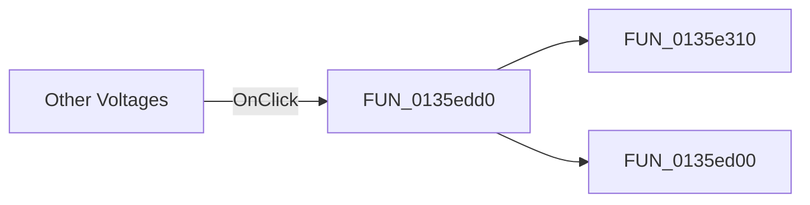

# Other Voltages

> Analysis status: Pending individual source review.

## Control

| Property | Recovered value |
| --- | --- |
| Form | CurveListFrm |
| Component path | CurveListFrm.FilterGB.OtherVCB |
| Control class | TCheckBox |
| Caption | Other Voltages |
| Hint | Not present in the recovered resource. |
| Text | Not present in the recovered resource. |
| Handler name | FilterChanged |
| Handler address | 0135edd0 |
| Graph node | `resource:dfm:CurveListFrm/CurveListFrm.FilterGB.OtherVCB` |
| Handler node | `function:0135edd0` |
| Graph layer | UI |

## What happens when clicked

Pending individual analysis. An agent must read the recovered handler source and its relevant callees before it replaces this text.

## Click flow

## Handler evidence

- Source: [DecompiledSources/Tina16/functions/000000000135EDD0__FUN_0135edd0.c](../../../DecompiledSources/Tina16/functions/000000000135EDD0__FUN_0135edd0.c)
- Recovered role: Not present in the recovered resource.
- Current graph summary: Handles 6 Delphi UI events: CurveListFrm.FilterGB.VoltagesCB.OnClick, CurveListFrm.FilterGB.CurrentsCB.OnClick, CurveListFrm.FilterGB.OtherVCB.OnClick.
- Current graph behavior: Not present in the recovered resource.
- Current graph evidence: Not present in the recovered resource.
- Complexity: moderate
- Distinct outgoing calls: 2

## Direct calls

- `function:0135e310` — FUN_0135e310
- `function:0135ed00` — FUN_0135ed00

## Resource evidence

- Kind: Not present in the recovered resource.
- Modal result: Not present in the recovered resource.
- Checked state: true
- List items: Not present in the recovered resource.
- Image reference: Not present in the recovered resource.
- Extracted glyph: None.

## Nearby label candidates

Nearby labels are layout candidates only. They are not proof of behavior.

- No same-parent label candidate is available.

## Analysis limits

- Do not infer behavior from the control class, caption, hint, glyph, or nearby label alone.
- Do not replace the pending status until the handler source and relevant call path provide enough evidence.
