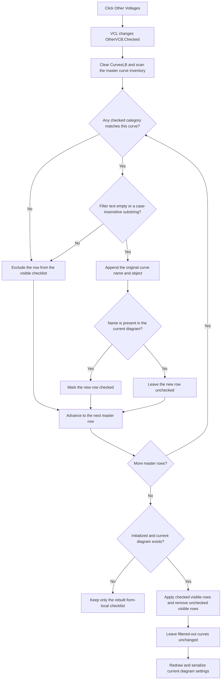

# Other Voltages

> Analysis status: Source reviewed.

## Control

| Property | Recovered value |
| --- | --- |
| Form | CurveListFrm |
| Component path | CurveListFrm.FilterGB.OtherVCB |
| Control class | TCheckBox |
| Caption | Other Voltages |
| Hint | Not present in the recovered resource. |
| Text | Not present in the recovered resource. |
| Handler name | FilterChanged |
| Handler address | 0135edd0 |
| Graph node | `resource:dfm:CurveListFrm/CurveListFrm.FilterGB.OtherVCB` |
| Handler node | `function:0135edd0` |
| Graph layer | UI |

## What happens when clicked

`Other Voltages` controls one category in the modeless `Show/hide curves` form. The VCL changes this checkbox's `Checked` state before it calls the shared `FilterChanged` handler. The recovered DFM gives the checkbox an initial checked state. FormShow can override that state: it sets both this checkbox's enabled state and checked state from one application flag before it builds the first visible list.

The category has an exact name-based definition. The form opener builds an available-curve inventory from the active analysis and diagram curve groups. `FUN_0135e230` copies each inventory string and its associated curve object into the form's private master list at offset `0x728`, in the original order. During filtering, a master row matches `Other Voltages` when the recovered case-sensitive search finds the uppercase literal `V_` at one-based position 1 in its display name. In other words, the display name must start with `V_`. Nodal voltages are a separate category whose names start with `VP`. Object-group tests define Outputs, Measurement, and User defined; they do not define this `Other Voltages` branch.

The six category checkboxes form an OR union. A curve is included when any enabled category test matches. Therefore, clearing `Other Voltages` removes the `V_` name rule from the union; it is not a hard exclusion. A `V_` curve that also belongs to another checked object-based category can remain in the list. Checking `Other Voltages` includes every `V_` row that also passes the text filter. The `FilterEB` text is an additional AND condition. Empty text accepts every category match. Non-empty text uses an uppercase copy of both strings and tests for a substring, so this part is case-insensitive.

The shared refresh clears `CurvesLB` and scans the complete master list. It appends each accepted row with its original display string and curve object. This keeps master-list order, but it does not restore the highlighted row, item index, or scroll position. For each accepted row, it enumerates the curves that are already present in the current diagram and checks the new row when its display name is present. Thus, filtering reconstructs checked states from live diagram state; it does not carry check marks by list index.

After the rebuild, `FilterChanged` calls the guarded live synchronization path. That path collects only unchecked rows that remain visible. It adds or retains checked visible rows, submits those unchecked visible rows as explicit removals, updates and redraws the current diagram, and writes the diagram settings because the handler passes `true`.

Rows excluded by the category or text filter are not in either visible set. They are not explicit removal requests. As a result, clearing `Other Voltages` does not by itself hide already plotted `V_` curves; it hides their rows from `CurvesLB`. A visible plotted row is reconstructed as checked and reapplied as visible. A visible unplotted row is reconstructed as unchecked and reapplied as absent. In the normal successful path, a category-only click therefore preserves plot visibility while it rebuilds the selection list, refreshes the diagram structures, redraws, and serializes the current diagram configuration.

There are two synchronization no-op guards. The diagram update returns when the form's initialization byte at offset `0x748` is set or when there is no current diagram object. The checklist rebuild still occurs. An empty master inventory or a category union with no matches leaves `CurvesLB` empty. It does not request that all plotted curves be hidden. A click can also have no membership effect when there are no `V_` rows or when every such row is still admitted through another checked category. The list is still cleared and rebuilt, so its selection can still be lost.

This form has no deferred OK commit for the filter. Its visible OK button only requests form closure. The hidden Cancel button uses the same close request and does not restore prior diagram visibility or filter state. FormClose frees the modeless form and its private inventories. A later open creates a new form and FormShow initializes the category controls again, so `Other Voltages.Checked` is not a saved user preference. The live diagram configuration written by the synchronization path is outside that form-local boundary.

The handler, list rebuild, and synchronization path have no local exception handler. A failure during list clearing or insertion can leave a partial visible list. A later failure during diagram synchronization, redraw, or settings output can leave the list rebuilt while only part of the external update has completed. The recovered code has no rollback.

## Click flow

## Handler evidence

- Shared event handler: [FUN_0135edd0](../../../DecompiledSources/Tina16/functions/000000000135EDD0__FUN_0135edd0.c)
- Filtered checklist rebuild: [FUN_0135e310](../../../DecompiledSources/Tina16/functions/000000000135E310__FUN_0135e310.c)
- Master-list copy: [FUN_0135e230](../../../DecompiledSources/Tina16/functions/000000000135E230__FUN_0135e230.c)
- Form opener and inventory source: [FUN_01a8aa10](../../../DecompiledSources/Tina16/functions/0000000001A8AA10__FUN_01a8aa10.c)
- Available-curve inventory builder: [FUN_00f1e090](../../../DecompiledSources/Tina16/functions/0000000000F1E090__FUN_00f1e090.c)
- Case-insensitive text match: [FUN_005b83d0](../../../DecompiledSources/Tina16/functions/00000000005B83D0__FUN_005b83d0.c)
- Guarded live synchronization: [FUN_0135ed00](../../../DecompiledSources/Tina16/functions/000000000135ED00__FUN_0135ed00.c)
- Visible unchecked-row collector: [FUN_0135ea90](../../../DecompiledSources/Tina16/functions/000000000135EA90__FUN_0135ea90.c)
- Checked-row category application: [FUN_01ada5a0](../../../DecompiledSources/Tina16/functions/0000000001ADA5A0__FUN_01ada5a0.c)
- Explicit-removal application: [FUN_01ad1010](../../../DecompiledSources/Tina16/functions/0000000001AD1010__FUN_01ad1010.c)
- FormShow initialization: [FUN_0135edf0](../../../DecompiledSources/Tina16/functions/000000000135EDF0__FUN_0135edf0.c)
- FormClose cleanup: [FUN_0135ef50](../../../DecompiledSources/Tina16/functions/000000000135EF50__FUN_0135ef50.c)
- Recovered role: Adds or removes the `V_` display-name category from CurveListFrm's visible category union and applies the rebuilt checklist live.
- Current graph summary: Handles 6 Delphi UI events through the shared `FilterChanged` handler.
- Complexity: moderate
- Distinct outgoing calls: 2

## Direct calls

- `function:0135e310` - Rebuilds the visible checklist from the private master inventory, category union, and text filter.
- `function:0135ed00` - Applies checked and unchecked visible rows to the current diagram under its guards, then redraws and persists settings.

## Resource evidence

- The form caption is `Show/hide curves`, and the parent group caption is `Show`.
- This `TCheckBox` has caption `Other Voltages`, recovered `Checked=true`, and recovered state `cbChecked`.
- Sibling categories are `Nodal Voltages`, `Currents`, `User defined`, `Outputs`, and `Measurement`.
- The checklist is labeled `Curves:`. The form also has a filter edit without recovered static text.
- The control has no hint, text, image, glyph, action, modal result, or button kind.

## Analysis limits

- The Delphi field RTTI maps `OtherVCB` to form offset `0x6e8`, `CurvesLB` to `0x6b0`, and `FilterEB` to `0x720`. FormCreate separately allocates the private master list at `0x728`.
- `V_` membership is proven from the recovered prefix literal and the one-based position test. The decompiled source does not give a more specific electrical subtype for names under that prefix.
- Other category matches can overlap. The code uses one common inclusion branch, so an unchecked category does not veto a match from another checked category.
- The shared handler `FUN_0135edd0` is repeated exactly from its canonical coordinated fragment because every control fragment must contain a function. The deeper shared functions `FUN_0135e310`, `FUN_0135ed00`, and `FUN_0135ea90` remain under their assigned sibling Beads and are not duplicated here.
