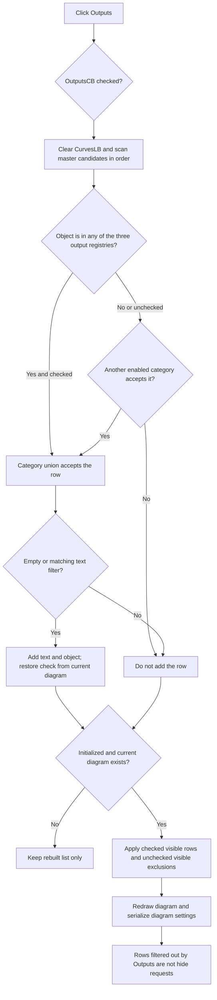

# Outputs curve-list filter

> Analysis status: Complete. The recovered form, shared filter rebuild, output registry tests, and live diagram synchronization establish the control behavior.

## Control

| Property | Recovered value |
| --- | --- |
| Form | CurveListFrm |
| Form caption | Show/hide curves |
| Group caption | Show |
| Component path | CurveListFrm.FilterGB.OutputsCB |
| Control class | TCheckBox |
| Caption | Outputs |
| DFM initial state | Checked |
| Handler name | FilterChanged |
| Handler address | 0135edd0 |
| Graph node | `resource:dfm:CurveListFrm/CurveListFrm.FilterGB.OutputsCB` |
| Handler node | `function:0135edd0` |
| Graph layer | UI |

## What happens when clicked

The VCL changes `OutputsCB.Checked` before it calls the shared `FilterChanged` handler. `FUN_0135edd0` then performs two operations in order:

1. `FUN_0135e310` clears and rebuilds `CurvesLB` from the form's master curve list.
2. `FUN_0135ed00(form, true)` applies the visible checklist state to the current diagram, redraws it, and serializes its settings.

For this control, output membership is not inferred from a curve name. For each master-list object, `FUN_0135e310` calls `FUN_00f1e290` against exactly these three global runtime registries:

- `*PTR_DAT_020059d8`
- `*PTR_DAT_02005118`
- `*PTR_DAT_02001630`

If the object is present in any of these registries and `OutputsCB` is checked, the output-category test admits it. All three registry tests use the same checkbox at form offset `+0x6f8`.

## Candidate source, union, and exclusions

The form does not create the output registries. Before the form is shown, `FUN_01a8aa10` calls `FUN_00f1e090` to assemble the available curve objects from the application's global runtime registries. `FUN_00f1df90` skips entries without a display name or with a non-positive object count, and it does not add a second entry with the same display name. `FUN_0135e230` copies the resulting text and object references into the form's master list at `+0x728`. The filter rebuild scans this stable list in its existing order.

The six category check boxes form an inclusive union. A curve is added when any enabled category accepts it. Therefore:

- Clearing `OutputsCB` disables all three output-registry admission paths.
- It does not impose a global exclusion. If the same curve also matches an enabled Nodal Voltages, Currents, Other Voltages, User defined, or Measurement rule, that other rule can still add the row.
- Checking `OutputsCB` does not bypass the text filter. An accepted category row is added only when `FilterEB` is empty or its display text contains the filter text. The comparison helper lowercases both strings before it searches, so this match is case-insensitive.
- A curve that matches no enabled category, or fails the text filter, is absent from `CurvesLB`.

The rebuild preserves master-list order. It does not sort the accepted output rows separately.

## Check state, selection, and live visibility

For every accepted row, the rebuild adds the original display text and curve-object reference to `CurvesLB`. It enumerates the current diagram's curve list through `FUN_01ad0d80` and checks the new row when that diagram list contains the same display text. Thus, the list reconstructs checked-means-shown state from the diagram after every filter click. It does not copy check marks from the old filtered list.

The code clears the whole list before it adds the accepted rows. It has no operation that restores the highlighted row, `ItemIndex`, top row, or scroll position. The recovered source therefore proves check-state restoration, but not selection or scroll restoration.

After the rebuild, the shared synchronization path collects only unchecked rows that are currently visible in `CurvesLB`. It reconciles the checked visible rows and these explicit unchecked rows with all runtime curve registries. A curve that the Outputs filter removed from the list is neither a visible checked row nor an explicit unchecked row. Clearing `OutputsCB` alone therefore does not hide an already shown output curve. To hide a curve, the user must leave its row visible and clear that row's check mark.

When the form is fully initialized and a current diagram exists, the shared path updates the live diagram, calls the diagram redraw path, and calls `FUN_01add6f0` because `FilterChanged` passes `true`. That writer serializes diagram configuration, including the active curve set. The change does not wait for the form's OK button.

## No-op, close, persistence, and errors

`FUN_0135ed00` does not apply or serialize checklist state while the form's initialization guard at `+0x748` is set, or when the application has no current diagram at global offset `+0x798`. The list rebuild itself still runs. A filter click can also produce no row change when the master list has no output-only match, when the text filter already removes all such rows, or when another enabled category admits every overlapping curve.

`FormShow` initializes `OutputsCB` as enabled and checked. The output filter state is not read from or written to a settings field. Closing the form destroys its local lists and clears the global form reference. The OK and Cancel handlers both call the same close routine, so Cancel does not roll back live curve changes or the diagram-settings serialization that already occurred. A later new form instance starts with Outputs checked again.

The filter handler and list rebuild have no local error message, exception handler, retry, or rollback. The deep curve insertion helper can reject a curve that is incompatible with the current coordinate system. This path calls that helper in silent mode and ignores its return status, so it does not show the helper's compatibility message. A failure can therefore leave a partial live update before control returns or an exception propagates.

## Click flow

## Evidence

- [Shared filter handler `FUN_0135edd0`](../../../DecompiledSources/Tina16/functions/000000000135EDD0__FUN_0135edd0.c) rebuilds the list and then requests guarded live synchronization with serialization enabled.
- [Filtered-list rebuild `FUN_0135e310`](../../../DecompiledSources/Tina16/functions/000000000135E310__FUN_0135e310.c) tests the three exact output registries, implements the category union and text filter, preserves source order, and reconstructs diagram-backed check marks.
- [Registry membership helper `FUN_00f1e290`](../../../DecompiledSources/Tina16/functions/0000000000F1E290__FUN_00f1e290.c) expands a supplied runtime registry and tests whether it contains the candidate object.
- [Candidate-list assembler `FUN_00f1e090`](../../../DecompiledSources/Tina16/functions/0000000000F1E090__FUN_00f1e090.c), [registry enumerator `FUN_00f1df90`](../../../DecompiledSources/Tina16/functions/0000000000F1DF90__FUN_00f1df90.c), [form launcher `FUN_01a8aa10`](../../../DecompiledSources/Tina16/functions/0000000001A8AA10__FUN_01a8aa10.c), and [master-list copier `FUN_0135e230`](../../../DecompiledSources/Tina16/functions/000000000135E230__FUN_0135e230.c) establish the candidate source and form ownership boundary.
- [Live synchronization `FUN_0135ed00`](../../../DecompiledSources/Tina16/functions/000000000135ED00__FUN_0135ed00.c), [unchecked-row collector `FUN_0135ea90`](../../../DecompiledSources/Tina16/functions/000000000135EA90__FUN_0135ea90.c), and [diagram reconciliation `FUN_01ada5a0`](../../../DecompiledSources/Tina16/functions/0000000001ADA5A0__FUN_01ada5a0.c) establish the visible-row apply boundary.
- [Diagram-settings writer `FUN_01add6f0`](../../../DecompiledSources/Tina16/functions/0000000001ADD6F0__FUN_01add6f0.c) serializes the diagram after this filter action.
- [Form show `FUN_0135edf0`](../../../DecompiledSources/Tina16/functions/000000000135EDF0__FUN_0135edf0.c), [form close `FUN_0135ef50`](../../../DecompiledSources/Tina16/functions/000000000135EF50__FUN_0135ef50.c), [OK `FUN_0135edc0`](../../../DecompiledSources/Tina16/functions/000000000135EDC0__FUN_0135edc0.c), and [Cancel `FUN_0135ef80`](../../../DecompiledSources/Tina16/functions/000000000135EF80__FUN_0135ef80.c) establish initialization and close behavior.
- Recovered role: Rebuild and immediately apply the CurveListFrm view after an output-category filter change.
- Complexity: moderate.
- Distinct outgoing calls: 2.

## Evidence limits

- The recovered source identifies the three output registries by runtime addresses and membership behavior. It does not provide reliable Delphi field names for those registries.
- A filtered-out row keeps its current diagram state, but the source does not keep a separate form-local snapshot of that state.
- This click serializes diagram settings. It does not prove an immediate operating-system file write or persistence of the `OutputsCB` check mark itself.
