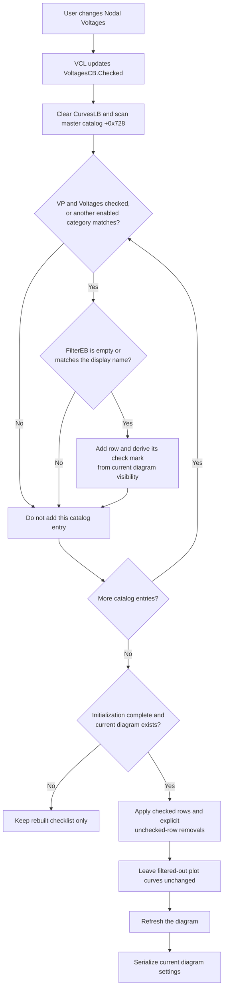

# Filter the curve checklist to nodal voltages

> Analysis status: Evidence-backed from the recovered form resource, handler, filter rebuild, diagram synchronization, and close paths.

## Control

| Property | Recovered value |
| --- | --- |
| Form | CurveListFrm (`Show/hide curves`) |
| Component path | CurveListFrm.FilterGB.VoltagesCB |
| Control class | TCheckBox |
| Caption | Nodal Voltages |
| Initial DFM state | Checked |
| Handler name | FilterChanged |
| Handler address | `0135edd0` |
| Graph node | `resource:dfm:CurveListFrm/CurveListFrm.FilterGB.VoltagesCB` |
| Handler node | `function:0135edd0` |

## What happens when clicked

The VCL changes `VoltagesCB.Checked` before it calls the shared `FilterChanged` handler. The handler first rebuilds `CurvesLB`, the checklist of curves that the user can show or hide. It then applies the check states of the rows that remain in that checklist to the current diagram.

The voltage category is identified by the recovered display-name prefix `VP`. It is not read from a dedicated voltage collection. The rebuild scans the form's complete master curve catalog at field `+0x728` in its existing order. A catalog entry is a nodal-voltage candidate when its first two UTF-16 characters are `VP`; the voltage branch accepts that entry only when `VoltagesCB` is checked. The recovered code does not establish why an upstream curve receives a `VP` name.

The six category checks form a union. A row is accepted if any enabled category matches it:

- `Nodal Voltages` uses the `VP` name prefix.
- `Currents` and `Other Voltages` use their recovered name-prefix tests.
- `User defined`, `Outputs`, and `Measurement` use membership in recovered object collections.

Consequently, clearing `Nodal Voltages` removes only entries whose sole active match is the voltage test. A `VP` entry remains if its object also belongs to another enabled category. After the category union accepts an entry, the text in `FilterEB` must be empty or occur in the display name in a case-insensitive search. Unlike the Add Curve dialog, this form does not exclude entries because another target list already contains them.

## Checklist state and plot visibility

The rebuild clears all checklist rows and adds the accepted catalog entries again. It preserves catalog order and associates each new row with the original curve object. It then checks the row only if a curve with that display name is currently present in the diagram. This process reconstructs check marks from live diagram state. It does not explicitly restore the highlighted row, scroll position, focus, or caret.

The second call applies only the rows in the rebuilt checklist:

- Checked visible rows are inserted or updated in the current diagram.
- Unchecked visible rows become explicit removal requests.
- Rows excluded by a category or text filter are in neither set, so the synchronization does not remove their existing plot curves.

This distinction is important. Clearing `Nodal Voltages` can remove voltage-only rows from the checklist while their plotted curves stay visible. Checking the box again restores eligible `VP` rows. A restored row is checked if that curve is still plotted, and it is unchecked if the curve is not plotted. The checkbox therefore changes which curves the user can edit in this window; it is not a `hide all voltage curves` command.

## Click flow

## Initial state, close behavior, and persistence

The DFM marks this checkbox as checked. On form show, the code replaces both `Checked` and `Enabled` with the application's `SaveAllAnalResults` state. If that state is false, the control is disabled and a normal user click cannot occur. The show handler rebuilds the list while an initialization guard is set, then clears that guard. It does not apply the initial rebuild to the plot.

For a later click, the shared handler requests persistence after the live diagram update. The settings writer serializes the current diagram configuration, including curve settings. There is no file-selection dialog and no separate OK-stage for this action.

Both the OK and Cancel handlers only start the same close path. Neither handler restores prior check marks, prior plot visibility, or prior settings. On close, the form frees its owned list data and requests that the form be freed. Therefore, Cancel does not undo a successful voltage-filter click or any live checklist changes that the user made after it.

## No-op and error boundaries

- If the form initialization guard is set, or if there is no current diagram, the checklist is still rebuilt but the diagram update, redraw, and settings write do not run.
- If no catalog entry qualifies, the checklist can become empty. Filtered-out plot curves still do not become explicit removal requests.
- If the resulting rows and check states are unchanged, the handler still rebuilds, synchronizes, redraws, and writes settings when the guard permits it.
- The handler displays no message for an empty result or for category and text exclusions.
- The recovered path has no local exception handler and no rollback. An exception during list construction can leave a partially rebuilt checklist and prevent synchronization. An exception after diagram mutation can leave live state changed before persistence finishes.
- The click does not modify the master catalog or the curve objects directly.

## Evidence

- [FUN_0135edd0](../../../DecompiledSources/Tina16/functions/000000000135EDD0__FUN_0135edd0.c) runs the rebuild and then requests live synchronization with persistence.
- [FUN_0135e310](../../../DecompiledSources/Tina16/functions/000000000135E310__FUN_0135e310.c) scans the master catalog, applies the category union and text filter, and reconstructs checklist check marks from the current diagram.
- [FUN_0135ed00](../../../DecompiledSources/Tina16/functions/000000000135ED00__FUN_0135ed00.c) enforces the initialization/current-diagram guard, synchronizes visible rows, refreshes the diagram, and conditionally writes settings.
- [FUN_0135ea90](../../../DecompiledSources/Tina16/functions/000000000135EA90__FUN_0135ea90.c) collects only unchecked rows that are present in the current filtered checklist.
- [FUN_0135edf0](../../../DecompiledSources/Tina16/functions/000000000135EDF0__FUN_0135edf0.c) initializes the checkbox from `SaveAllAnalResults` and performs the guarded initial list rebuild.
- [FUN_0135ef90](../../../DecompiledSources/Tina16/functions/000000000135EF90__FUN_0135ef90.c) applies a later checklist-row click through the same live synchronization path.
- [FUN_0135edc0](../../../DecompiledSources/Tina16/functions/000000000135EDC0__FUN_0135edc0.c), [FUN_0135ef80](../../../DecompiledSources/Tina16/functions/000000000135EF80__FUN_0135ef80.c), and [FUN_0135ef50](../../../DecompiledSources/Tina16/functions/000000000135EF50__FUN_0135ef50.c) establish the shared close path and the absence of Cancel rollback.

## Annotation ownership

This article does not add function annotations. `FUN_0135edd0`, `FUN_0135e310`, and `FUN_0135ed00` are shared with the Currents control and are owned by `TIARA-diz.6.7.232`. `FUN_0135ea90` is owned by `TIARA-diz.6.7.231`. The evidence for this control does not prove a separate, voltage-only function role.
