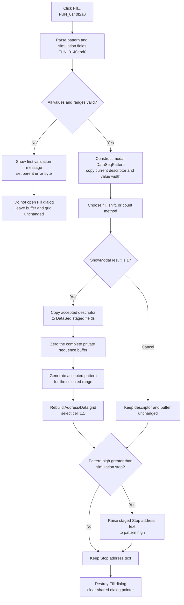

# Fill the staged Data Generator sequence

> Analysis status: Evidence-backed source review complete.

## Control

| Property | Recovered value |
| --- | --- |
| Form | DataSeq |
| Component path | DataSeq.rgPattern.bFill |
| Control class | TButton |
| Caption | Fill... |
| Handler name | bFillClick |
| Handler address | 0140f2a0 |
| Graph node | `resource:dfm:DataSeq/DataSeq.rgPattern.bFill` |
| Handler node | `function:0140f2a0` |
| Graph layer | UI |

The button is in the **Pattern** group beside the **Affected address (low)** and **Affected address (high)** edits. The parent `DataSeq` form is captioned **Data Generator**. It has a private 16-bit value buffer, an Address/Data grid, Bin and Hex display modes, simulation-address fields, and a Repeat pattern option.

## What happens when clicked

`TDataSeq.bFillClick` first parses and validates the current parent-form fields. It collects the pattern low and high addresses, the current pattern descriptor, the simulation start and stop addresses, and the step-time value. It rejects these cases before it opens the Fill dialog:

- invalid numeric address text;
- pattern low greater than pattern high;
- simulation start greater than simulation stop;
- pattern high greater than the recovered sequence-count value; or
- simulation stop greater than that count.

The common error helper shows only the first message for that validation pass and sets the parent error byte at `+0x780`. If the byte is set, this click does not construct the Fill dialog and does not change the staged sequence or grid.

## Fill methods and inputs

After successful parent validation, the handler constructs the application-owned modal `TDataSeqPattern` form and copies the current pattern descriptor into it. It also supplies the Data Generator's value width and selects the two-byte DataSeq mode. The recovered dialog caption is **Fill** and its Methods radio group contains:

1. Fill with 0
2. Fill with 1
3. Shift 1 left
4. Shift 1 right
5. Shift 0 left
6. Shift 0 right
7. Count up
8. Count down

The dialog also has **Initial**, **Increment/decrement**, and **Limit** edits. Its method-change helper derives fixed width-aware start values for the fill and shift methods and disables these three inputs. For Count up and Count down, it enables the inputs. Count up defaults to zero and Count down defaults to the maximum value for the configured width.

The dialog's OK handler parses the enabled values into its private pattern descriptor. Invalid text shows a localized invalid-value message and sets the dialog error byte at `+0x700`. `FormCloseQuery` then rejects that OK close and clears the byte, so the user can correct the value. Cancel returns a result other than `1` and does not copy the dialog descriptor to `DataSeq`.

## Accepted fill and grid rebuild

When `ShowModal` returns `1`, the handler copies the accepted six-field pattern descriptor to `DataSeq` fields `+0x7b0` through `+0x7c0`. It then performs two separate buffer operations:

1. `FUN_0140f520` builds a constant-zero descriptor for the complete sequence and clears the whole private 16-bit buffer.
2. `FUN_0140e970` applies the accepted method and range through the shared pattern generator.

This means values outside the selected fill range are not retained. They remain zero after an accepted Fill.

The shared generator implements the eight methods with width-masked fills, shifts, and count operations. It writes two-byte values for DataSeq. After generation, the DataSeq helper clears and reconstructs the Address/Data grid in the current Bin or Hex mode, restores one editor for each sequence element, and requests grid cell `(1,1)`.

## Simulation-stop adjustment

After the modal dialog returns, the handler compares the parent pattern high address that was parsed before the dialog with the parsed simulation stop address. If pattern high is greater, it formats pattern high and writes it to the **Stop address** edit.

This adjustment is outside the `ShowModal = 1` branch. It can therefore occur after either OK or Cancel in the Fill dialog. It changes only the staged parent-form text at this point; it does not write the caller's model.

The handler destroys the temporary `TDataSeqPattern` instance and clears the shared dialog pointer after the normal return path.

## Fill flow

## Parent OK, Cancel, and persistence boundary

`DataSeq.FormCreate` allocates a private `count * 2` byte buffer and copies the caller's original words into it. Fill writes this private buffer only.

- The parent Cancel button has no recovered event handler and does not call `DataSeq.OKBtnClick`. No other recovered path copies this private buffer to the caller. The form destructor frees it when the owning editor destroys the form, so a close without parent OK discards the generated values and the simulation-stop edit change. The exact controller-level Cancel/close sequence is outside this click handler.
- Parent OK first validates the grid editors, copies their values into the private buffer, and then copies that buffer to the caller's word array. It subsequently validates and copies the pattern and simulation fields and the Repeat pattern state.
- The parent OK order is not atomic: the data words are copied to the caller before the later pattern and simulation validation. A later validation error can therefore leave the caller's data words changed while the parent form remains open.
- Fill itself does not write a file, registry value, INI setting, or other persistent store.

## Cancel, no-op, and error behavior

- Cancel in the Fill dialog skips descriptor copy, buffer clearing, generation, and grid rebuild. The separate simulation-stop adjustment can still change parent-form text.
- A failed parent preflight is a no-op for the Fill dialog and data buffer. The recovered handler does not clear parent error byte `+0x780`; the parent `FormCloseQuery` clears it on a later close attempt, and the parent OK handler can overwrite it with its grid-validation result.
- The fixed fill and shift methods use a generated, disabled Initial value. Their disabled Increment/decrement and Limit texts are not parsed. Count up and Count down validate all three inputs before the dialog can close.
- Accepted Fill clears the buffer before it applies the selected pattern. There is no local exception handler or rollback. An exception during generation or grid reconstruction can therefore leave a cleared or partly regenerated private buffer and an accepted descriptor.
- The temporary dialog destruction and shared-pointer clear are not in a recovered `finally` block. An exception before those statements can bypass the normal cleanup.

## Recovered evidence

- [`FUN_0140f2a0`](../../../DecompiledSources/Tina16/functions/000000000140F2A0__FUN_0140f2a0.c) is `TDataSeq.bFillClick`. It validates parent fields, constructs and stages `TDataSeqPattern`, tests modal result `1`, resets and generates the private buffer, adjusts simulation stop, and destroys the temporary dialog.
- [`FUN_0140ebd0`](../../../DecompiledSources/Tina16/functions/000000000140EBD0__FUN_0140ebd0.c) parses the parent pattern and simulation fields and applies the order and count checks.
- [`FUN_0140e8d0`](../../../DecompiledSources/Tina16/functions/000000000140E8D0__FUN_0140e8d0.c) and [`FUN_01b1cf30`](../../../DecompiledSources/Tina16/functions/0000000001B1CF30__FUN_01b1cf30.c) show the first parent validation error and set its error byte.
- [`FUN_0140c7c0`](../../../DecompiledSources/Tina16/functions/000000000140C7C0__FUN_0140c7c0.c), [`FUN_0140c240`](../../../DecompiledSources/Tina16/functions/000000000140C240__FUN_0140c240.c), [`FUN_0140c130`](../../../DecompiledSources/Tina16/functions/000000000140C130__FUN_0140c130.c), and [`FUN_0140c220`](../../../DecompiledSources/Tina16/functions/000000000140C220__FUN_0140c220.c) initialize the Fill dialog, switch method-specific input state, validate OK, and veto an invalid close.
- [`FUN_0140af60`](../../../DecompiledSources/Tina16/functions/000000000140AF60__FUN_0140af60.c) supplies the width-aware default values for all eight methods.
- [`FUN_0140f520`](../../../DecompiledSources/Tina16/functions/000000000140F520__FUN_0140f520.c) clears the complete DataSeq buffer. [`FUN_0140e970`](../../../DecompiledSources/Tina16/functions/000000000140E970__FUN_0140e970.c) applies the accepted descriptor and rebuilds the grid.
- [`FUN_0140b070`](../../../DecompiledSources/Tina16/functions/000000000140B070__FUN_0140b070.c) is the shared DataSeq and DataSPI pattern generator. Bead `.399` owns its canonical graph annotation.
- [`FUN_0140dfd0`](../../../DecompiledSources/Tina16/functions/000000000140DFD0__FUN_0140dfd0.c) creates the private DataSeq buffer. [`FUN_0140df70`](../../../DecompiledSources/Tina16/functions/000000000140DF70__FUN_0140df70.c) frees it during form destruction.
- [`FUN_0140f100`](../../../DecompiledSources/Tina16/functions/000000000140F100__FUN_0140f100.c) is the parent OK commit boundary and proves the caller-copy order.
- [`ui-evidence.json`](../../../DecompiledSources/Tina16/resources/dfm/ui-evidence.json) supplies both forms, captions, field labels, the eight ordered method names, and the modal button kinds.

## Analysis limits

Most original Delphi field names are unavailable, so the article keeps recovered offsets where no resource name proves the field. The generator receives the recovered sequence-count boundary and width mask, but no live boundary-value run was performed. DataSPI Bead `.399` owns the shared generator; this Bead annotates the unique DataSeq Fill handler and the shared DataSeq parent-field validator requested by coordination.
