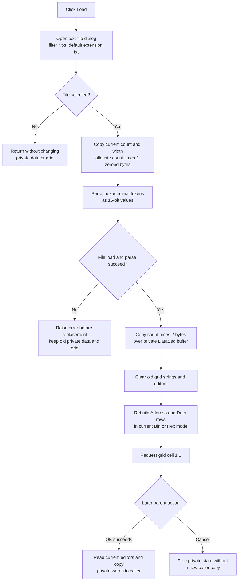

# Load hexadecimal Data Generator words from a text file

> Analysis status: Evidence-backed source review complete.

## Control

| Property | Recovered value |
| --- | --- |
| Form | DataSeq |
| Form caption | Data Generator |
| Component path | DataSeq.rgPattern.bLoad |
| Control class | TButton |
| Caption | Load |
| Hint | Not present in the recovered resource. |
| Glyph | None |
| Handler name | bLoadClick |
| Handler address | 0140f640 |
| Graph node | `resource:dfm:DataSeq/DataSeq.rgPattern.bLoad` |
| Handler node | `function:0140f640` |
| Graph layer | UI |

## What happens when clicked

`TDataSeq.bLoadClick` opens the form's `TOpenDialog`. DataSeq initialization sets the filter to **Text file (*.txt)|*.txt** and uses the recovered `txt` constant as the default extension. The DFM and initialization path do not set a title, initial directory, or initial file name. The handler does not clear `OpenDialog.FileName` before execution, so the dialog can retain a path from an earlier accepted selection.

Canceling the file dialog returns without allocating an import buffer, clearing the grid, or changing the staged sequence. Accepting a file creates a temporary descriptor from the current sequence count and value width. Its buffer contains `count` 16-bit elements and is cleared to zero before parsing.

The handler then reads `OpenDialog.FileName`, passes it to the shared hexadecimal text loader with the 16-bit selector `0x10`, and copies exactly `count * 2` bytes over the DataSeq form's private sequence buffer. This is full replacement. It does not append values or restrict the import to the **Affected address (low)** and **Affected address (high)** range.

## Text format and fixed capacity

The shared loader treats every token as hexadecimal, regardless of whether the DataSeq **Mode** radio group currently shows **Bin** or **Hex**. Each nonempty line must start with a hexadecimal digit. After a token, spaces, tabs, and `|` can separate the next token. Uppercase and lowercase hexadecimal digits are accepted. A `0x` prefix is not accepted because `x` is not a hexadecimal digit or a supported separator.

The configured sequence count remains fixed:

- If the file contains fewer than `count` values, unused temporary elements stay zero. The full-buffer copy replaces the corresponding old staged words with zero.
- If the file contains more than `count` values, later values are parsed but are not stored. A malformed surplus token can still raise an error because parsing continues after the output capacity is full.
- Each stored token is truncated to the low 16 bits. The loader does not compare it with the DataSeq value width or grid editor limits.
- The line-list load does not receive an explicit encoding argument. The recovered path uses the VCL loader's default decoding behavior; the source does not prove one fixed file encoding.

The parser does not change the count, value width, numeric display mode, pattern or simulation fields, or Repeat pattern state.

## Grid rebuild

After parsing and replacement, the handler clears the old `TAttributeGrid`, calls the shared DataSeq grid rebuild, and requests cell `(1,1)`.

The rebuild restores the localized **Address** and **Data** headers and creates one row for each configured sequence element. It reads the newly loaded 16-bit words from the private buffer and formats them in the current cached mode. Mode `0` uses binary text and mode `1` uses hexadecimal text. Thus, Load always parses hexadecimal file tokens but can immediately display their numeric values as binary.

The grid rebuild does not resize the sequence. The final cell request has no explicit empty-sequence guard or returned-status check in the recovered handler.

## Staging, OK, and Cancel

DataSeq creation obtains a pointer to the caller-owned record, copies its 72-byte header into form fields, allocates a separate `count * 2` byte sequence buffer, and copies the caller's original words into that private buffer. Load changes only this private buffer and its grid presentation.

The [OK handler](okbtn-820ad26a9b.md) is the later caller-copy boundary. It validates the active grid editor, reads the displayed values back into the private buffer, and copies `count * 2` bytes to the caller-owned sequence array. It then validates the other Pattern and Simulation fields before it copies those settings and refreshes the owning generator.

The handler-free `bkCancel` button does not run this OK copy. Cancel without an earlier partial OK attempt discards the imported private buffer when form destruction frees it. The OK order is not atomic: it copies the sequence before later range validation. If an earlier OK attempt copied the sequence and then failed a later check, Cancel does not restore the caller's old words. That partial-commit boundary belongs to OK, not Load.

Load does not set a modal result, close the form, save the imported path, update the caller record, refresh the owning generator, or write a file, registry value, or other persistent setting.

## Errors and partial state

The shared loader checks the selected path before it loads the text. A missing path raises `File not found: <path>`. A nonempty line without the required hexadecimal token raises `Hex number expected, lineno: <number>`. File-open, decoding, allocation, and other I/O errors can also propagate. The Load handler has no local catch, retry, or rollback.

Parsing completes before `FUN_0140f610` replaces the private sequence. Therefore, an allocation, file-load, missing-file, or token error leaves the previous private sequence and grid unchanged. The temporary buffer can contain partial parsed data, but it is not copied to the form after an exception.

After parsing succeeds, replacement occurs before grid clearing and reconstruction. A later copy, grid-clear, formatting, editor-allocation, row-add, or active-cell error can therefore leave the imported private words in place with an empty or partly rebuilt grid. There is no transaction or undo record in this path.

## Load flow

## Evidence

- [Load handler `FUN_0140f640`](../../../DecompiledSources/Tina16/functions/000000000140F640__FUN_0140f640.c) executes the dialog, prepares the temporary descriptor, gets the accepted file name, invokes the shared parser for 16-bit output, replaces the private buffer, clears and rebuilds the grid, and requests cell `(1,1)`.
- [Temporary-buffer helper `FUN_0140f5d0`](../../../DecompiledSources/Tina16/functions/000000000140F5D0__FUN_0140f5d0.c) copies the current count and bit width, allocates `count * 2` bytes, and clears the complete allocation.
- [Replacement helper `FUN_0140f610`](../../../DecompiledSources/Tina16/functions/000000000140F610__FUN_0140f610.c) copies `count * 2` bytes from the parsed temporary buffer to the existing private DataSeq buffer.
- [Shared hexadecimal text loader `FUN_013a67f0`](../../../DecompiledSources/Tina16/functions/00000000013A67F0__FUN_013a67f0.c) checks the file, loads text lines, parses all tokens, applies fixed output capacity, and uses two-byte stores for selector `0x10`. Bead `.400` owns its canonical annotation.
- [Required hexadecimal-token reader](../../../DecompiledSources/Tina16/functions/00000000010CAAD0__FUN_010caad0.c), [separator reader](../../../DecompiledSources/Tina16/functions/00000000010CA040__FUN_010ca040.c), [hexadecimal character test](../../../DecompiledSources/Tina16/functions/0000000001AA1060__FUN_01aa1060.c), and [base-16 accumulator](../../../DecompiledSources/Tina16/functions/0000000001AA1170__FUN_01aa1170.c) establish the file grammar and errors.
- [DataSeq initialization `FUN_0140dfd0`](../../../DecompiledSources/Tina16/functions/000000000140DFD0__FUN_0140dfd0.c) sets the text filter and default extension, copies the caller record, allocates the private sequence buffer, initializes the mode, and performs the first grid build.
- [Shared DataSeq grid rebuild `FUN_0140e330`](../../../DecompiledSources/Tina16/functions/000000000140E330__FUN_0140e330.c) restores Address/Data rows from the private words in the current numeric mode. Bead `.402` owns its canonical annotation.
- [Generic AttributeGrid clear `FUN_00b0b020`](../../../DecompiledSources/Tina16/functions/0000000000B0B020__FUN_00b0b020.c) removes old grid content and editor objects before the rebuild.
- [OK handler `FUN_0140f100`](../../../DecompiledSources/Tina16/functions/000000000140F100__FUN_0140f100.c), [grid-to-buffer converter `FUN_0140e810`](../../../DecompiledSources/Tina16/functions/000000000140E810__FUN_0140e810.c), and [form destructor `FUN_0140df70`](../../../DecompiledSources/Tina16/functions/000000000140DF70__FUN_0140df70.c) establish the later commit, Cancel, and private-buffer lifetime boundaries.
- [Recovered UI evidence](../../../DecompiledSources/Tina16/resources/dfm/ui-evidence.json) supplies the Data Generator caption, Load binding, Pattern group, Bin/Hex items, `TOpenDialog`, standard OK and Cancel kinds, and absence of a Load hint or glyph.

## Ownership and limits

- This Bead owns the canonical annotations for `FUN_0140f640`, `FUN_0140f5d0`, and `FUN_0140f610`.
- Bead `.400` owns shared parser `FUN_013a67f0`. Bead `.402` owns shared grid rebuild `FUN_0140e330`. Bead `.401` owns the OK commit path. These functions are evidence only here.
- The original Delphi names for the two buffer helpers and the 72-byte record type are not recovered. Their offset-based data flow establishes the documented roles.
- The file has no recovered vendor-specific signature, header, or version marker. This article describes it only as fixed-capacity hexadecimal text.
