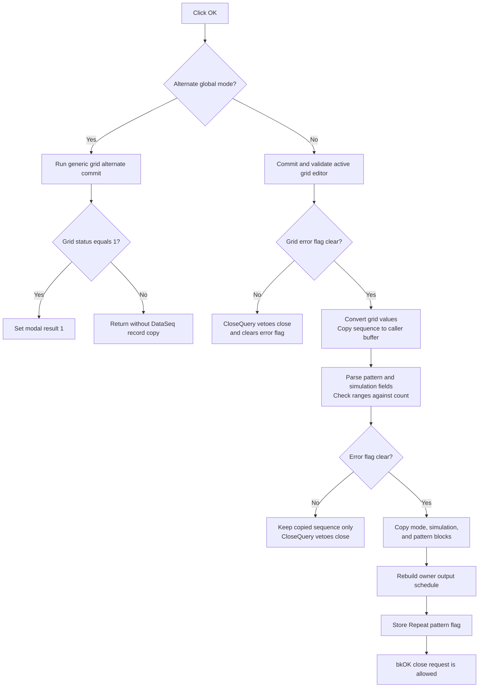

# Validate and commit Data Generator settings

> Analysis status: Complete. The recovered OK handler, form staging setup, field parser, close-query guard, caller-owned record, and downstream schedule rebuild establish the command behavior and its partial-commit boundary.

## Control

| Property | Recovered value |
| --- | --- |
| Form | DataSeq (`Data Generator`) |
| Component path | DataSeq.OKBtn |
| Control class | TBitBtn |
| Button kind | bkOK |
| Handler name | OKBtnClick |
| Handler address | 0140f100 |
| Graph node | `resource:dfm:DataSeq/DataSeq.OKBtn` |
| Handler node | `function:0140f100` |
| Graph layer | UI |

The button has no separate caption in the recovered DFM because `bkOK` supplies the standard OK presentation and modal result. The handler performs validation and commit work before the form's close-query guard decides whether the OK close request can complete.

## Caller-owned staging model

`FUN_0140de60` constructs the form with an owner object and a record selector. During `FUN_0140dfd0`, the form asks that owner for the selected Data Generator record and stores the returned pointer at form `+0x778`.

The form copies a 72-byte record snapshot into fields beginning at `+0x788`. It then replaces the copied sequence pointer with a newly allocated form-local sequence buffer at `+0x790` and copies the original 16-bit sequence values into it. The grid, [Bin/Hex mode](rgmode-54058ae2c0.md), [Fill](bfill-e893c7ed97.md), and [Load](bload-f65181aef4.md) commands edit this form-local representation. They do not replace the owner record pointer.

The recovered record layout used by OK is:

| Record offset | Meaning established by UI and consumers | OK behavior |
| ---: | --- | --- |
| `+0x00` | 16-bit sequence count | Read; not changed. |
| `+0x02` | 16-bit value width | Read for parsing and formatting; not changed. |
| `+0x08` | Pointer to 16-bit sequence values | Pointed-to values are overwritten. |
| `+0x10` | Bin/Hex mode index | Replaced with `rgMode.ItemIndex`. |
| `+0x18` | Simulation start, stop, and step-time block | Replaced after validation. |
| `+0x28` | Pattern parameters, including low and high affected addresses | Replaced after validation. |
| `+0x40` | Repeat-pattern flag | Replaced after the owner refresh succeeds. |

## Normal OK path

When the global alternate-mode flag is clear, `FUN_0140f100` performs these operations in order:

1. Call the shared AttributeGrid active-editor gate `FUN_00b0a890`. If the current cell cannot be committed, store its nonzero result in form error byte `+0x780` and stop the DataSeq commit path.
2. Call `FUN_0140e810` to convert every internal grid-list value into the form-local 16-bit sequence buffer. The current mode at `+0x7e0` selects the numeric parser, so the displayed Bin or Hex text becomes the same 16-bit value representation.
3. Copy `record.count * 2` bytes from the form-local buffer into the caller-owned sequence buffer at record `+0x08`.
4. Call `FUN_0140ebd0` to parse and validate the pattern and simulation controls into two local blocks.
5. If error byte `+0x780` remains clear, copy the parsed simulation block, pattern block, and mode index into the caller-owned record.
6. Call `FUN_0140ae60` to rebuild the owning generator's output schedule from the updated record and current output objects.
7. Read `Repeat pattern` and store its checked state at record `+0x40`.

The sequence count controls both the copy length and the allowed high-address checks. Form creation builds the grid with the same count. The OK handler does not independently compare the internal list count with the record count and does not change the count or value width.

## Pattern and simulation validation

`FUN_0140ebd0` clears its local output blocks, then parses these controls:

- `Affected address (low)` and `Affected address (high)`.
- `Start address` and `Stop address`.
- `Step time`.

The address parser checks the text against the record's value width. The validation then rejects these conditions:

- Pattern high is less than pattern low.
- Simulation stop is less than simulation start.
- Pattern high is greater than the sequence count.
- Simulation stop is greater than the sequence count.

`FUN_01b1cf30` shows only the first error message for one OK attempt and sets form byte `+0x780`. Later checks see that flag and do not show another message. The parsed blocks, mode, owner refresh, and repeat flag are committed only when the flag stays clear.

## Modal result and close veto

The standard `bkOK` button requests the OK modal result. DataSeq's `FUN_0140e650` `FormCloseQuery` sets `CanClose` to true only when error byte `+0x780` is zero. It then clears the byte.

- A successful normal commit leaves the flag clear, so the OK close can complete.
- An active-grid or DataSeq field validation failure leaves the flag set, so that close attempt is vetoed. The flag reset lets the user correct the input and try again.
- The handler does not close or destroy the form directly.

The Cancel button is a handler-free `bkCancel`. If the user cancels without first running OK, the form-local grid, pattern, load, mode, and simulation edits are discarded when the form is destroyed.

## Partial state on a failed OK

The handler copies the converted sequence values into the caller-owned buffer before it validates the pattern and simulation fields. Therefore, the two failure stages have different effects:

- If the active grid editor fails first, no DataSeq record field or sequence value is copied.
- If pattern or simulation validation fails later, the caller-owned sequence buffer has already changed. The mode, simulation block, pattern block, owner schedule refresh, and repeat flag are not committed.

There is no rollback of that early sequence-buffer copy. Cancel after this later failure does not restore the preceding sequence values. This is a recovered partial-commit boundary, not an atomic staging transaction.

The handler also has no exception catch. An allocation, conversion, owner-refresh, or other raised error can leave the writes completed before that point. In particular, the repeat flag is written after the owner refresh.

## Alternate application mode

When global flag `PTR_DAT_020039a8` is set, the handler skips the normal DataSeq conversion, range validation, record copy, and owner refresh. It calls generic grid helper `FUN_00b0a960`. That helper invokes the active grid cell's alternate commit operation and stores its completion status at grid `+0x638`. If the status is 1, the handler explicitly writes modal result 1 at form `+0x508`.

The recovered sources do not establish a domain name for this global mode. This article therefore describes it by the flag and does not equate it with normal interactive editing.

## Downstream effect

After a valid normal commit, `FUN_0140ae60` reads the updated owner record and current output objects. It dispatches to one of two recovered schedule builders according to owner type. The ordinary Data Generator builder iterates the configured address range, reads each 16-bit sequence word, extracts its output bits, and emits timed value changes with the configured step time and repeat state. Thus, OK does more than store dialog text: it immediately regenerates the owner's output schedule.

The record remains owned by the object passed to the form constructor. The form destructor releases only its form-local list and temporary sequence buffer; it does not free the caller's record or sequence allocation.

## Click flow

## Evidence

- [OK handler `FUN_0140f100`](../../../DecompiledSources/Tina16/functions/000000000140F100__FUN_0140f100.c) contains the normal and alternate branches, ordered sequence copy, conditional field commits, owner refresh, repeat write, and explicit alternate modal result.
- [DataSeq constructor `FUN_0140de60`](../../../DecompiledSources/Tina16/functions/000000000140DE60__FUN_0140de60.c) stores the caller owner and record selector.
- [Form creation `FUN_0140dfd0`](../../../DecompiledSources/Tina16/functions/000000000140DFD0__FUN_0140dfd0.c) obtains the caller-owned record, copies its fields into a form-local snapshot, allocates the form-local sequence buffer, and initializes all controls.
- [Grid-to-buffer converter `FUN_0140e810`](../../../DecompiledSources/Tina16/functions/000000000140E810__FUN_0140e810.c) parses every internal list value with the selected mode and stores one 16-bit value per entry.
- [Pattern and simulation parser `FUN_0140ebd0`](../../../DecompiledSources/Tina16/functions/000000000140EBD0__FUN_0140ebd0.c) parses the labeled controls, checks low/high ordering, and checks both high bounds against the sequence count. TIARA-diz.6.7.403 owns its shared annotation.
- [Shared AttributeGrid gate `FUN_00b0a890`](../../../DecompiledSources/Tina16/functions/0000000000B0A890__FUN_00b0a890.c) commits the active editor and returns its validation result. Its canonical annotation is owned by TIARA-diz.6.7.63.
- [Alternate grid commit `FUN_00b0a960`](../../../DecompiledSources/Tina16/functions/0000000000B0A960__FUN_00b0a960.c) records the active cell's alternate completion status and can request modal result 1.
- [Close-query guard `FUN_0140e650`](../../../DecompiledSources/Tina16/functions/000000000140E650__FUN_0140e650.c) derives `CanClose` from `+0x780` and then resets the flag.
- [Owner schedule refresh `FUN_0140ae60`](../../../DecompiledSources/Tina16/functions/000000000140AE60__FUN_0140ae60.c) reads the updated record and current output objects, then dispatches to the recovered schedule builder.
- The DataSeq DFM supplies the `Data Generator` form caption, `bkOK` kind, Bin/Hex choices, pattern and simulation labels, and `Repeat pattern` checkbox.

## Evidence limits

- The global alternate-mode flag has no recovered domain name. Only its distinct grid-only branch is documented.
- The handler and owner record access establish ownership and in-place mutation. The Delphi type name of the 72-byte record is not recovered.
- The normal path relies on form setup to keep the grid-list count, temporary buffer size, and caller record count equal. The OK handler has no separate mismatch check.
