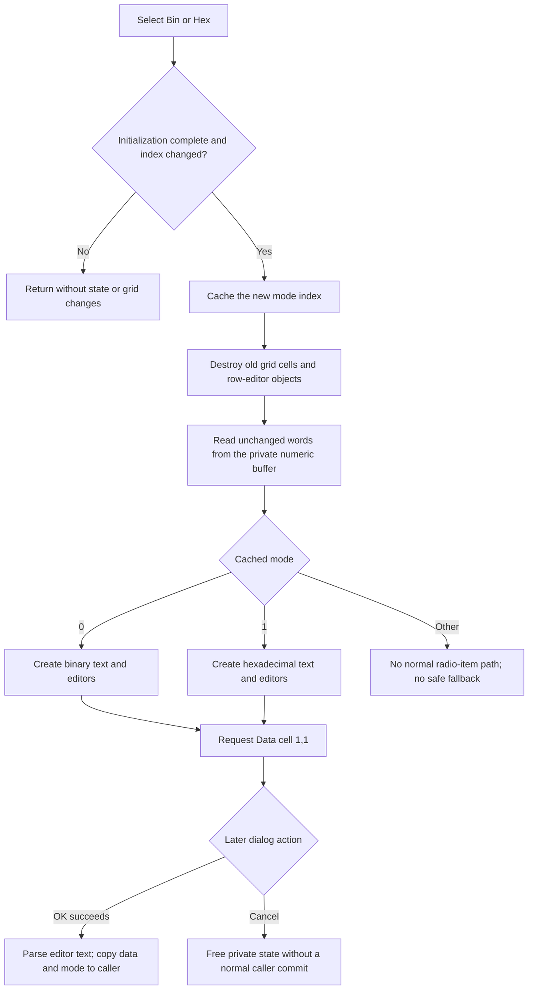

# Rebuild the DataSeq grid as binary or hexadecimal

> Analysis status: Evidence-backed source review complete.

## Control

| Property | Recovered value |
| --- | --- |
| Form | DataSeq |
| Form caption | Data Generator |
| Component path | DataSeq.rgMode |
| Control class | TRadioGroup |
| Caption | Mode |
| Items | Bin, Hex |
| Hint | Not present in the recovered resource. |
| Handler name | rgModeClick |
| Handler address | 0140f220 |
| Graph node | `resource:dfm:DataSeq/DataSeq.rgMode` |
| Handler node | `function:0140f220` |
| Graph layer | UI |

## What happens when clicked

`rgModeClick` changes how the staged DataSeq words are displayed and edited. It does not convert the numeric words in the dialog-local buffer, change the sequence length, run a simulation, or commit the dialog to its caller.

The DFM item order and the matching formatter and editor branches establish this mapping:

| ItemIndex | Radio item | Data-cell representation |
| --- | --- | --- |
| `0` | Bin | Binary formatter and binary editor class |
| `1` | Hex | Hexadecimal formatter and hexadecimal editor class |

The row-address text uses a separate fixed formatter. It does not change with the selected data mode.

## Initialization and repeat guards

The handler performs work only when both conditions are true:

- initialization guard `+0x7f0` is nonzero; and
- the current radio-group `ItemIndex` differs from cached mode `+0x7e0`.

`FormCreate` clears `+0x7f0` before it obtains the caller record, copies the saved mode to the radio group, creates the dialog-local data buffer, and builds the initial grid. It sets `+0x7f0` to `1` only after this work. An `OnClick` notification caused by the initial `ItemIndex` assignment therefore cannot rebuild a partly initialized form.

Clicking the selected item again is a silent no-op. The handler does not clear the grid, move the active cell, or rewrite the cached mode.

## Grid reset and representation rebuild

For an accepted change, the handler stores the new `ItemIndex` in `+0x7e0` before it changes the grid. It then:

1. clears the `TAttributeGrid` from column zero, including old cell editor objects and selection markers;
2. calls the shared DataSeq grid rebuild;
3. requests grid cell `(1,1)` as the active cell.

The shared rebuild clears the form's row-editor collection at `+0x7d0`, restores the two localized column headers, and sets the grid row count from the staged word count at `+0x788`. For each row it:

- reads the unchanged 16-bit word from dialog-local buffer `+0x790`;
- formats that word with bit width `+0x78a` and cached mode `+0x7e0`;
- formats the zero-based row index as the address text;
- creates the editor class for the selected representation;
- applies the recovered lower and upper editor limits from `+0x7ec` and `+0x7ee`; and
- adds the Address/Data row to the grid.

The rebuild contains an internal decimal branch for mode `2`, but the recovered DataSeq radio group has only **Bin** and **Hex** items. A normal click can therefore select only modes `0` and `1`.

The final cell request has no explicit empty-sequence guard and no returned-status test. The behavior of the recovered virtual method for an empty sequence is not established.

## Staged editor text and numeric data

DataSeq has three state layers:

1. The caller record owns the committed mode and data array.
2. Form buffer `+0x790` is a private numeric copy created when the dialog opens.
3. Row-editor collection `+0x7d0` contains the current editable text and editor objects shown in the grid.

The mode handler destroys the old editor collection and rebuilds it from numeric buffer `+0x790`. It does not first call the grid-to-buffer parser used by OK. A value that the user changed only in the old editor text can therefore be lost when the user changes mode. Numeric values that Fill or Load already put in `+0x790` remain unchanged and are only reformatted.

## OK, Cancel, and downstream state

The mode selection remains local to the dialog until OK succeeds. In the normal record-commit branch, the OK path first validates the grid. It then parses each current editor with cached mode `+0x7e0` and writes the result into private numeric buffer `+0x790`. It copies that buffer to the caller before it validates the other DataSeq range fields. It writes the radio group's current `ItemIndex` to the caller record only after all later validation succeeds.

This order creates a partial-update boundary: if grid validation succeeds but later range validation fails, the caller data array can already contain the parsed words while the caller's saved mode is not yet changed. The mode handler has no rollback for this later OK failure.

Cancel is a standard `bkCancel` button without a custom click handler. A normal Cancel does not run the OK copy and does not commit the new mode. Form destruction frees the private word buffer and the row-editor collection. Cancel cannot undo a caller data copy that an earlier, partly successful OK attempt already performed.

The saved caller mode is used to select the radio item and initial representation the next time this DataSeq editor is created. The mode click itself does not update a simulation object, file, registry value, or document modified flag.

## Invalid index and failure behavior

- The handler has no explicit `0..1` range check. Normal `TRadioGroup` input supplies one of the two DFM item indexes.
- Mode `2` reaches a decimal formatter and editor branch in the shared rebuild, but no recovered DataSeq radio item exposes it.
- An index outside `0..2` is cached before the grid is cleared. The rebuild has no matching editor-class branch and no safe fallback in the recovered source.
- The handler has no local exception handler, transaction, retry, or rollback. A clear, allocation, formatter, editor-construction, row-add, or grid-selection failure can leave the new mode cached with an empty or partly rebuilt grid.
- A failure in this handler does not directly write the caller data array. Buffer-to-caller copy is in the OK path.

## Mode-change flow

## Handler and model evidence

- Mode-change guard, cache update, grid reset, rebuild, and active-cell request: [FUN_0140f220](../../../DecompiledSources/Tina16/functions/000000000140F220__FUN_0140f220.c)
- Shared DataSeq grid rebuild and mode-specific editors: [FUN_0140e330](../../../DecompiledSources/Tina16/functions/000000000140E330__FUN_0140e330.c)
- Binary, hexadecimal, and internal decimal formatting branches: [FUN_01408750](../../../DecompiledSources/Tina16/functions/0000000001408750__FUN_01408750.c)
- Generic AttributeGrid clear: [FUN_00b0b020](../../../DecompiledSources/Tina16/functions/0000000000B0B020__FUN_00b0b020.c)
- Caller-to-form copy, initial mode assignment, first rebuild, and guard lifetime: [FUN_0140dfd0](../../../DecompiledSources/Tina16/functions/000000000140DFD0__FUN_0140dfd0.c)
- OK grid parsing and private-buffer update: [FUN_0140e810](../../../DecompiledSources/Tina16/functions/000000000140E810__FUN_0140e810.c)
- OK copy, later validation, and saved-mode update: [FUN_0140f100](../../../DecompiledSources/Tina16/functions/000000000140F100__FUN_0140f100.c)
- Validation close veto and private-buffer destruction: [FUN_0140e650](../../../DecompiledSources/Tina16/functions/000000000140E650__FUN_0140e650.c) and [FUN_0140df70](../../../DecompiledSources/Tina16/functions/000000000140DF70__FUN_0140df70.c)
- Fill and Load buffer/rebuild paths: [FUN_0140e970](../../../DecompiledSources/Tina16/functions/000000000140E970__FUN_0140e970.c) and [FUN_0140f640](../../../DecompiledSources/Tina16/functions/000000000140F640__FUN_0140f640.c)
- Recovered form and control resources: [ui-evidence.json](../../../DecompiledSources/Tina16/resources/dfm/ui-evidence.json)

## Resource and annotation limits

- `rgMode` has caption **Mode** and items **Bin** and **Hex**. It has no hint, action, glyph, or recovered checked-state property.
- The nearby **Address / Data** label agrees with the two columns created by the rebuild. Layout distance alone is not used as behavior evidence.
- The recovered editor classes have address-based symbols. Their selected constructors and matching formatters establish their representation roles without invented Delphi class names.
- This Bead owns `FUN_0140f220` and the canonical shared DataSeq grid rebuild `FUN_0140e330`. Bead `.401` owns the OK parsing and validation/commit path. Beads `.403` and `.404` own Fill and Load. The generic AttributeGrid clear stays evidence only.
