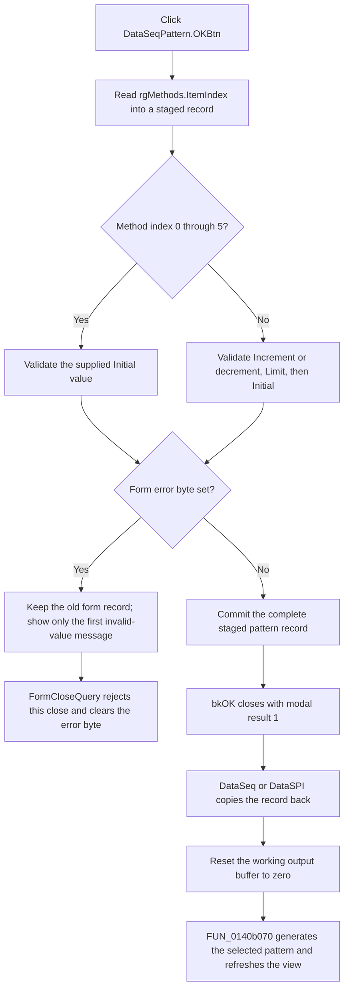

# Validate and apply a data-sequence pattern

> Analysis status: Evidence-backed source review complete.

## Control

| Property | Recovered value |
| --- | --- |
| Form | DataSeqPattern |
| Component path | DataSeqPattern.OKBtn |
| Control class | TBitBtn |
| Caption | Not present in the recovered resource. |
| Hint | Not present in the recovered resource. |
| Kind | bkOK |
| Handler name | OKBtnClick |
| Handler address | 0140c130 |
| Graph node | `resource:dfm:DataSeqPattern/DataSeqPattern.OKBtn` |
| Handler node | `function:0140c130` |
| Handler graph layer | UI |

## What happens when clicked

`FUN_0140c130` validates the pattern values and stages one complete pattern
record for the modal caller. It does not generate the output data directly.

The handler starts with a local copy of the 24-byte record at form offset
`+0x710`. The recovered fields used by this path are:

| Record offset | Meaning in this path |
| --- | --- |
| `+0x00` | Selected method index from `rgMethods.ItemIndex`. |
| `+0x04` | First output position, retained by this click. |
| `+0x08` | Last output position, retained by this click. |
| `+0x0c` | Initial value parsed from `eInitValue`. |
| `+0x10` | Increment or decrement parsed from `eCountValue` for Count Up or Count Down. |
| `+0x14` | Limit parsed from `eLimitValue` for Count Up or Count Down. |

The method list supplies eight normal indexes:

0. Fill with 0
1. Fill with 1
2. Shift 1 left
3. Shift 1 right
4. Shift 0 left
5. Shift 0 right
6. Count up
7. Count down

The OK handler separates these methods into two validation paths:

- For indexes 0 through 5, it validates only `eInitValue`. The method updater
  disables all three numeric edits for these choices and supplies the initial
  value that the selected fill or shift operation needs.
- For the Count Up and Count Down choices, it validates `eCountValue`,
  `eLimitValue`, and `eInitValue`, in that order. The method updater enables
  those edits for this path.

The handler has no explicit `0..7` range check. A normal `TRadioGroup` click is
limited to the eight recovered items. A programmatic invalid index takes the
same three-value branch as Count Up or Count Down and can be committed if its
text values pass validation. The later generator has no branch for a method
outside `0..7`, so such a record does not create a selected-method pattern.

## Numeric validation and error reporting

Each applicable edit and its label are passed to `FUN_0140bf50`. The helper:

1. Reads the edit text.
2. Calls `FUN_014089a0` with the dialog's numeric-format selector and data
   width.
3. Converts accepted text to a 32-bit value with `FUN_01408880`.
4. On invalid text, builds a message from the associated label and localized
   resource `HDLStrings.Msg_FC_InvValue`, then calls the dialog error path.

The conversion selector reaches recovered binary, hexadecimal, or integer
parsers. Format 0 also requires at least the configured data-width number of
characters. The character-check helper at `FUN_01408910` has no useful
recovered body, so the exact accepted character set is not asserted here.

The two normal callers set the stored selector at `+0x728` to format 1. For
Count Up and Count Down, all three edits therefore use the recovered
hexadecimal conversion path. For methods 0 through 5, the handler temporarily
uses format 0 for `DataSeq` and format 1 for `DataSPI`. Thus, the supplied
Initial value uses the binary path in `DataSeq` and the hexadecimal path in
`DataSPI`.

`FUN_0140bed0` passes the message and form byte `+0x700` to the common one-shot
error helper. The first invalid field displays its message and sets the byte.
Later invalid fields in the same click do not display more messages.

After all applicable checks, `FUN_0140c130` tests `+0x700`:

- If it is clear, the handler writes the selected method, parsed initial value,
  parsed increment or decrement, and parsed limit to the form record.
- If it is set, the handler writes none of the local record back. The old form
  record remains intact, including when a later validation call produced an
  unusable temporary return value.

The handler has no local exception handler, retry, or rollback. An unexpected
exception from a called validator or converter escapes the handler. The
normal invalid-text route is staged and does not partially update the record.

## Modal close and retry

The resource gives the button `Kind = bkOK`. The VCL therefore requests the
standard accepted modal result after the click handler. `FUN_0140c220`, the
form's `OnCloseQuery` handler, sets `CanClose` to true only when error byte
`+0x700` is clear. It then clears that byte in both cases.

A valid click permits the dialog to close with result `1`. An invalid click
shows the first validation message, preserves the prior record, rejects that
close request, and clears the error byte so the user can correct the values and
try OK again. The close query does not revalidate the edits itself.

`CancelBtn` is a built-in `bkCancel` button with no custom click handler. Once
the dialog can close, a Cancel result is not `1`, so both recovered callers
skip pattern-record copy-back and pattern generation.

## Caller copy-back and generated output

The dialog is shared by the **Fill** commands in `DataSeq` and `DataSPI`.
`FUN_0140f2a0` and `FUN_01411ab0` each construct a private dialog, copy the
parent's current range and pattern record into it, and call `ShowModal` through
virtual slot `+0x2d0`.

Only result `1` performs the accepted-output path:

1. The caller copies all 24 bytes of the dialog record back to its parent form.
2. It updates the parent's cached initial value from record offset `+0x0c`.
3. It calls a zero-fill wrapper to reset the working output buffer.
4. It calls shared generator `FUN_0140b070` with the accepted record.
5. It refreshes the parent data view.

The generator writes the selected inclusive output range. Its eight branches
implement the recovered Fill, left-shift, right-shift, Count Up, and Count Down
choices. The count branches use the accepted initial value and increment or
decrement; the limit can cap the generated range, and Count Up also uses the
derived limit in its wrap calculation. `DataSeq` receives 16-bit entries and
`DataSPI` receives 32-bit entries through the generator's output-mode flag.

Both callers destroy the private dialog after either modal result. They can
also normalize a separate parent range edit after the modal call from values
that were collected before the dialog opened. This post-dialog range display
update is independent of the DataSeqPattern result; Cancel still does not copy
the dialog record or generate a pattern.

## Persistence boundary

Accepted values replace the parent editor's working pattern record and output
buffer. This click does not save a file, serialize the pattern, or mark a
document as changed in the traced path. Persistence belongs to the enclosing
DataSeq or DataSPI editor workflow.

## Click flow

## Source and graph evidence

- [OK handler `FUN_0140c130`](../../../DecompiledSources/Tina16/functions/000000000140C130__FUN_0140c130.c)
  stages the record, selects the method-specific validation path, and commits
  only while error byte `+0x700` is clear.
- [Value validator `FUN_0140bf50`](../../../DecompiledSources/Tina16/functions/000000000140BF50__FUN_0140bf50.c),
  [text validator `FUN_014089a0`](../../../DecompiledSources/Tina16/functions/00000000014089A0__FUN_014089a0.c),
  and [converter `FUN_01408880`](../../../DecompiledSources/Tina16/functions/0000000001408880__FUN_01408880.c)
  prove the edit-read, validation, conversion, and invalid-value routes.
- [Error wrapper `FUN_0140bed0`](../../../DecompiledSources/Tina16/functions/000000000140BED0__FUN_0140bed0.c)
  and [one-shot error helper `FUN_01b1cf30`](../../../DecompiledSources/Tina16/functions/0000000001B1CF30__FUN_01b1cf30.c)
  prove the first-message and error-byte behavior.
- [Close-query handler `FUN_0140c220`](../../../DecompiledSources/Tina16/functions/000000000140C220__FUN_0140c220.c)
  proves the close veto and error-byte reset.
- [Method updater `FUN_0140c240`](../../../DecompiledSources/Tina16/functions/000000000140C240__FUN_0140c240.c)
  enables or disables the edits and formats the selected method's values. It
  is coordinated with `TIARA-diz.6.7.406` and is not annotated here.
- [DataSeq caller `FUN_0140f2a0`](../../../DecompiledSources/Tina16/functions/000000000140F2A0__FUN_0140f2a0.c)
  and [DataSPI caller `FUN_01411ab0`](../../../DecompiledSources/Tina16/functions/0000000001411AB0__FUN_01411ab0.c)
  prove the modal-result check, copy-back, generation calls, and destruction.
- [Shared generator `FUN_0140b070`](../../../DecompiledSources/Tina16/functions/000000000140B070__FUN_0140b070.c)
  is owned by `TIARA-diz.6.7.399`; this article cites it but does not annotate
  it.
- [Recovered UI evidence](../../../DecompiledSources/Tina16/resources/dfm/ui-evidence.json)
  binds `OKBtnClick` to `0140c130`, gives the button `bkOK`, and supplies the
  eight method items and the Initial, Increment/decrement, and Limit labels.

The graph places `FUN_0140c130` and `FUN_0140c220` in the `UI` layer. The OK
handler has one direct call edge to `FUN_0140bf50`; the modal caller and
generator connections are downstream of the accepted dialog result.

## Annotation ownership

- This Bead owns `FUN_0140c130`, numeric validator `FUN_0140bf50`, and
  close-query handler `FUN_0140c220`.
- `TIARA-diz.6.7.399` owns shared generator `FUN_0140b070`.
- `TIARA-diz.6.7.406` owns method updater `FUN_0140c240` and radio-group handler
  `FUN_0140c7b0`.
