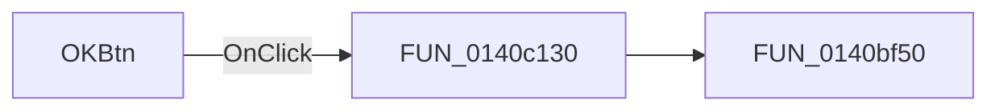

# OKBtn

> Analysis status: Pending individual source review.

## Control

| Property | Recovered value |
| --- | --- |
| Form | DataSeqPattern |
| Component path | DataSeqPattern.OKBtn |
| Control class | TBitBtn |
| Caption | Not present in the recovered resource. |
| Hint | Not present in the recovered resource. |
| Text | Not present in the recovered resource. |
| Handler name | OKBtnClick |
| Handler address | 0140c130 |
| Graph node | `resource:dfm:DataSeqPattern/DataSeqPattern.OKBtn` |
| Handler node | `function:0140c130` |
| Graph layer | UI |

## What happens when clicked

Pending individual analysis. An agent must read the recovered handler source and its relevant callees before it replaces this text.

## Click flow

## Handler evidence

- Source: [DecompiledSources/Tina16/functions/000000000140C130__FUN_0140c130.c](../../../DecompiledSources/Tina16/functions/000000000140C130__FUN_0140c130.c)
- Recovered role: Not present in the recovered resource.
- Current graph summary: Handles 1 Delphi UI event: DataSeqPattern.OKBtn.OnClick.
- Current graph behavior: Not present in the recovered resource.
- Current graph evidence: Not present in the recovered resource.
- Complexity: simple
- Distinct outgoing calls: 1

## Direct calls

- `function:0140bf50` — FUN_0140bf50

## Resource evidence

- Kind: bkOK
- Modal result: Not present in the recovered resource.
- Checked state: Not present in the recovered resource.
- List items: Not present in the recovered resource.
- Image reference: Not present in the recovered resource.
- Extracted glyph: None.

## Nearby label candidates

Nearby labels are layout candidates only. They are not proof of behavior.

- Rank 1: &Limit: at distance 56.
- Rank 2: &Increment/decrement: at distance 81.
- Rank 3: &Initial: at distance 108.

## Analysis limits

- Do not infer behavior from the control class, caption, hint, glyph, or nearby label alone.
- Do not replace the pending status until the handler source and relevant call path provide enough evidence.
