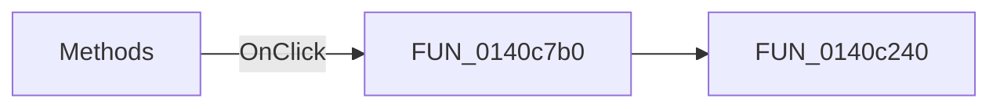

# Methods

> Analysis status: Pending individual source review.

## Control

| Property | Recovered value |
| --- | --- |
| Form | DataSeqPattern |
| Component path | DataSeqPattern.rgMethods |
| Control class | TRadioGroup |
| Caption | Methods |
| Hint | Not present in the recovered resource. |
| Text | Not present in the recovered resource. |
| Handler name | rgMethodsClick |
| Handler address | 0140c7b0 |
| Graph node | `resource:dfm:DataSeqPattern/DataSeqPattern.rgMethods` |
| Handler node | `function:0140c7b0` |
| Graph layer | UI |

## What happens when clicked

Pending individual analysis. An agent must read the recovered handler source and its relevant callees before it replaces this text.

## Click flow

## Handler evidence

- Source: [DecompiledSources/Tina16/functions/000000000140C7B0__FUN_0140c7b0.c](../../../DecompiledSources/Tina16/functions/000000000140C7B0__FUN_0140c7b0.c)
- Recovered role: Not present in the recovered resource.
- Current graph summary: Handles 1 Delphi UI event: DataSeqPattern.rgMethods.OnClick.
- Current graph behavior: Not present in the recovered resource.
- Current graph evidence: Not present in the recovered resource.
- Complexity: simple
- Distinct outgoing calls: 1

## Direct calls

- `function:0140c240` — FUN_0140c240

## Resource evidence

- Kind: Not present in the recovered resource.
- Modal result: Not present in the recovered resource.
- Checked state: Not present in the recovered resource.
- List items: ("&Fill with 0", "F&ill with 1", "&Shift 1 left", "S&hift 1 right", "Shi&ft 0 left", "Shif&t 0 right", "Count &up", "Count &down")
- Image reference: Not present in the recovered resource.
- Extracted glyph: None.

## Nearby label candidates

Nearby labels are layout candidates only. They are not proof of behavior.

- Rank 1: &Initial: at distance 225.
- Rank 2: &Increment/decrement: at distance 252.
- Rank 3: &Limit: at distance 277.

## Analysis limits

- Do not infer behavior from the control class, caption, hint, glyph, or nearby label alone.
- Do not replace the pending status until the handler source and relevant call path provide enough evidence.
