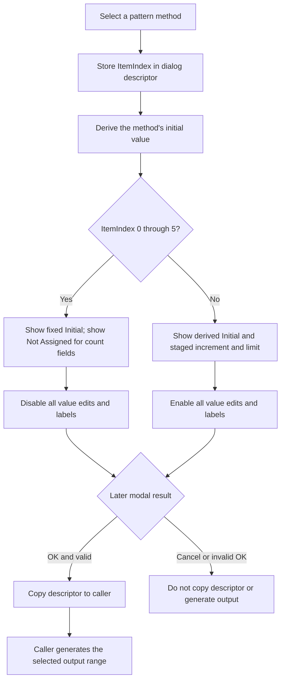

# Select how the sequence pattern is generated

> Analysis status: Evidence-backed source review complete.

## Control

| Property | Recovered value |
| --- | --- |
| Form | DataSeqPattern |
| Form caption | Fill |
| Component path | DataSeqPattern.rgMethods |
| Control class | TRadioGroup |
| Caption | Methods |
| Items | Fill with 0, Fill with 1, Shift 1 left, Shift 1 right, Shift 0 left, Shift 0 right, Count up, Count down |
| Hint | Not present in the recovered resource. |
| Handler name | rgMethodsClick |
| Handler address | 0140c7b0 |
| Graph node | `resource:dfm:DataSeqPattern/DataSeqPattern.rgMethods` |
| Handler node | `function:0140c7b0` |
| Graph layer | UI |

## What happens when clicked

`rgMethods` selects the algorithm that a caller will later use to fill a data range. The click does not generate or change output data. It updates the dialog's staged method and resets the three value editors for that method.

`FUN_0140c7b0` is a one-call event wrapper. It calls `FUN_0140c240`, which reads `rgMethods.ItemIndex`, writes it to staged descriptor field `+0x710`, calculates the method's default initial value, updates the editor text, and changes which editors and labels are enabled.

The DFM item order, the default-value helper, and the later sequence generator establish this mapping:

| ItemIndex | Radio item | Default initial value | Later generator operation |
| --- | --- | --- | --- |
| `0` | Fill with 0 | `0` | Write zero to every target item. |
| `1` | Fill with 1 | All bits set for the effective width | Write the all-ones value to every target item. |
| `2` | Shift 1 left | Low bit set | Move one set bit left and wrap it within the effective width. |
| `3` | Shift 1 right | High bit set | Move one set bit right and wrap it within the effective width. |
| `4` | Shift 0 left | All bits set except the low bit | Move one clear bit left and wrap it within the effective width. |
| `5` | Shift 0 right | All bits set except the high bit | Move one clear bit right and wrap it within the effective width. |
| `6` | Count up | `0` | Add the staged increment and apply the generator's wrap limit. |
| `7` | Count down | All bits set for the effective width | Subtract the staged decrement and apply the generator's wrap rule. |

The effective width comes from the dialog context fields. A 32-bit context uses `0xffffffff` as the all-ones value. A narrower context derives the mask from `2^width - 1`.

## Fixed-pattern and count editor states

The related edits and labels are:

| Form field | Control | Staged descriptor field |
| --- | --- | --- |
| `+0x6d8` | **Initial** edit | Parsed to `+0x71c` by OK |
| `+0x6e8` | **Increment/decrement** edit | Parsed to `+0x720` by OK |
| `+0x6f8` | **Limit** edit | Parsed to `+0x724` by OK |

For **Fill** and **Shift** methods, indexes `0..5`, the refresh helper:

1. formats the derived fixed initial value in the dialog's numeric format;
2. writes localized **Not Assigned** text to Increment/decrement and Limit;
3. disables all three edits and their labels; and
4. removes the three disabled edits from the tab order.

The initial edit is disabled because these six methods use the derived fixed value. Increment/decrement and Limit do not apply to these methods.

For **Count up** and **Count down**, indexes `6` and `7`, the helper:

1. formats the derived count initial value;
2. restores Increment/decrement from staged field `+0x720`;
3. restores Limit from staged field `+0x724`;
4. enables all three edits and labels; and
5. adds the edits to the tab order.

The click does not set new increment or limit defaults. It restores their last staged numeric fields. Text that the user typed into these edits is not parsed until OK. If the user changes methods before OK, the refresh can overwrite that unparsed text.

## Show, repeated selection, and staged state

The form's `OnShow` path sets the three edit hints to a localized **Enter hex value** message, assigns the staged method to the radio group, and runs the same refresh helper. This gives the first display the same defaults and enabled states as a later click.

There is no unchanged-index or initialization guard in `FUN_0140c7b0` or `FUN_0140c240`. Each handler call rewrites `+0x710`, re-formats Initial, rewrites both count fields, and reapplies the enabled and tab-stop states. If the UI emits another click for the selected item, this work runs again and any unparsed edit text is reset from staged fields.

The click changes only dialog-owned state:

- `+0x710` holds the selected method immediately.
- `+0x71c`, `+0x720`, and `+0x724` are not updated by the click.
- No target buffer, grid, simulation object, file, or settings store is changed.

## OK, Cancel, and later output generation

The custom OK handler validates the enabled numeric text. For indexes `0..5`, it uses the fixed-method rules and validates Initial. For indexes `6` and `7`, it also validates Increment/decrement and Limit. If no validation error is recorded, OK writes the selected `ItemIndex` and parsed values to the dialog descriptor.

The caller decides whether to accept that descriptor. The DataSPI **Fill...** path copies it only after the modal result is OK. It then clears the grid view, calls the shared pattern generator for the selected address range and bit width, and rebuilds the grid from the changed private buffer. Cancel is a standard `bkCancel` path. It causes no descriptor copy and no generated output.

This Bead does not own the OK validator or the shared generator. Bead `.405` owns the OK boundary, and Bead `.399` owns the DataSPI Fill and generator path.

## Invalid indexes and failures

- Normal `TRadioGroup` input supplies an index from `0` through `7`.
- The refresh has no explicit bounds check. For another index, the default helper returns zero and the refresh uses the count-style branch: it enables all three fields and restores Increment/decrement and Limit.
- The OK handler also treats an invalid index as a count-style method and can copy it if the numeric text validates.
- The downstream generator has branches only for indexes `0..7`. An invalid accepted index therefore writes no generated items.
- The refresh writes staged method `+0x710` before it formats text or changes controls. It has no local exception handler, status return, or rollback. A localization, allocation, formatting, or VCL setter failure can leave the new method staged with only part of the UI refreshed. Caller data and output remain unchanged until a later successful OK and caller action.
- The click shows no confirmation or error dialog. Numeric errors belong to the later OK handler.

## Method-selection flow

## Handler and model evidence

- Event wrapper: [FUN_0140c7b0](../../../DecompiledSources/Tina16/functions/000000000140C7B0__FUN_0140c7b0.c)
- Method staging, default text, and enabled-state refresh: [FUN_0140c240](../../../DecompiledSources/Tina16/functions/000000000140C240__FUN_0140c240.c)
- Fixed initial-value mapping: [FUN_0140af60](../../../DecompiledSources/Tina16/functions/000000000140AF60__FUN_0140af60.c), [FUN_0140a5b0](../../../DecompiledSources/Tina16/functions/000000000140A5B0__FUN_0140a5b0.c), and [FUN_0140a660](../../../DecompiledSources/Tina16/functions/000000000140A660__FUN_0140a660.c)
- Form-show initialization: [FUN_0140c7c0](../../../DecompiledSources/Tina16/functions/000000000140C7C0__FUN_0140c7c0.c)
- OK parsing and staged-descriptor update: [FUN_0140c130](../../../DecompiledSources/Tina16/functions/000000000140C130__FUN_0140c130.c) and [FUN_0140bf50](../../../DecompiledSources/Tina16/functions/000000000140BF50__FUN_0140bf50.c)
- Later sequence generator: [FUN_0140b070](../../../DecompiledSources/Tina16/functions/000000000140B070__FUN_0140b070.c)
- DataSPI modal acceptance and output generation: [FUN_01411ab0](../../../DecompiledSources/Tina16/functions/0000000001411AB0__FUN_01411ab0.c) and [FUN_01411d50](../../../DecompiledSources/Tina16/functions/0000000001411D50__FUN_01411d50.c)
- VCL enabled-state implementation for virtual slot `+0x128`: [FUN_0064dc60](../../../DecompiledSources/Tina16/functions/000000000064DC60__FUN_0064dc60.c)
- Edit tab-stop setter: [FUN_0064dfb0](../../../DecompiledSources/Tina16/functions/000000000064DFB0__FUN_0064dfb0.c)
- [OKBtn](okbtn-bfa7388797.md) owns the dialog validation and accept boundary.
- Recovered form and control resources: [ui-evidence.json](../../../DecompiledSources/Tina16/resources/dfm/ui-evidence.json)

## Resource and annotation limits

- The method names and their order come from the recovered DFM. They agree with the source branches and generator operations; the article does not use the captions alone.
- The three nearby labels map to their edits through form field order, `OnShow`, the refresh helper, and OK parsing.
- The exact localized text behind `HDLStrings.Msg_NotAssigned` and `HDLStrings.Msg_EnterHexValue` is not embedded in the recovered C. This article uses the resource keys and does not invent longer messages.
- This Bead owns `FUN_0140c7b0` and the direct shared method-control refresh `FUN_0140c240`. The OK parser and validator, DataSPI caller, sequence generator, numeric formatters, VCL setters, and arithmetic helpers remain evidence only.
