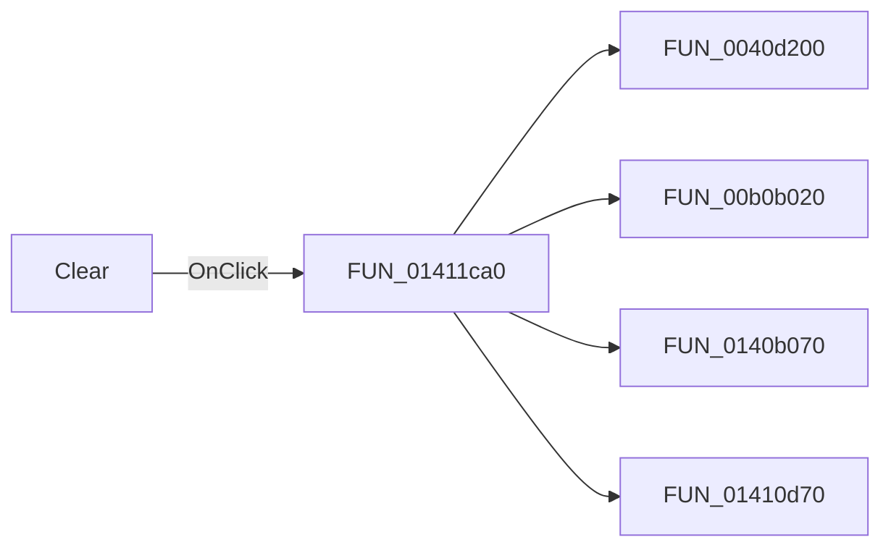

# Clear

> Analysis status: Pending individual source review.

## Control

| Property | Recovered value |
| --- | --- |
| Form | DataSPI |
| Component path | DataSPI.bClear |
| Control class | TButton |
| Caption | Clear |
| Hint | Not present in the recovered resource. |
| Text | Not present in the recovered resource. |
| Handler name | bClearClick |
| Handler address | 01411ca0 |
| Graph node | `resource:dfm:DataSPI/DataSPI.bClear` |
| Handler node | `function:01411ca0` |
| Graph layer | UI |

## What happens when clicked

Pending individual analysis. An agent must read the recovered handler source and its relevant callees before it replaces this text.

## Click flow

## Handler evidence

- Source: [DecompiledSources/Tina16/functions/0000000001411CA0__FUN_01411ca0.c](../../../DecompiledSources/Tina16/functions/0000000001411CA0__FUN_01411ca0.c)
- Recovered role: Not present in the recovered resource.
- Current graph summary: Handles 1 Delphi UI event: DataSPI.bClear.OnClick.
- Current graph behavior: Not present in the recovered resource.
- Current graph evidence: Not present in the recovered resource.
- Complexity: complex
- Distinct outgoing calls: 4

## Direct calls

- `function:0040d200` — FUN_0040d200
- `function:00b0b020` — FUN_00b0b020
- `function:0140b070` — FUN_0140b070
- `function:01410d70` — FUN_01410d70

## Resource evidence

- Kind: Not present in the recovered resource.
- Modal result: Not present in the recovered resource.
- Checked state: Not present in the recovered resource.
- List items: Not present in the recovered resource.
- Image reference: Not present in the recovered resource.
- Extracted glyph: None.

## Nearby label candidates

Nearby labels are layout candidates only. They are not proof of behavior.

- Rank 1:  Address     /   Data   at distance 284.

## Analysis limits

- Do not infer behavior from the control class, caption, hint, glyph, or nearby label alone.
- Do not replace the pending status until the handler source and relevant call path provide enough evidence.
