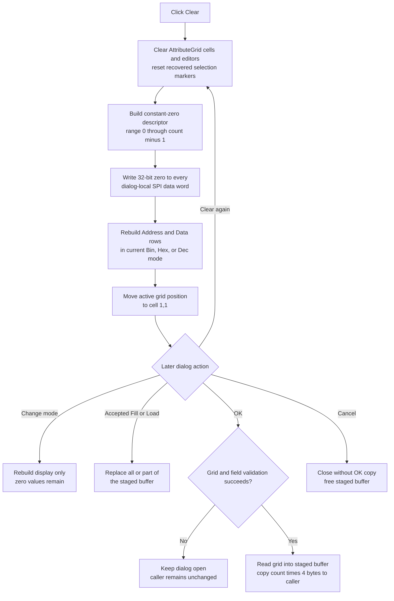

# Clear SPI pattern data

> Analysis status: Complete from recovered resource, handler, staging-buffer, grid-rebuild, mode, OK, Cancel, Fill, and Load evidence.

## Control

| Property | Recovered value |
| --- | --- |
| Form | DataSPI |
| Form caption | SPI Transmitter |
| Component path | DataSPI.bClear |
| Control class | TButton |
| Caption | Clear |
| Hint | Not present in the recovered resource. |
| Glyph | None |
| Handler name | bClearClick |
| Handler address | 01411ca0 |
| Graph node | `resource:dfm:DataSPI/DataSPI.bClear` |
| Handler node | `function:01411ca0` |
| Graph layer | UI |

## What happens when clicked

`bClearClick` replaces every value in the dialog's staged SPI pattern buffer with zero. It does not remove the address rows or change the number of values.

The handler creates a zeroed 24-byte pattern descriptor on the stack. It sets the descriptor's pattern kind and initial value to `0`, and sets its last affected index to the dialog item count at `+0x7B0` minus one. It then calls the shared pattern generator with:

- start index `0`;
- end index `count - 1`;
- staged buffer pointer `+0x7B8`;
- current bit width `+0x7B4`;
- 32-bit output enabled.

The selected generator branch writes value `0` to each buffer element from index `0` through `count - 1`. The writer uses a four-byte stride, so the operation clears all staged data words. Address numbers are not data in this buffer and are regenerated as row labels.

## Grid reset and rebuild

Before it changes the buffer, the handler clears the whole `TAttributeGrid` from column `0`. The grid clear removes the old nonfixed cell strings and editor objects, resets two recovered selection markers to `-1`, and returns its row marker to the fixed-row count.

After the buffer is zeroed, `FUN_01410d70` rebuilds the grid:

1. It clears the dialog's grid-editor model at `+0x808`.
2. It writes localized column headers from resource IDs `0x478` and `0x479`. The DFM's nearby label identifies the columns as **Address / Data**.
3. It sets the data-row count from `+0x7B0`.
4. For each index, it formats the index as the address label and formats the staged value with the current bit width and numeric mode.
5. It creates the mode-specific value editor, applies the recovered lower and upper limits from `+0x824` and `+0x828`, and adds the row to the grid.

The clear handler then calls the grid's virtual operation with column `1` and row `1`. This resets the active grid position to the first data cell when that cell exists. The original Delphi method name is not recovered.

The grid is therefore not left empty. It shows the same address range with zero in every Data cell.

## Numeric mode and other options

Clear does not change the `Mode` radio group or form field `+0x818`. The rebuild selects one of three editor and formatter types from that field. The recovered DFM labels the items **Bin**, **Hex**, and **Dec**. A later mode click clears only the grid presentation and rebuilds it from the same zeroed buffer, so it changes representation but not the cleared values.

The handler does not read or change the Pattern low/high edits, the Simulation edits, the **Repeat pattern** check box, the Open dialog, or the item count. It also does not open the Fill or Load dialogs.

Fill uses this handler as its reset step after the Fill dialog is accepted. It first clears all staged values, then applies the accepted generated pattern to its chosen range. Load has a separate path that replaces the staged buffer from a file and rebuilds the same grid.

## Dialog-local state and commit boundary

The DataSPI create path gets the caller's transmitter record, copies its fields to form offset `+0x7B0`, allocates a private `count * 4` byte buffer at `+0x7B8`, and copies the caller's data words into it. Clear writes only this private buffer and the dialog's grid objects. It does not write the caller record.

The OK handler is the commit boundary. It first validates the grid. On success, it reads each current grid editor back into the staged buffer and copies `count * 4` bytes from that buffer to the caller's data array. It then validates and copies the other dialog fields. Thus, edits made after Clear can replace some zero values before OK commits them.

Cancel is a standard `TBitBtn` with `Kind = bkCancel` and has no custom click handler. It does not run the OK copy. The form destructor frees the private `+0x7B8` buffer, so Cancel discards the clear operation together with other uncommitted edits.

## Repeat, no-op, and errors

A second Clear writes zero over the same staged values, rebuilds the grid again, and returns the active position to cell `(1,1)`. The data result is unchanged after the first clear, but the grid reset and rebuild still occur.

The handler has no confirmation prompt, empty-selection branch, validation call, result test, local exception handler, error message, undo record, or rollback. It assumes that the dialog count and staged buffer were initialized by the create path. An allocation, formatter, editor-construction, or grid failure can propagate to higher-level Delphi exception handling. A failure after the buffer write can leave zeroed staged data with a partly rebuilt grid, but the caller remains unchanged until a later successful OK commit.

## Clear and commit flow

## Evidence

- [bClearClick](../../../DecompiledSources/Tina16/functions/0000000001411CA0__FUN_01411ca0.c) clears the grid, constructs the constant-zero descriptor for indices `0..count-1`, applies it to form buffer `+0x7B8`, rebuilds the grid, and calls the grid virtual operation with `(1,1)`.
- [The shared pattern generator](../../../DecompiledSources/Tina16/functions/000000000140B070__FUN_0140b070.c) selects its constant-zero branch from descriptor kind `0`. [Its element writer](../../../DecompiledSources/Tina16/functions/000000000140B020__FUN_0140b020.c) proves that this call writes four-byte values because the handler passes the final flag as `1`.
- [The AttributeGrid clear helper](../../../DecompiledSources/Tina16/functions/0000000000B0B020__FUN_00b0b020.c) clears cell strings and editor objects, resets selection fields `+0x63C/+0x640` to `-1`, and restores the recovered row marker at `+0x644`.
- [The DataSPI grid rebuild](../../../DecompiledSources/Tina16/functions/0000000001410D70__FUN_01410d70.c) restores the headers and one row for each staged value. It formats values by bit width and mode and creates the matching editor type.
- [DataSPI creation](../../../DecompiledSources/Tina16/functions/00000000014109F0__FUN_014109f0.c) copies the caller record, allocates the form-local data buffer, copies the caller's words, and performs the initial rebuild. [The form destructor](../../../DecompiledSources/Tina16/functions/0000000001410990__FUN_01410990.c) frees that buffer.
- [OKBtnClick](../../../DecompiledSources/Tina16/functions/0000000001411850__FUN_01411850.c) validates the grid and copies the staged words to the caller only on success. [The grid-to-buffer reader](../../../DecompiledSources/Tina16/functions/0000000001408C30__FUN_01408c30.c) reads each active editor before that copy.
- [rgModeClick](../../../DecompiledSources/Tina16/functions/0000000001411980__FUN_01411980.c) changes the current mode and rebuilds the grid without replacing the staged buffer. [bFillClick](../../../DecompiledSources/Tina16/functions/0000000001411AB0__FUN_01411ab0.c) calls Clear before it applies an accepted pattern. [bLoadClick](../../../DecompiledSources/Tina16/functions/0000000001411E50__FUN_01411e50.c) replaces the staged buffer only after the file dialog succeeds.
- The recovered DFM gives the form caption `SPI Transmitter`, the Clear caption, the `TAttributeGrid`, the **Address / Data** label, the **Bin / Hex / Dec** mode items, the **Repeat pattern** check box, and the standard OK and Cancel button kinds. Clear has no hint or glyph.

## Ownership and limits

- This Bead owns the `FUN_01411ca0` clear handler and shared DataSPI grid-rebuild helper `FUN_01410d70` annotations.
- Bead `.396` owns OK. Bead `.398` owns the mode handler, `.399` owns Fill and the shared pattern generator, and `.400` owns Load. Their functions are call-path evidence only here.
- The original Delphi field, descriptor, and virtual-method names are not available. Offset and mode labels describe proven use in the recovered sources.
