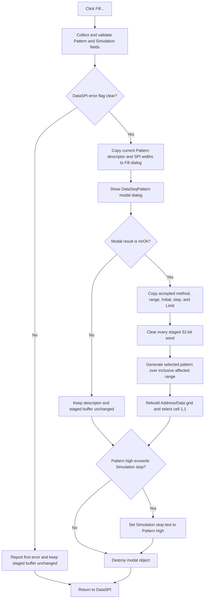

# Fill the staged SPI transmitter data with a generated pattern

> Analysis status: Reviewed from the DataSPI handler, shared Pattern and Simulation validator, `DataSeqPattern` modal dialog, pattern-application worker, broad generator, grid rebuild, form staging path, and DFM resources.

## Control

| Property | Recovered value |
| --- | --- |
| Form | DataSPI |
| Component path | DataSPI.rgPattern.bFill |
| Control class | TButton |
| Caption | Fill... |
| Hint | Not present in the recovered resource. |
| Size | 57 by 25 |
| Handler name | bFillClick |
| Handler address | 01411ab0 |
| Graph node | `resource:dfm:DataSPI/DataSPI.rgPattern.bFill` |
| Handler node | `function:01411ab0` |
| Graph layer | UI |

## What happens when clicked

[`FUN_01411ab0`](../../../DecompiledSources/Tina16/functions/0000000001411AB0__FUN_01411ab0.c) first calls the [shared DataSPI validator](../../../DecompiledSources/Tina16/functions/00000000014112E0__FUN_014112e0.c). It collects the current Pattern low and high addresses, the Simulation start and stop addresses, and the other Pattern and Simulation fields. It rejects invalid hexadecimal text, reversed ranges, and upper addresses that exceed the recovered transmitter capacity. A failure reports the first error through form flag `+0x7A8`. The Fill handler does not open another dialog or change the staged data while that flag is nonzero.

When validation succeeds, the handler creates the shared `TDataSeqPattern` modal form. The resource captions this form **Fill**. The handler supplies:

- the current 24-byte Pattern descriptor, including the selected method, affected low and high addresses, initial value, increment or decrement, and limit;
- the SPI data-format and pattern-width fields;
- an SPI mode flag that makes the generator write four-byte values; and
- the DataSPI owner reference used by the modal help path.

The modal form works on its own copy of this descriptor. It does not receive the staged data-buffer pointer.

## Pattern methods and inputs

The `DataSeqPattern.rgMethods` resource gives the method order that the generator uses:

| Index | Recovered item | Proven generated pattern |
| ---: | --- | --- |
| 0 | Fill with 0 | Writes zero. |
| 1 | Fill with 1 | Writes the method's all-one initial value. |
| 2 | Shift 1 left | Rotates one set bit to the left within the configured width. |
| 3 | Shift 1 right | Rotates one set bit to the right within the configured width. |
| 4 | Shift 0 left | Rotates one clear bit to the left through an otherwise set value. |
| 5 | Shift 0 right | Rotates one clear bit to the right through an otherwise set value. |
| 6 | Count up | Starts at the accepted Initial value and adds the accepted increment with the recovered wrap rule. |
| 7 | Count down | Starts at the accepted Initial value and subtracts the accepted decrement with the recovered wrap rule. |

The modal resource labels its three text boxes **Initial**, **Increment/decrement**, and **Limit**. [`FUN_0140c240`](../../../DecompiledSources/Tina16/functions/000000000140C240__FUN_0140c240.c) derives the method-specific initial value and updates which fields and labels are enabled. The six fill or shift methods use generated defaults and mark the count-specific values as not assigned. Count Up and Count Down enable all three inputs.

The form's show path supplies a localized **Enter hex value** hint. [`FUN_0140c130`](../../../DecompiledSources/Tina16/functions/000000000140C130__FUN_0140c130.c), the modal OK handler, parses the required fields through [`FUN_0140bf50`](../../../DecompiledSources/Tina16/functions/000000000140BF50__FUN_0140bf50.c). Invalid text reports the field label and a localized invalid-value message. The modal close-query handler vetoes the close when its error flag is set and clears the flag for another attempt. Thus, an invalid modal OK does not return an accepted descriptor to DataSPI.

## Accepted descriptor and staged-buffer replacement

When the modal result is `mrOk`, `FUN_01411ab0` copies the six descriptor fields back to DataSPI fields `+0x7E8` through `+0x7FC`. It also copies the accepted Initial value to the current generator seed at `+0x820`.

The replacement then has two steps:

1. It calls the [Clear handler](bclear-c9952c37ff.md), which writes a four-byte zero to every element of the private `count * 4` byte buffer at `+0x7B8`.
2. It calls [`FUN_01411d50`](../../../DecompiledSources/Tina16/functions/0000000001411D50__FUN_01411d50.c), which applies the accepted descriptor to the affected low-through-high range, rebuilds the Address/Data grid, and requests grid cell `(1,1)`.

The buffer pointer and item count do not change. Its contents are replaced: values inside the accepted range come from the selected method, and values outside that range remain zero from the preceding Clear operation.

[`FUN_0140b070`](../../../DecompiledSources/Tina16/functions/000000000140B070__FUN_0140b070.c) is the broad pattern generator used by both DataSPI and DataSeq. It reads the method, inclusive low and high indexes, initial value, step, and limit from the descriptor. It dispatches the eight methods above and writes each result through [`FUN_0140b020`](../../../DecompiledSources/Tina16/functions/000000000140B020__FUN_0140b020.c). The final flag selects two-byte or four-byte elements; DataSPI passes `1`, so this path writes 32-bit words. The generator allocates nothing and assumes that its caller supplied a validated descriptor and a large enough buffer.

## Click flow

## Cancel, no-op, and error boundaries

- Canceling `DataSeqPattern` skips descriptor copy-back, Clear, generation, and grid rebuild.
- The handler compares the already validated Pattern high address with the Simulation stop address after the modal call, independent of `mrOk`. If Pattern high is greater, it writes Pattern high to the Simulation stop edit. This adjustment can therefore survive a cancellation of the Fill dialog.
- A failed outer DataSPI validation skips modal construction and all buffer mutation.
- A failed modal OK keeps the modal form open. It does not reach the DataSPI copy-back branch.
- The broad generator has no range message, buffer-size check, exception handler, or rollback. The recovered UI path relies on the earlier DataSPI and modal validation.
- An accepted repeated click clears and regenerates the private buffer again. A canceled repeated click keeps the current descriptor and buffer, subject to the Simulation stop adjustment above.
- When the handler creates the temporary modal object, it destroys that object after the modal call returns and clears the global modal reference.

## Commit and persistence boundary

The DataSPI form owns a private copy of the caller's data while the form is open. Fill changes only this private buffer and the form's staged Pattern and Simulation fields.

The [DataSPI OK command](okbtn-fd7567f774.md) is the later caller-copy boundary. It converts the current grid editors, copies `count * 4` bytes to the caller-owned SPI record, validates the records again, and copies the Pattern and Simulation descriptors only when the error flag remains clear. Closing DataSPI with its Cancel button frees the private buffer without this normal copy-back. The Fill handler does not write a file, registry value, or other persistent setting.

## Resource and ownership evidence

- The DFM places **Fill...** inside the **Pattern** group beside **Affected address (low)** and **Affected address (high)**. These labels agree with the validated descriptor and the generator range; proximity alone was not used as proof.
- The button has no hint, action, image reference, or extracted glyph.
- `TIARA-diz.6.7.396` owns the canonical `FUN_014112e0` validation annotation.
- `TIARA-diz.6.7.397` owns the canonical `FUN_01410d70` grid-rebuild annotation.
- This Bead owns `FUN_01411ab0`, its DataSPI apply worker `FUN_01411d50`, and the shared generator `FUN_0140b070`.

## Analysis limits

- The original Delphi field names are not recovered. This article uses the DFM control names and stable form offsets.
- The exact business meaning of the generator's recovered Limit wrap rule is not named in source. The article does not rename it beyond the visible **Limit** label.
- The recovered path does not prove an undo command or automatic persistence after Fill.
