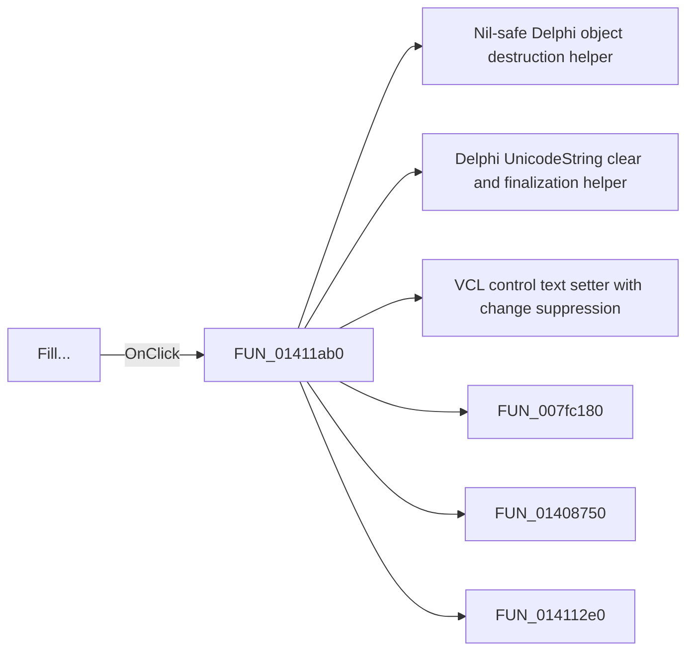

# Fill...

> Analysis status: Pending individual source review.

## Control

| Property | Recovered value |
| --- | --- |
| Form | DataSPI |
| Component path | DataSPI.rgPattern.bFill |
| Control class | TButton |
| Caption | Fill... |
| Hint | Not present in the recovered resource. |
| Text | Not present in the recovered resource. |
| Handler name | bFillClick |
| Handler address | 01411ab0 |
| Graph node | `resource:dfm:DataSPI/DataSPI.rgPattern.bFill` |
| Handler node | `function:01411ab0` |
| Graph layer | UI |

## What happens when clicked

Pending individual analysis. An agent must read the recovered handler source and its relevant callees before it replaces this text.

## Click flow

## Handler evidence

- Source: [DecompiledSources/Tina16/functions/0000000001411AB0__FUN_01411ab0.c](../../../DecompiledSources/Tina16/functions/0000000001411AB0__FUN_01411ab0.c)
- Recovered role: Not present in the recovered resource.
- Current graph summary: Handles 1 Delphi UI event: DataSPI.rgPattern.bFill.OnClick.
- Current graph behavior: Not present in the recovered resource.
- Current graph evidence: Not present in the recovered resource.
- Complexity: complex
- Distinct outgoing calls: 8

## Direct calls

- `function:00410f20` — Nil-safe Delphi object destruction helper
- `function:00414480` — Delphi UnicodeString clear and finalization helper
- `function:0064de00` — VCL control text setter with change suppression
- `function:007fc180` — FUN_007fc180
- `function:01408750` — FUN_01408750
- `function:014112e0` — FUN_014112e0
- `function:01411ca0` — Handles 1 Delphi UI event: DataSPI.bClear.OnClick.
- `function:01411d50` — FUN_01411d50

## Resource evidence

- Kind: Not present in the recovered resource.
- Modal result: Not present in the recovered resource.
- Checked state: Not present in the recovered resource.
- List items: Not present in the recovered resource.
- Image reference: Not present in the recovered resource.
- Extracted glyph: None.

## Nearby label candidates

Nearby labels are layout candidates only. They are not proof of behavior.

- Rank 1: Affected address (high): at distance 42.
- Rank 2: Affected address (low): at distance 96.

## Analysis limits

- Do not infer behavior from the control class, caption, hint, glyph, or nearby label alone.
- Do not replace the pending status until the handler source and relevant call path provide enough evidence.
