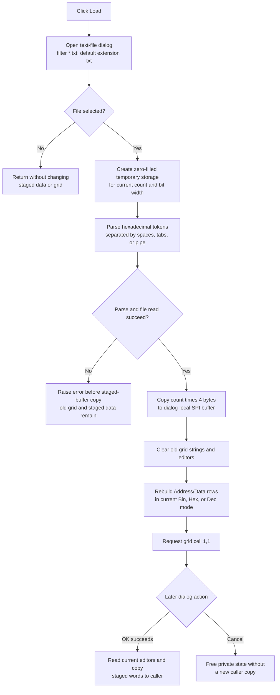

# Load hexadecimal SPI words from a text file

> Analysis status: Evidence-backed source review complete.

## Control

| Property | Recovered value |
| --- | --- |
| Form | DataSPI |
| Form caption | SPI Transmitter |
| Component path | DataSPI.rgPattern.bLoad |
| Control class | TButton |
| Caption | Load |
| Hint | Not present in the recovered resource. |
| Glyph | None |
| Handler name | bLoadClick |
| Handler address | 01411e50 |
| Graph node | `resource:dfm:DataSPI/DataSPI.rgPattern.bLoad` |
| Handler node | `function:01411e50` |
| Graph layer | UI |

## What happens when clicked

`FUN_01411e50` opens the form's `TOpenDialog`. DataSPI initialization configures this dialog with the filter **Text file (*.txt)|*.txt** and the default extension `txt`. The DFM and handler do not set a dialog title, initial directory, or initial file name. A later click can therefore reuse state that the dialog kept from an earlier selection, but the recovered application code does not select a starting folder.

If the user cancels the file dialog, the handler returns after local cleanup. It does not clear the grid, change the staged data, or change the caller record.

If the user accepts a file, the handler prepares a zero-filled temporary descriptor with the current item count from form field `+0x7B0` and the current data bit width from `+0x7B4`. It reads `OpenDialog.FileName`, parses the selected file into that temporary storage, and then copies `count * 4` bytes over the form-local SPI data buffer at `+0x7B8`.

The import replaces the complete staged word array. It does not append to the old values and it does not use the **Affected address (low)** or **Affected address (high)** edits to select a range.

## Text format and capacity

The shared loader `FUN_013a67f0` treats every value as hexadecimal. A nonempty line must start with a hexadecimal digit. After a value, the parser accepts spaces, tabs, or the `|` character before the next value. Uppercase and lowercase hexadecimal digits are accepted. The parser does not accept a `0x` prefix because `x` is not part of its hexadecimal-token test.

The loader reads all lines and all tokens, but it writes only the first `count` values:

- If the file has fewer than `count` values, the remaining temporary entries stay zero. The later full-buffer copy therefore replaces the remaining old staged values with zero.
- If the file has more than `count` values, the extra values are parsed but not stored. A malformed extra token can still raise an error because parsing continues after capacity is full.
- The SPI caller requests 32-bit output. Each stored token is the 32-bit result of repeated base-16 accumulation. The loader itself does not compare the value with the DataSPI bit width or grid limits.
- No explicit text encoding is passed to the line loader. The recovered call therefore uses the VCL file loader's default decoding behavior; this source does not prove one fixed file encoding.

## Grid rebuild and unchanged settings

After the parser returns and the staged buffer copy completes, the handler clears the `TAttributeGrid`, calls the shared DataSPI rebuild helper, and requests grid cell `(1,1)`. The rebuild restores the **Address** and **Data** columns and one row for each configured item. It displays the newly loaded words in the current **Bin**, **Hex**, or **Dec** mode and creates the matching value editors.

Load does not change these settings:

- item count or data bit width;
- numeric mode;
- Pattern low or high address;
- Simulation values;
- **Repeat pattern** state; or
- the form's modal result.

A second accepted Load replaces the same staged buffer and rebuilds the grid again. A second click that is canceled is still a no-op.

## Staging, OK, and Cancel

The DataSPI form starts with a private copy of the caller's data words. Load changes that private buffer and the grid presentation only. It does not immediately update the caller-owned SPI record and it does not persist a file path.

The [OK handler](okbtn-fd7567f774.md) is the later commit boundary. It validates the active grid editor, reads every displayed value back into the private buffer, and copies `count * 4` bytes to the caller before it validates the remaining Pattern and Simulation fields. A successful OK therefore commits the imported values, including any edits made after Load.

The standard `bkCancel` button has no custom click handler. Cancel without a prior partial OK commit closes the form without copying the imported buffer to the caller. The form destructor frees the private buffer. If a previous OK attempt already copied the data words and then failed a later range check, Cancel does not restore those caller words; that partial-commit boundary belongs to OK, not Load.

## Errors and partial state

The shared loader tests that the selected file exists. A missing file raises `File not found: <path>`. A nonempty line that does not provide the expected hexadecimal token raises `Hex number expected, lineno: <number>`. File-open, decoding, allocation, and other I/O failures can also propagate. There is no local exception handler or message recovery in `bLoadClick`.

Parsing occurs before the temporary array is copied to `+0x7B8`. A parser exception therefore stops before the handler replaces the staged buffer or clears the existing grid. After a successful parse, the handler copies the staged buffer before it clears and rebuilds the grid. A later copy, grid-clear, formatter, editor-allocation, or grid-insertion failure can therefore leave the new staged words with an empty or partly rebuilt grid. There is no rollback or undo record.

The recovered temporary-allocation helper has a notable size mismatch: it allocates and clears `count * 2` bytes, while the SPI parser writes 32-bit entries and the copy-back helper reads `count * 4` bytes. The recovered C does not resolve whether this is a defect in the original path or a decompiler reconstruction problem. This article does not assume that the temporary allocation is safe.

## Load flow

## Evidence

- [bLoadClick](../../../DecompiledSources/Tina16/functions/0000000001411E50__FUN_01411e50.c) executes the dialog, prepares the temporary descriptor, gets the selected file name, invokes the shared parser for 32-bit output, copies the result over the staged buffer, clears and rebuilds the grid, and requests cell `(1,1)`.
- [The SPI temporary descriptor helper](../../../DecompiledSources/Tina16/functions/0000000001411DE0__FUN_01411de0.c) copies the current count and bit width and creates zero-filled temporary storage. Its recovered `count * 2` allocation is the size mismatch described above.
- [The SPI temporary copy helper](../../../DecompiledSources/Tina16/functions/0000000001411E20__FUN_01411e20.c) copies `count * 4` bytes from temporary storage to the form's private data buffer.
- [The shared hexadecimal text loader](../../../DecompiledSources/Tina16/functions/00000000013A67F0__FUN_013a67f0.c) checks file existence, loads lines, parses every token, enforces fixed output capacity, and selects 32-bit stores for this call.
- [The required hexadecimal-token reader](../../../DecompiledSources/Tina16/functions/00000000010CAAD0__FUN_010caad0.c), [separator reader](../../../DecompiledSources/Tina16/functions/00000000010CA040__FUN_010ca040.c), [hexadecimal character test](../../../DecompiledSources/Tina16/functions/0000000001AA1060__FUN_01aa1060.c), and [base-16 accumulator](../../../DecompiledSources/Tina16/functions/0000000001AA1170__FUN_01aa1170.c) establish the file grammar and messages.
- [DataSPI initialization](../../../DecompiledSources/Tina16/functions/00000000014109F0__FUN_014109f0.c) configures the text filter and `txt` default extension, copies the caller record, allocates the form-local data buffer, and performs the first grid build.
- [The shared grid rebuild](../../../DecompiledSources/Tina16/functions/0000000001410D70__FUN_01410d70.c) restores Address/Data rows in the selected numeric mode. Bead `.397` owns its canonical annotation.
- [The AttributeGrid clear helper](../../../DecompiledSources/Tina16/functions/0000000000B0B020__FUN_00b0b020.c) removes old cell strings and editor objects before the rebuild.
- [OKBtnClick](../../../DecompiledSources/Tina16/functions/0000000001411850__FUN_01411850.c), [the grid-to-buffer reader](../../../DecompiledSources/Tina16/functions/0000000001408C30__FUN_01408c30.c), and [form destruction](../../../DecompiledSources/Tina16/functions/0000000001410990__FUN_01410990.c) establish the commit, cancel, and private-buffer boundaries.
- The recovered [UI evidence](../../../DecompiledSources/Tina16/resources/dfm/ui-evidence.json) gives the form caption, Load caption, `TOpenDialog`, Address/Data label, Bin/Hex/Dec items, Pattern and Simulation controls, Repeat option, standard OK and Cancel kinds, and event binding. Load has no hint or glyph.

## Ownership and limits

- This Bead owns the canonical annotations for `FUN_01411e50`, `FUN_01411de0`, `FUN_01411e20`, and shared hexadecimal text loader `FUN_013a67f0`. DataSeq Load and MemoryEditor Load reuse the parser as evidence only.
- Bead `.397` owns shared DataSPI grid rebuild `FUN_01410d70`. Bead `.396` owns OK, `.398` owns mode change, and `.399` owns Fill. Their functions are evidence only here.
- The original Delphi names for the form fields, temporary descriptor, and helper functions are not recovered. Offset-based names describe their proven use.
- The parser does not identify the user-facing purpose of the text file beyond fixed-capacity hexadecimal values. This article does not invent a vendor file format name.
