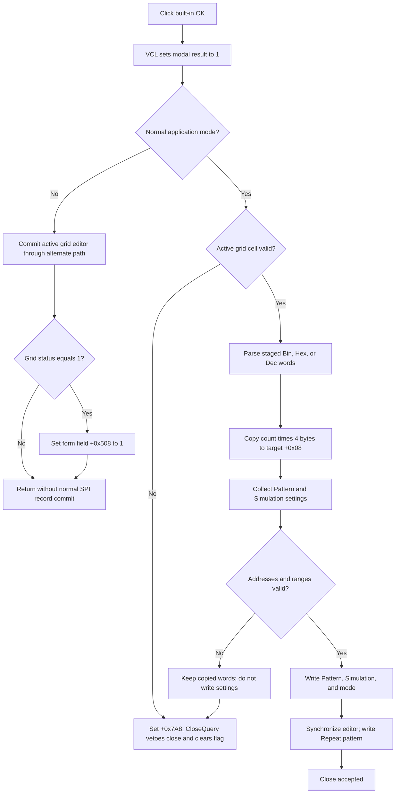

# Validate and commit SPI transmitter data

> Analysis status: Evidence-backed source review complete.

## Control

| Property | Recovered value |
| --- | --- |
| Form | DataSPI |
| Form caption | SPI Transmitter |
| Component path | DataSPI.OKBtn |
| Control class | TBitBtn |
| Caption | Supplied by the standard `bkOK` kind; no explicit caption is stored. |
| Kind | `bkOK` |
| Handler name | OKBtnClick |
| Handler address | 01411850 |
| Graph node | `resource:dfm:DataSPI/DataSPI.OKBtn` |
| Handler node | `function:01411850` |
| Graph layer | UI |

## What happens when clicked

In the normal application mode, `FUN_01411850` validates the active `AttributeGrid` cell, converts all staged data strings to 32-bit words, and commits the DataSPI settings to the caller-owned SPI record. This is a direct commit. The modal caller does not copy a separate result object after the dialog closes.

The commit uses these recovered target fields:

| Target field | Committed value |
| --- | --- |
| `+0x08` buffer, for `count * 4` bytes | All staged Address / Data words, parsed in the current Bin, Hex, or Dec display mode. |
| `+0x10` | `rgMode.ItemIndex`. |
| `+0x18` through `+0x37` | A 32-byte Simulation record: bit count, start address, stop address, step time, and frame time. |
| `+0x38` through `+0x4F` | A 24-byte Pattern record: the parsed affected low and high addresses plus four retained pattern fields. |
| `+0x50` | `cbRepeat.Checked` for **Repeat pattern**. |

The address edits are hexadecimal address fields. `FUN_014111d0` accepts hexadecimal characters and parses them through the hex branch of `FUN_01408880`. The Bin, Hex, and Dec radio choices apply to the grid's data-word representation, not to these address edits.

## Validation and close veto

The first guard calls `FUN_00b0a890` for the active grid cell. If that editor cannot commit its current value, the handler stores the error state at form field `+0x7A8` and stops before it converts or copies any target data.

If the active cell is valid, the handler converts every staged grid value with `FUN_01408c30` and copies `count * 4` bytes to the target data buffer. It then calls `FUN_014112e0`, which collects and validates the Pattern and Simulation records:

- Pattern low and high addresses must be valid hexadecimal text.
- Pattern high must not be less than pattern low.
- Simulation start and stop addresses must be valid hexadecimal text.
- Simulation stop must not be less than simulation start.
- Pattern high and simulation stop must not be greater than the stored target count or capacity value.
- The numeric editors supply step time, frame time, and bit count. Their editor-level `OnError` handlers provide their input checks. This collector does not prove another positive or nonzero range rule for those three values.

`FUN_01411130` records the first validation failure and shows its message. Invalid address text uses the field label followed by `invalid value!`. Reversed ranges use an `exceeds` message. Values above the target limit use the localized `HDLStrings.Msg_PsgExceed` text. Later checks do not replace the first recorded error.

The DFM binds `FUN_01411090` as `OnCloseQuery`. It allows the close only when `+0x7A8` is zero, then clears that field. Because `OKBtn` is `bkOK`, the VCL assigns modal result `1` before it dispatches `OnClick`. A validation failure therefore vetoes that close and resets the error state for a retry. A successful click completes the setting writes, invokes the editor synchronization helper, and closes with the accepted modal result.

## Partial commit and retry behavior

The normal path is not transactional. The handler copies the staged grid words to target buffer `+0x08` before `FUN_014112e0` validates the Pattern and Simulation ranges. A later range or address failure keeps the form open, but the target word buffer has already changed.

The 24-byte Pattern record, 32-byte Simulation record, mode, and repeat flag are written only while the error field remains clear. Thus, a failed late validation can leave new data words together with the previous settings. A retry can replace them. A later exception during the ordered direct writes can also leave a partial target update; the recovered handler has no rollback or local exception handler.

## Staging, Cancel, and ownership

`FUN_014109f0` obtains the caller-owned target record from the editor, copies its 88-byte setting area into the form, allocates a private word buffer, and copies the original target words into that buffer. Clear, Fill, Load, and mode-change commands operate on this form-local buffer or its grid presentation. They do not by themselves copy the staged words to the target.

The separate `CancelBtn` is `bkCancel` and has no custom `OnClick`. Cancel before any OK attempt discards the form-local buffer when the modal owner destroys the form, so it leaves the caller record unchanged. Cancel after a failed late OK does not restore the target word buffer that OK already copied. There is no saved caller snapshot copy-back in the modal owner.

`FUN_01433d30` creates DataSPI for the owning editor. The common modal wrapper `FUN_00b088a0` shows the form and destroys it after return; it does not perform a result-dependent SPI copy. The committed record remains owned by the editor and supplies the configured word pattern, numeric representation, simulation timing and address interval, affected pattern interval, and repeat setting. The recovered call tree does not identify the later simulator routine that consumes each field, so this article does not claim an exact transmission scheduling algorithm.

## Alternate application mode

When global flag `PTR_DAT_020039A8` is nonzero, `FUN_01411850` takes a different path. It calls `FUN_00b0a960` for the active grid editor and, when the grid status at `+0x638` is `1`, sets form field `+0x508` to `1`. This branch does not run the normal word-buffer conversion, Pattern and Simulation collection, mode write, repeat write, or `+0x7A8` close-veto path. The recovered source does not establish the purpose of this global mode or of form field `+0x508`.

## OK flow

## Source evidence

- OK validation, word conversion, copy order, setting writes, mode, and repeat commit: [FUN_01411850](../../../DecompiledSources/Tina16/functions/0000000001411850__FUN_01411850.c)
- Pattern and Simulation collection, address and range checks, timing reads, and limit checks: [FUN_014112e0](../../../DecompiledSources/Tina16/functions/00000000014112E0__FUN_014112e0.c)
- Hexadecimal address validation and parse: [FUN_014111d0](../../../DecompiledSources/Tina16/functions/00000000014111D0__FUN_014111d0.c), [FUN_014089a0](../../../DecompiledSources/Tina16/functions/00000000014089A0__FUN_014089a0.c), and [FUN_01408880](../../../DecompiledSources/Tina16/functions/0000000001408880__FUN_01408880.c)
- First-error message state: [FUN_01411130](../../../DecompiledSources/Tina16/functions/0000000001411130__FUN_01411130.c)
- Active-grid-cell commit: [FUN_00b0a890](../../../DecompiledSources/Tina16/functions/0000000000B0A890__FUN_00b0a890.c)
- Grid strings to 32-bit word buffer: [FUN_01408c30](../../../DecompiledSources/Tina16/functions/0000000001408C30__FUN_01408c30.c)
- Form initialization, caller-record snapshot, and private buffer allocation: [FUN_014109f0](../../../DecompiledSources/Tina16/functions/00000000014109F0__FUN_014109f0.c)
- Close-query veto and retry reset: [FUN_01411090](../../../DecompiledSources/Tina16/functions/0000000001411090__FUN_01411090.c)
- DataSPI creation and generic modal ownership: [FUN_01433d30](../../../DecompiledSources/Tina16/functions/0000000001433D30__FUN_01433d30.c) and [FUN_00b088a0](../../../DecompiledSources/Tina16/functions/0000000000B088A0__FUN_00b088a0.c)
- Standard `bkOK` setup and modal-result dispatch: [FUN_0082bc30](../../../DecompiledSources/Tina16/functions/000000000082BC30__FUN_0082bc30.c) and [FUN_00687f30](../../../DecompiledSources/Tina16/functions/0000000000687F30__FUN_00687f30.c)
- Recovered form, labels, radio items, button kinds, and event bindings: [ui-evidence.json](../../../DecompiledSources/Tina16/resources/dfm/ui-evidence.json)

## Resource and annotation limits

- `OKBtn` has no explicit caption, hint, or extracted glyph. Its caption, standard image, default state, and modal result come from `bkOK`.
- The DFM proves the labels **Address / Data**, **Step time**, **Frame time**, **Bit count**, **Start address**, **Stop address**, **Affected address (low)**, **Affected address (high)**, and **Repeat pattern**, plus the **Bin**, **Hex**, and **Dec** radio items.
- The exact meaning of the four retained Pattern fields and the alternate global mode is not recovered. They are not named here.
- This Bead owns canonical annotations for `FUN_01411850` and `FUN_014112e0`. Sibling control handlers and generic VCL, editor, parser, message, and modal-owner helpers remain evidence only.
