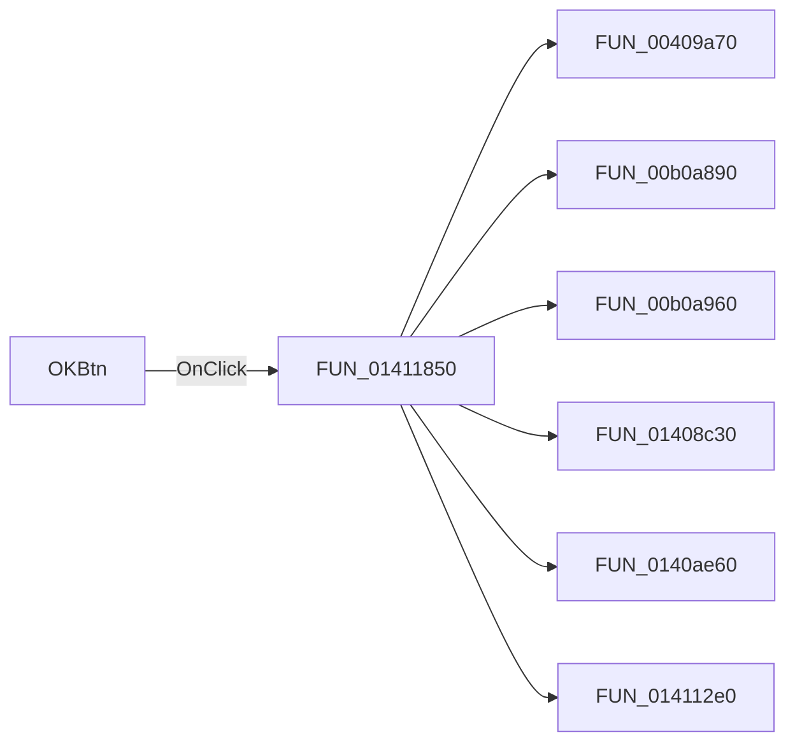

# OKBtn

> Analysis status: Pending individual source review.

## Control

| Property | Recovered value |
| --- | --- |
| Form | DataSPI |
| Component path | DataSPI.OKBtn |
| Control class | TBitBtn |
| Caption | Not present in the recovered resource. |
| Hint | Not present in the recovered resource. |
| Text | Not present in the recovered resource. |
| Handler name | OKBtnClick |
| Handler address | 01411850 |
| Graph node | `resource:dfm:DataSPI/DataSPI.OKBtn` |
| Handler node | `function:01411850` |
| Graph layer | UI |

## What happens when clicked

Pending individual analysis. An agent must read the recovered handler source and its relevant callees before it replaces this text.

## Click flow

## Handler evidence

- Source: [DecompiledSources/Tina16/functions/0000000001411850__FUN_01411850.c](../../../DecompiledSources/Tina16/functions/0000000001411850__FUN_01411850.c)
- Recovered role: Not present in the recovered resource.
- Current graph summary: Handles 1 Delphi UI event: DataSPI.OKBtn.OnClick.
- Current graph behavior: Not present in the recovered resource.
- Current graph evidence: Not present in the recovered resource.
- Complexity: complex
- Distinct outgoing calls: 6

## Direct calls

- `function:00409a70` — FUN_00409a70
- `function:00b0a890` — FUN_00b0a890
- `function:00b0a960` — FUN_00b0a960
- `function:01408c30` — FUN_01408c30
- `function:0140ae60` — FUN_0140ae60
- `function:014112e0` — FUN_014112e0

## Resource evidence

- Kind: bkOK
- Modal result: Not present in the recovered resource.
- Checked state: Not present in the recovered resource.
- List items: Not present in the recovered resource.
- Image reference: Not present in the recovered resource.
- Extracted glyph: None.

## Nearby label candidates

Nearby labels are layout candidates only. They are not proof of behavior.

- Rank 1:  Address     /   Data   at distance 460.

## Analysis limits

- Do not infer behavior from the control class, caption, hint, glyph, or nearby label alone.
- Do not replace the pending status until the handler source and relevant call path provide enough evidence.
