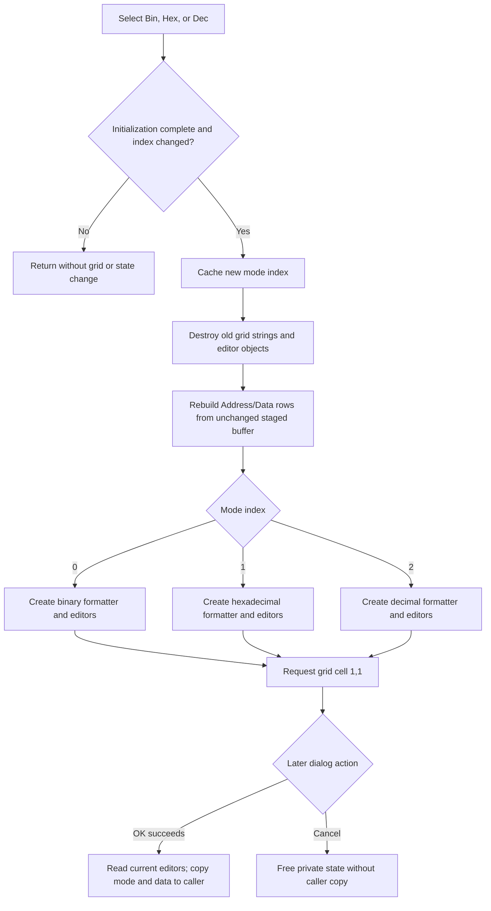

# Rebuild the staged SPI data grid as binary, hexadecimal, or decimal

> Analysis status: Evidence-backed source review complete.

## Control

| Property | Recovered value |
| --- | --- |
| Form | DataSPI |
| Form caption | SPI Transmitter |
| Component path | DataSPI.rgMode |
| Control class | TRadioGroup |
| Caption | Mode |
| Items | Bin, Hex, Dec |
| Hint | Not present in the recovered resource. |
| Handler name | rgModeClick |
| Handler address | 01411980 |
| Graph node | `resource:dfm:DataSPI/DataSPI.rgMode` |
| Handler node | `function:01411980` |
| Graph layer | UI |

## What happens when clicked

`rgMode` changes how each staged SPI data word is displayed and edited. It does not convert the stored 32-bit words, change the address sequence, change the SPI bit count, or start a transfer.

`FUN_01411980` reads the radio group's `ItemIndex` from control field `+0x4a8` and compares it with cached form field `+0x818`. The DFM item order and the three matching rebuild branches establish this mapping:

| ItemIndex | Radio item | Data-cell representation |
| --- | --- | --- |
| `0` | Bin | Binary formatter and binary editor class |
| `1` | Hex | Hexadecimal formatter and hexadecimal editor class |
| `2` | Dec | Decimal formatter and decimal editor class |

The address labels use their separate fixed formatter and do not depend on this mode.

## Change and initialization guards

The handler performs work only when both conditions are true:

- the current `ItemIndex` differs from cached mode `+0x818`; and
- initialization guard `+0x82c` is nonzero.

DataSPI creation clears `+0x82c` before it loads the caller record, assigns the caller's saved mode to the radio group, caches that index, and performs the initial grid build. It sets `+0x82c` only after initialization is complete. An `OnClick` or change notification caused by initial property assignment therefore does not rebuild a partly initialized form.

Clicking the already selected radio item is a silent no-op. The handler does not clear the grid, move the active cell, or rewrite the cached mode in that case.

## Grid reset and mode-specific rebuild

For an accepted mode change, the handler stores the new index in `+0x818` before it changes the grid. It then:

1. clears the `TAttributeGrid` from column `0`, including old cell strings and editor objects;
2. resets recovered grid selection markers;
3. calls the shared DataSPI rebuild helper;
4. requests active grid cell `(1,1)`.

The shared rebuild clears the dialog's grid-editor model at `+0x808`, restores the localized **Address** and **Data** headers, and sets the row count from staged item count `+0x7b0`. For each row it:

- reads the unchanged 32-bit data word from dialog-local buffer `+0x7b8`;
- formats that word using bit width `+0x7b4` and the new mode;
- formats the row index as the address label;
- creates the binary, hexadecimal, or decimal editor class for that mode;
- applies recovered lower and upper editor limits `+0x824` and `+0x828`; and
- adds the address/value row to the grid.

The mode handler does not call a buffer writer. A representation-only change therefore preserves the values already in `+0x7b8`. It replaces the data-cell editor objects and their formatted strings.

The final cell request has no explicit empty-count guard. For a nonempty pattern it returns the active position to the first Data cell. The recovered virtual method's behavior for an empty data set is not identified here.

## Staged editor values and commit boundary

DataSPI has three relevant state layers:

1. The caller record owns the committed SPI mode and data array.
2. Form buffer `+0x7b8` is a private copy made when the dialog is created.
3. Grid-editor model `+0x808` contains the current editable cell values.

The mode handler clears the editor model and rebuilds it from form buffer `+0x7b8`. It does not first call the grid-to-buffer reader used by OK. A cell edit that exists only in the old editor model can therefore be lost when the user changes mode. Values already synchronized into `+0x7b8` remain and are only reformatted.

The OK handler is the caller-commit boundary. After grid validation succeeds, it reads each current mode-specific editor into `+0x7b8`, copies the private buffer to the caller's data array, and stores the radio group's current `ItemIndex` in the caller record. A validation failure leaves the dialog open and does not perform that caller copy.

Cancel is a standard `bkCancel` button without a custom click handler. It does not execute the OK copy. Destruction frees the private buffer and editor model, so Cancel discards the uncommitted mode and staged values.

## Relationship to Clear, Fill, and Load

- **Clear** changes every staged buffer word to zero and then calls the same grid rebuild in the current mode.
- An accepted **Fill** operation changes a selected range of the staged buffer and then rebuilds the grid.
- An accepted **Load** operation replaces staged buffer values from the selected text file and then rebuilds the grid.
- `rgMode` does the opposite kind of operation: it changes the formatter/editor mode and rebuilds the grid without changing the buffer.

These operations share grid-clear and rebuild paths, but their buffer mutations and dialog boundaries remain owned by their separate handlers.

## Enabled, visible, repeat, and error behavior

- The handler contains no VCL enabled-state or visibility setter. It does not show, hide, enable, or disable Clear, Fill, Load, OK, Cancel, the pattern controls, simulation controls, or the radio group itself.
- It does replace the grid's per-row editor controls and moves the active cell after a real mode change.
- Repeating the same selection is a no-op. Switching to another mode and back performs two complete grid resets and rebuilds; the underlying buffer remains unchanged unless another operation or accepted editor input changed it.
- The handler accepts the radio group's index without an explicit `0..2` check. Normal `TRadioGroup` interaction supplies one of the three item indexes. A direct or corrupted invalid index is cached, clears the grid, and reaches a rebuild path that has no matching editor-class branch. The source does not define a safe fallback.
- The new cached mode is written before grid clearing and rebuilding. There is no local exception handler, returned-status test, transaction, or rollback. A clear, allocation, formatter, editor-construction, limit-application, or grid failure can leave the new mode cached with an empty or partly rebuilt grid. The form-local data buffer and caller record remain unchanged by this handler.
- No confirmation, validation message, file I/O, simulation call, SPI transfer, settings write, or document persistence occurs in the mode handler.

## Mode-change flow

## Handler and model evidence

- Mode-change guard, cache update, grid reset, rebuild, and cell request: [FUN_01411980](../../../DecompiledSources/Tina16/functions/0000000001411980__FUN_01411980.c)
- Shared DataSPI grid rebuild and three editor branches: [FUN_01410d70](../../../DecompiledSources/Tina16/functions/0000000001410D70__FUN_01410d70.c)
- Binary, hexadecimal, and decimal formatting branches: [FUN_01408750](../../../DecompiledSources/Tina16/functions/0000000001408750__FUN_01408750.c)
- Generic AttributeGrid clear: [FUN_00b0b020](../../../DecompiledSources/Tina16/functions/0000000000B0B020__FUN_00b0b020.c)
- Caller-to-form initialization and guard lifetime: [FUN_014109f0](../../../DecompiledSources/Tina16/functions/00000000014109F0__FUN_014109f0.c)
- OK validation, grid read, buffer copy, and mode commit: [FUN_01411850](../../../DecompiledSources/Tina16/functions/0000000001411850__FUN_01411850.c) and [FUN_01408c30](../../../DecompiledSources/Tina16/functions/0000000001408C30__FUN_01408c30.c)
- Private-buffer destruction: [FUN_01410990](../../../DecompiledSources/Tina16/functions/0000000001410990__FUN_01410990.c)
- [Clear](bclear-c9952c37ff.md) documents the canonical shared rebuild and its zero-buffer mutation.
- Fill and Load handlers: [FUN_01411ab0](../../../DecompiledSources/Tina16/functions/0000000001411AB0__FUN_01411ab0.c) and [FUN_01411e50](../../../DecompiledSources/Tina16/functions/0000000001411E50__FUN_01411e50.c)
- Recovered form and control resources: [ui-evidence.json](../../../DecompiledSources/Tina16/resources/dfm/ui-evidence.json)

## Resource and annotation limits

- `rgMode` has caption **Mode** and items **Bin**, **Hex**, and **Dec**. It has no hint, glyph, action, or same-parent label that directly names the data buffer.
- The nearby **Address / Data** label and the grid rebuild support the column identities. Layout proximity alone is not used to prove behavior.
- The recovered editor-class symbols are address-based. Their mode-specific constructor selection and matching value formatters establish their binary, hexadecimal, and decimal roles without invented Delphi class names.
- This Bead owns only the unique `FUN_01411980` handler annotation. Bead `.397` owns shared DataSPI grid rebuild `FUN_01410d70`; generic grid-clear, staging, OK, Clear, Fill, Load, validation, and destructor helpers remain evidence only.
