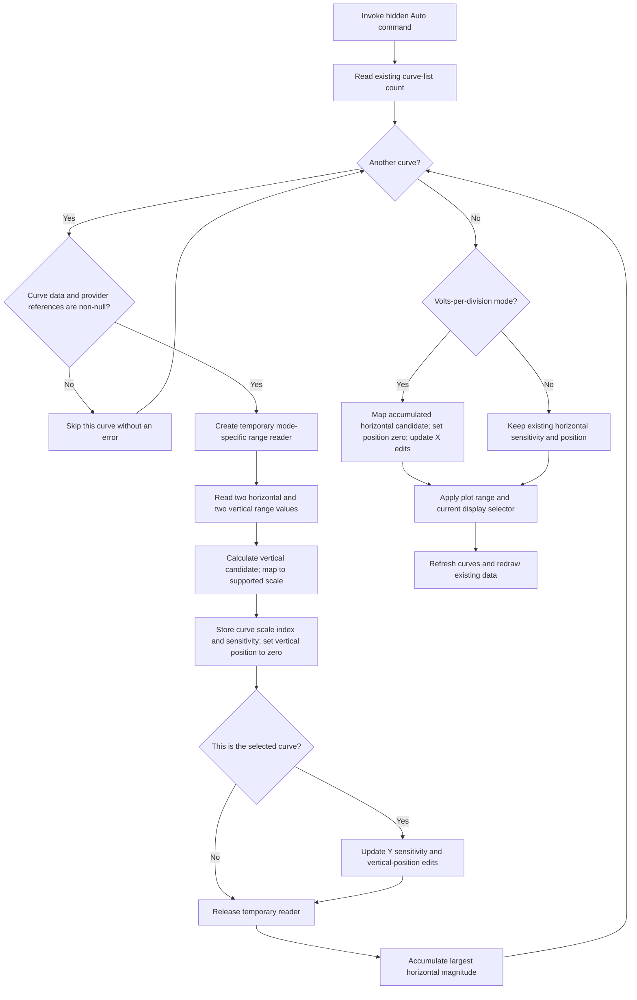

# Auto-range the existing measurement curves

> Analysis status: Reviewed from the recovered handler, curve model, display helpers, measurement controls, resource properties, and graph neighborhood.

## Control

| Property | Recovered value |
| --- | --- |
| Form | DC_CharMeasWin |
| Form caption | DC Parameter Analyzer |
| Parent group | Measurement |
| Component path | DC_CharMeasWin.StorageGroupBox.AutoBtn |
| Control class | TSpeedButton |
| Caption | Auto |
| Initial visibility | false |
| Handler name | AutoBtnClick |
| Handler address | 01b689b0 |
| Graph node | `resource:dfm:DC_CharMeasWin/DC_CharMeasWin.StorageGroupBox.AutoBtn` |
| Handler node | `function:01b689b0` |
| Graph layer | UI |

## What happens when clicked

`TDC_CharMeasWin.AutoBtnClick` performs one auto-range pass over the curves that are already in the DC Parameter Analyzer. It does not enable automatic storage, start a measurement, store a new curve, or erase sample data.

The handler gets the count from the analyzer's curve list and visits each curve. A curve is eligible only when both recovered references at curve offsets `+0x40` and `+0x98` are non-null. For each eligible curve, the handler:

1. creates a temporary data-range reader for the curve's existing provider;
2. reads four recovered range values for the curve's existing data;
3. derives a vertical sensitivity candidate from the larger magnitude of the second value pair, divided by five;
4. asks the analyzer controller to map that candidate to a supported scale value and scale index;
5. stores the index at curve offset `+0x2a`, the supported sensitivity at `+0x118`, and zero at vertical-position offset `+0x150`;
6. updates `YSensitivityEdit` and `VerticalPosEdit` when this is the selected curve;
7. releases the temporary reader.

The division by five matches a centered ten-division display: the largest recovered magnitude is fitted into the five divisions on one side of zero. The controller can adjust the candidate to one of its supported sensitivity steps before the handler stores it.

## Horizontal auto-range mode

The handler also accumulates the largest recovered magnitude from the first range-value pair across all eligible curves. Its use depends on form mode byte `+0xdb4`:

- nonzero, the volts-per-division mode: use the accumulated value divided by five as the horizontal sensitivity candidate, map it through the controller, set horizontal position `+0xd90` to zero, and update `XSensitivityEdit` and `HorizontalPosEdit`;
- zero, the time-per-division mode: keep the existing horizontal sensitivity and position.

The related mode-switch paths label the sensitivity as `Volts/Div` when the byte is nonzero and `Time/Div` when it is zero. This supports the mode meaning without assigning an unrecovered Delphi field name to `+0xdb4`.

After the curve loop, the handler applies the current horizontal range to the plot, restores the plot's current display selector, and refreshes the curve display. These calls redraw existing data. They do not acquire a new value or change the curve-list count.

## Button state

The resource makes `AutoBtn` different from the Start and Stop controls:

- `AutoBtn` starts hidden with `Visible = false`.
- It has caption `Auto` and no hint.
- It has no `GroupIndex`, `AllowAllUp`, or serialized `Down` property. The VCL defaults therefore make it a momentary speed-button command, not a latched mode.
- The handler does not read or write `AutoBtn.Down`, change its caption, make it visible, or change the `Down` state of Start or Stop.
- It has no glyph, picture, image-list reference, or extracted image resource.

Thus, `Auto` is a one-shot auto-range command. It is not an `Auto store` toggle or an on/off indication.

## Measurement and storage boundaries

The DC Parameter Analyzer resource has Start, Stop, Erase, and Auto controls. It has no separate Store button. This differs from the Scope window, which has a manual Store control. The analyzer does have a separate glyph-only Data Save button, but its handler follows the shared data-save path and is not called by `AutoBtnClick`.

The recovered boundaries are:

- `StartBtnClick` and its acquisition helper validate the measurement command, communicate with the analyzer source, and fill existing curve data.
- `StopBtnClick` ends the active measurement state and updates the acquisition controls.
- `EraseBtnClick` sends the separate erase command `0x539` through its command helper.
- `AutoBtnClick` calls none of those paths. It reads existing curve data and changes only live scale, position, scale-index, edit-control, plot-range, and redraw state.

Auto-range does not allocate a curve record, append an item, remove an item, replace a curve's data pointer, or write sample values. An acquired or manually retained curve stays the same curve after Auto; only its display metadata changes.

## Click flow

## Repeated, empty, and partial paths

- Repeated clicks recalculate the scales from the current data. With unchanged data and the same controller mapping, the stored values can remain the same, but the handler still applies the plot range and requests a refresh.
- An empty curve list skips the loop. In time-per-division mode, the existing horizontal values remain. In volts-per-division mode, the horizontal candidate starts at zero and is passed to the controller, which can normalize it to a supported scale; horizontal position is then set to zero.
- A curve with a null data reference or null provider reference is silently skipped. Other eligible curves are still processed.
- If the selected curve is skipped, its Y edit controls are not rewritten by the loop.
- The handler has no message, retry, rollback, or local exception handler. If a reader, controller, or display call fails after earlier curves were changed, those earlier scale changes can remain. The source does not provide an all-curves transaction.
- The handler does not save the scale changes to a file, registry key, or INI setting. The recovered effect is limited to the live form, curve objects, and plot.

## Handler evidence

- Primary handler: [FUN_01b689b0](../../../DecompiledSources/Tina16/functions/0000000001B689B0__FUN_01b689b0.c) scans the existing curve list, calculates scale candidates, writes curve display metadata, updates the selected-curve edits, applies the horizontal range, and refreshes the plot.
- Maximum helper: [FUN_00b90620](../../../DecompiledSources/Tina16/functions/0000000000B90620__FUN_00b90620.c) returns the larger of two doubles and is used for each pair and the cross-curve horizontal accumulator.
- Magnitude-mask helper: [FUN_0040c850](../../../DecompiledSources/Tina16/functions/000000000040C850__FUN_0040c850.c) applies the recovered shared bit mask before the maximum comparisons.
- Temporary reader constructor: [FUN_01cc6f70](../../../DecompiledSources/Tina16/functions/0000000001CC6F70__FUN_01cc6f70.c) retains the curve provider and creates the range-reader support list. The handler frees the reader after each eligible curve.
- Plot-range helper: [FUN_01b655a0](../../../DecompiledSources/Tina16/functions/0000000001B655A0__FUN_01b655a0.c) applies time-based or centered volts-based horizontal bounds and requests a plot update.
- Curve refresh: [FUN_010f67e0](../../../DecompiledSources/Tina16/functions/00000000010F67E0__FUN_010f67e0.c) visits the current curves and updates their display objects.
- Acquisition contrast: [FUN_01b65d90](../../../DecompiledSources/Tina16/functions/0000000001B65D90__FUN_01b65d90.c) is the Start wrapper; [FUN_01b65dd0](../../../DecompiledSources/Tina16/functions/0000000001B65DD0__FUN_01b65dd0.c) owns the measurement-acquisition path.
- Data-save contrast: [FUN_01b68d70](../../../DecompiledSources/Tina16/functions/0000000001B68D70__FUN_01b68d70.c) is the separate Data Save wrapper. `AutoBtnClick` does not call it.
- Erase contrast: [FUN_01b675e0](../../../DecompiledSources/Tina16/functions/0000000001B675E0__FUN_01b675e0.c) sends command `0x539` to [FUN_01b67610](../../../DecompiledSources/Tina16/functions/0000000001B67610__FUN_01b67610.c). Detailed erase semantics remain with the separate [Erase article](erasebtn-46f0e40277.md).
- Recovered resources: [ui-evidence.json](../../../DecompiledSources/Tina16/resources/dfm/ui-evidence.json) supplies the hidden state, caption, parent group, control classes, Start/Stop group index, measurement-mode items, and event bindings.
- The graph puts `FUN_01b689b0` in the UI layer. It records nine outgoing calls and only the `AutoBtn.OnClick` trigger as an incoming edge.

## Resource and glyph evidence

- Direct text evidence is caption `Auto` under the `Measurement` group.
- `AutoBtn` has no nearby same-parent label candidate.
- It has no embedded glyph or image metadata. The glyph manifest and `ui_event_glyphs` view contain no entry for this handler.
- The adjacent recording-mode combo contains `Average`, `RMS`, and `Momentary`. `AutoBtnClick` does not read that combo or change its selection.

## Analysis limits

- The names of the four virtual range-reader methods are not recovered. Their grouping into horizontal and vertical pairs follows how the handler uses the results for the X controls, per-curve Y metadata, and the identical Scope-window auto-range algorithm.
- The value of the shared magnitude mask used by `FUN_0040c850` is not present in the recovered function source. This article does not invent its constant.
- The controller can adjust a candidate scale passed by reference. The stored scale can therefore differ from the raw maximum divided by five.
- No recovered direct function caller invokes `FUN_01b689b0`; the graph has only the hidden DFM event trigger. The evidence does not prove whether another runtime path can expose or dispatch the command indirectly.
- Shared range and redraw helpers are cited here but are not duplicated in this Bead's annotation fragment.
