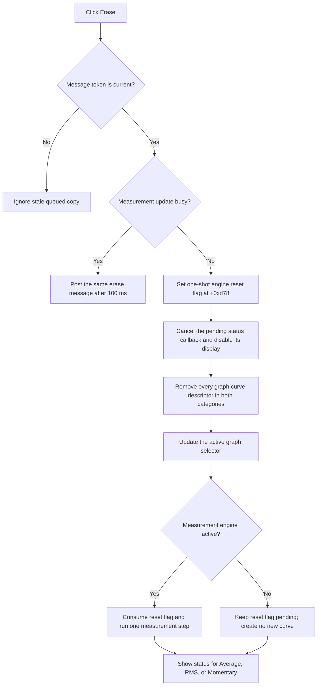

# Erase all measurement curves and reset acquisition

> Analysis status: Evidence-backed source review complete.

## Control

| Property | Recovered value |
| --- | --- |
| Form | DC_CharMeasWin (`DC Parameter Analyzer`) |
| Component path | DC_CharMeasWin.StorageGroupBox.EraseBtn |
| Parent group | Measurement |
| Control class | TSpeedButton |
| Caption | Erase |
| Hint | Not present in the recovered resource. |
| Handler name | EraseBtnClick |
| Handler address | 01b675e0 |
| Graph node | `resource:dfm:DC_CharMeasWin/DC_CharMeasWin.StorageGroupBox.EraseBtn` |
| Handler node | `function:01b675e0` |
| Graph layer | UI |

## What is erased

The click does not inspect a selected curve, list index, or storage-slot number. It passes erase class value `2` to the common graph cleanup helper. That value matches both values of the curve descriptor's internal category flag at `+0x10`. The helper therefore processes every curve descriptor in the form's graph collection.

For each matching descriptor, the cleanup path removes its primary graph-data object at `+0x40` from the graph controller, clears descriptor field `+0x70`, and invokes the descriptor's virtual cleanup method. The click does not preserve a selected curve or treat the current curve differently. An empty graph collection makes this loop a no-op.

The handler also writes one to the one-shot measurement reset flag at form offset `+0xd78`. If the measurement engine is active, the subsequent measurement step passes this flag to the engine and then clears it. If the engine is inactive, this function does not consume the flag, so it remains pending for a later measurement step.

## Guard and confirmation behavior

There is no confirmation dialog. The click first creates message code `0x539` and enters the form's serialized-message gate.

- A stale queued copy whose token does not match the gate is ignored.
- If the form's shared measurement-busy byte at `+0x9c3` is clear, erase runs immediately.
- If that byte is set, the same message is posted again with a 100 ms delay. No curves are removed on that attempt.

This delay prevents the erase worker from changing graph and measurement state while another measurement update owns the shared busy byte.

## Plot, cursor, and readout effects

Before curve cleanup, the worker cancels the pending status callback and disables the common status display. It does not clear the stored caption directly. After cleanup, it invokes the graph controller's virtual update for the form's active graph selector at `+0x990`. The per-curve removal path can also request the common graph redraw helper. These calls make the plot-data removal visible.

The direct erase path does not call the known cursor-off helpers, the cursor-position reset helper, or the numeric cursor-readout formatter. Cursor and readout changes that result from removing their source curves are therefore inside the graph-controller virtual methods and are not separately recovered. The source does not prove that cursor A or B selection is reset.

After the graph update, the worker runs one measurement-processing step. If acquisition is active, this step consumes the reset flag and can create fresh measurement data. Thus the plot can start to fill again without another Erase click. If acquisition is inactive, no new curve is produced on this path.

Finally, the worker selects a status-message entry from the recording-mode combo-box index plus nine. The recovered combo items are `Average`, `RMS`, and `Momentary`. The actual message-table text is not present in the source export.

## Auto and recording-mode interaction

The `Auto` button is a separate, hidden speed button. Its handler is `FUN_01b689b0`; it calculates display ranges from existing curves. Erase does not call that handler and does not use an Auto-button state. The similarly addressed `FUN_01b69a50` called by Erase is only the recording-mode status-message updater.

Erase applies to all graph curve descriptors for every recovered recording mode. `Average`, `RMS`, or `Momentary` affects the subsequent engine step and the selected status message, not which existing curve descriptor is removed. The handler does not switch the recording mode.

## Click flow

## Empty, repeated-click, error, and persistence boundaries

- No curve selection is required. An empty graph still sets the reset flag, updates the graph controller, runs the conditional measurement step, and updates the status message.
- A repeated completed click again removes all curves that exist at that time and sets the reset flag again. Active acquisition can recreate curves between clicks.
- The worker has no local exception handler or rollback. It sets the reset flag before it starts graph cleanup. A later exception can therefore leave a partial graph cleanup with the reset still pending.
- A recording-mode index whose value plus nine is outside zero through 21 raises the recovered `MsgOffset out of tMessages range` exception. The DFM combo has only three normal items, so its normal indexes are within this guard.
- There is no file, registry, settings, or explicit document-save call. The click changes live measurement and graph state. Persistence to a saved data file is not proven.

## Glyph and resource evidence

The DFM supplies the caption `Erase` inside the `Measurement` group. It supplies no hint, image reference, or embedded glyph, and the glyph manifest has no extracted image for this button. The text identifies the command, while the all-curve cleanup and measurement-reset code prove its scope.

## Source evidence

- Click wrapper: [FUN_01b675e0](../../../DecompiledSources/Tina16/functions/0000000001B675E0__FUN_01b675e0.c)
- Serialized erase worker: [FUN_01b67610](../../../DecompiledSources/Tina16/functions/0000000001B67610__FUN_01b67610.c)
- All-category curve cleanup: [FUN_010f6af0](../../../DecompiledSources/Tina16/functions/00000000010F6AF0__FUN_010f6af0.c)
- Per-curve graph-data removal: [FUN_010f6740](../../../DecompiledSources/Tina16/functions/00000000010F6740__FUN_010f6740.c)
- Conditional measurement step and reset-flag consumer: [FUN_01b64fa0](../../../DecompiledSources/Tina16/functions/0000000001B64FA0__FUN_01b64fa0.c)
- Status-display clear helper: [FUN_010e4410](../../../DecompiledSources/Tina16/functions/00000000010E4410__FUN_010e4410.c)
- Recording-mode status-message updater: [FUN_01b69a50](../../../DecompiledSources/Tina16/functions/0000000001B69A50__FUN_01b69a50.c)
- Auto-range counterpart: [FUN_01b689b0](../../../DecompiledSources/Tina16/functions/0000000001B689B0__FUN_01b689b0.c)
- Graph redraw helper: [FUN_010e8e30](../../../DecompiledSources/Tina16/functions/00000000010E8E30__FUN_010e8e30.c)
- Cursor-position reset helper not called here: [FUN_010e7b90](../../../DecompiledSources/Tina16/functions/00000000010E7B90__FUN_010e7b90.c)

## Direct calls

- `function:01b67610` - Serializes erase against measurement updates, resets acquisition, removes all graph curves, updates the graph, runs a conditional measurement step, and updates the mode status.

## Evidence limits

- The measurement engine call at virtual slot `+0xd8` is indirect. The reset flag's downstream engine-specific buffer changes are not recovered.
- The graph controller updates after curve removal are indirect. The source proves no separate cursor-selection or cursor-readout reset.
