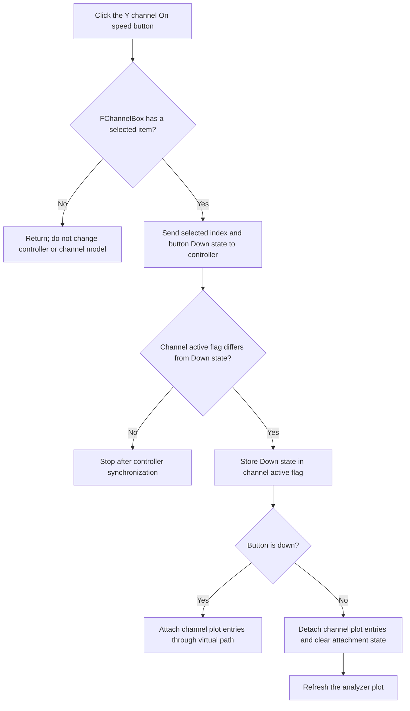

# Y channel On

## Control

| Property | Recovered value |
| --- | --- |
| Form | DC_CharMeasWin (`DC Parameter Analyzer`) |
| Component path | DC_CharMeasWin.YChannelGroupBox.FChannelOnBtn |
| Control class | TSpeedButton |
| Caption | On |
| Initial visibility | False |
| Group behavior | `GroupIndex = 1`; `AllowAllUp = true` |
| Hint | Not present in the recovered resource. |
| Glyph | Not present in the recovered resource or glyph manifest. |
| Handler name | ChannelOnBtnClick |
| Handler address | 01b65960 |
| Graph node | `resource:dfm:DC_CharMeasWin/DC_CharMeasWin.YChannelGroupBox.FChannelOnBtn` |
| Handler node | `function:01b65960` |
| Graph layer | UI |

The recovered resource hides this control by default. The handler can still run through programmatic state restoration, and it defines the behavior if another path makes the control available.

## What happens when clicked

The VCL changes the speed button's `Down` state before `ChannelOnBtnClick` runs. The handler reads the selected index from `FChannelBox`, whose recovered items are `In` and `#1` through `#16`.

For a valid selection, the handler always passes the selected index and the button's Down state to the DC-analysis controller. It then compares that state with the selected channel model's active byte at offset `+0x11`:

- When the states already agree, it stops after the controller synchronization. It does not attach or detach plot entries again.
- When they differ, it writes the button state to the channel model.
- When the new state is on, it calls the form's virtual channel-attach path. The matching recovered `DC_CharMeasWin` implementation adds the channel's plot source with its color and trace attributes, a vertical span of minus to plus five unit-per-division values, and the form's current vertical-position offset.
- When the new state is off, it removes the channel's primary plot entry and, when requested by the calling mode, its secondary entry. It clears the channel's plot-attachment state and refreshes the analyzer plot.

This is a channel selection and display/acquisition configuration change. It does not start a sweep or data acquisition.

## Click flow

## Selected channel and downstream effects

`ChannelBoxChange` establishes the selected model object before it calls this handler. It also copies the selected channel's unit-per-division and vertical-position values into their editors. During this selection change, it initializes the model as active, sets the On button down, and then calls `ChannelOnBtnClick`. This call usually takes the already-agree branch and avoids a duplicate plot attachment.

The active byte has two proven later uses:

- A recovered multi-channel DC-analysis acquisition implementation copies the active byte into each measurement-channel object's active field when it builds the measurement.
- The parameter-analyzer settings writer serializes it as each channel's `isactive` value. `FormClose` calls that writer, so persistence occurs on form close, not during this click.

The click does not write a separate numeric readout field. The visible readout effect is limited to adding or removing the channel's plot entry and its associated trace metadata. Scale and position readouts are updated by the combo-box and spin-button handlers, not by this click.

The configuration loader performs the reverse operation. It reads `isactive`, selects the matching channel, sets the speed button, and calls this handler to apply a restored off state when necessary.

## Repeated clicks, missing state, and errors

- `AllowAllUp = true` lets a user release this GroupIndex 1 button. Thus, repeated user clicks alternate the Down state and normally alternate channel activation.
- A programmatic call with the same button and model state is a partial no-op. The controller still receives the state, but the handler does not attach, detach, or redraw the channel.
- If `FChannelBox.ItemIndex` is `-1`, the handler returns before controller, model, or plot changes. It does not restore the button state, so a VCL click can leave the button state changed while no channel was selected.
- The handler assumes that a valid combo-box selection has a selected channel object at form offset `+0x870`. It has no null guard for malformed form state.
- There is no error dialog, local exception handler, rollback, file operation, or direct hardware API call. Failures from the virtual controller or plot methods are not handled locally.
- The nearby `Position` and `Unit/Div` labels describe sibling editors. They are not evidence for the On button's behavior.

## Evidence

- The DFM evidence records caption `On`, `Visible = false`, `GroupIndex = 1`, `AllowAllUp = true`, no glyph, and the `ChannelOnBtnClick` binding: [ui-evidence.json](../../../DecompiledSources/Tina16/resources/dfm/ui-evidence.json).
- The handler reads `FChannelBox.ItemIndex`, sends index and Down state to the controller, updates the selected channel's `+0x11` active byte, and selects attach or detach behavior: [FUN_01b65960](../../../DecompiledSources/Tina16/functions/0000000001B65960__FUN_01b65960.c).
- The combo-box handler selects the channel model, updates the Y scale and position editors, initializes the active state, sets the On button, and calls this handler: [FUN_01b65820](../../../DecompiledSources/Tina16/functions/0000000001B65820__FUN_01b65820.c).
- The matching form-local attach implementation passes the channel source, color, scaling span, and vertical position to the plot add-entry routine: [FUN_01b64cd0](../../../DecompiledSources/Tina16/functions/0000000001B64CD0__FUN_01b64cd0.c).
- The detach helper removes plot entries, clears attachment state, and returns a change flag: [FUN_010f6740](../../../DecompiledSources/Tina16/functions/00000000010F6740__FUN_010f6740.c).
- The refresh helper updates plot geometry and repaints the plot: [FUN_010e8e30](../../../DecompiledSources/Tina16/functions/00000000010E8E30__FUN_010e8e30.c).
- The multi-channel acquisition builder copies that active byte to the measurement channel's active field: [FUN_01b5e800](../../../DecompiledSources/Tina16/functions/0000000001B5E800__FUN_01b5e800.c).
- The settings writer serializes the active byte as `isactive`: [FUN_01b63550](../../../DecompiledSources/Tina16/functions/0000000001B63550__FUN_01b63550.c).
- The form-close handler invokes the settings writer before inherited close processing: [FUN_01b65cc0](../../../DecompiledSources/Tina16/functions/0000000001B65CC0__FUN_01b65cc0.c).
- The TSpeedButton state setter confirms that offset `+0x328` is the recovered Down state used by this handler: [FUN_0082a6c0](../../../DecompiledSources/Tina16/functions/000000000082A6C0__FUN_0082a6c0.c).

## Analysis limits

- The enable branch is a virtual call at form VMT offset `+0x550`. `FUN_01b64cd0` is the matching form-local implementation by signature, channel type, form offsets, and scaling fields, but the static call graph cannot record this indirect edge.
- The controller method at VMT offset `+0xb8` receives the selected index and enabled state. Its concrete implementation is also indirect, so this article does not claim a direct hardware transaction.
- The resource does not contain a glyph or hint that adds semantic evidence.
