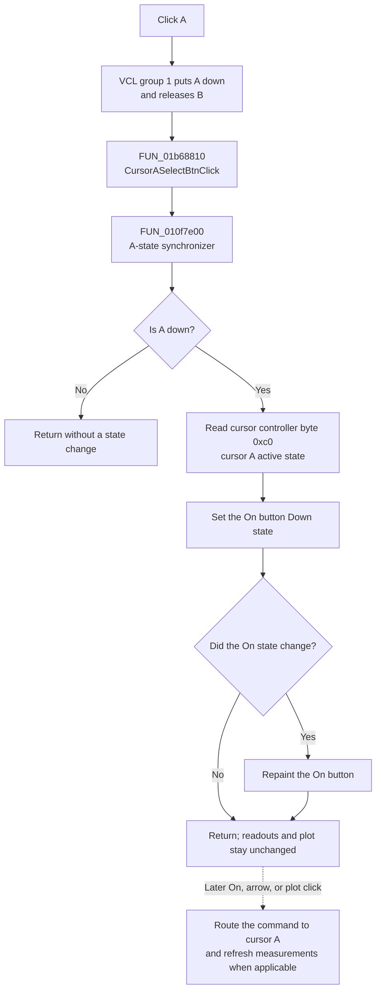

# A

## Control

| Property | Recovered value |
| --- | --- |
| Form | DC_CharMeasWin |
| Form caption | DC Parameter Analyzer |
| Component path | DC_CharMeasWin.CursorBox.FCursorASelectBtn |
| Control class | TSpeedButton |
| Caption | A |
| Group index | 1, shared with the B button |
| Handler name | CursorASelectBtnClick |
| Handler address | 01b68810 |
| Graph node | `resource:dfm:DC_CharMeasWin/DC_CharMeasWin.CursorBox.FCursorASelectBtn` |
| Handler node | `function:01b68810` |
| Graph layer | UI |

## What happens when clicked

The button selects plot cursor A as the target for later cursor commands. It does not turn cursor A on or move it during this click.

The A and B speed buttons both have `GroupIndex = 1`. The VCL therefore treats them as one mutually exclusive group. A normal click puts A in the down state and releases B before `CursorASelectBtnClick` runs. A does not have `AllowAllUp`, so another normal click on the selected A button keeps A selected.

`FUN_01b68810` delegates to `FUN_010f7e00`. The helper first tests the A button's down state. When A is down, it reads byte `0xc0` from the form's cursor controller. Related cursor code proves that this byte is the active state for cursor A. The helper then sets the separate **On** speed button to the same state:

- If cursor A is active, **On** appears down.
- If cursor A is inactive, **On** appears up.

The speed-button setter repaints the **On** button only when its state changes. Therefore, a repeated A click is normally a UI no-op after the two button states are already synchronized. If this event is invoked while A is not down, the helper returns without changing **On**.

The selected A state affects later commands. The left/right movement path passes `FCursorASelectBtn.Down` to the plot controller; true selects cursor A and false selects cursor B. The plot-click cursor-position path uses the same Boolean selector. The separate **On** click handler also reads the A/B selection before it activates or removes a cursor. Those later activation and movement paths refresh the measurement display. Their refresh reads both cursor records and updates the XA/YA, XB/YB, and DX/DY fields. The A selection handler does not call that refresh, so it does not immediately change measurement values.

There is no curve-count or data-availability test in this click path. With no data, the handler still only selects A and synchronizes the **On** appearance from the controller's existing A-active byte. It does not create a cursor record or report a no-data message. The handler has no explicit error, exception, or rollback branch; it assumes that the form buttons and cursor controller created during form setup are valid.

The click writes no settings, file, global value, or measurement model. The selection remains in the A speed button's down state for the current form. Form setup creates the cursor controller and initializes both cursor-active bytes to false; no persistent cursor-selection load or save is present in this path.

## Click flow

## Handler and call-path evidence

- [FUN_01b68810](../../../DecompiledSources/Tina16/functions/0000000001B68810__FUN_01b68810.c) is the DFM-bound handler and contains only a call to `FUN_010f7e00`.
- [FUN_010f7e00](../../../DecompiledSources/Tina16/functions/00000000010F7E00__FUN_010f7e00.c) tests `FCursorASelectBtn.Down`, reads controller byte `0xc0`, and passes that value to the shared **On** button's down-state setter.
- [FUN_010f7e40](../../../DecompiledSources/Tina16/functions/00000000010F7E40__FUN_010f7e40.c), the B-specific sibling, uses `FCursorBSelectBtn.Down` and controller byte `0xc1`. This paired layout identifies `0xc0` as A and `0xc1` as B.
- [FUN_010f7c30](../../../DecompiledSources/Tina16/functions/00000000010F7C30__FUN_010f7c30.c) is the later **On** state machine. It reads the A/B selected button and the **On** button, then activates or removes the selected cursor. This function is not called by the A handler.
- [FUN_010f77a0](../../../DecompiledSources/Tina16/functions/00000000010F77A0__FUN_010f77a0.c) passes `FCursorASelectBtn.Down` into the cursor-movement controller and then calls the readout refresh. [FUN_010f6d70](../../../DecompiledSources/Tina16/functions/00000000010F6D70__FUN_010f6d70.c) uses the same selector for plot-click movement.
- [FUN_010f6ef0](../../../DecompiledSources/Tina16/functions/00000000010F6EF0__FUN_010f6ef0.c) reads cursor A and B records and formats the A, B, and difference measurements. It is not reachable from `FUN_01b68810` during this click.
- [FUN_010f5a80](../../../DecompiledSources/Tina16/functions/00000000010F5A80__FUN_010f5a80.c) creates the form's cursor controller and clears its `0xc0` and `0xc1` active-state bytes.

## Resource and glyph evidence

The recovered [DFM evidence](../../../DecompiledSources/Tina16/resources/dfm/ui-evidence.json) gives A and B the same group index and binds A to `CursorASelectBtnClick`. The A button has the text caption **A**. It has no hint, embedded glyph, or extracted glyph, so the resource does not provide a separate icon for A.

The adjacent movement buttons do have extracted glyphs: [left arrow](../../../glyph/0071_DC_CharMeasWin_DC_CharMeasWin_CursorBox_FMoveCursorLeftBtn_Glyph_Data.png) and [right arrow](../../../glyph/0074_DC_CharMeasWin_DC_CharMeasWin_CursorBox_FMoveCursorRightBtn_Glyph_Data.png). These images support the identity of the later movement controls only. They do not show that the A click itself moves a cursor.

## Boundaries

- The click selects cursor A and synchronizes the **On** button's appearance.
- It does not activate, remove, or move a plot cursor.
- It does not recalculate or rewrite the measurement readouts.
- It does not validate curve data or display an error.
- It does not persist the selection outside the current form state.
