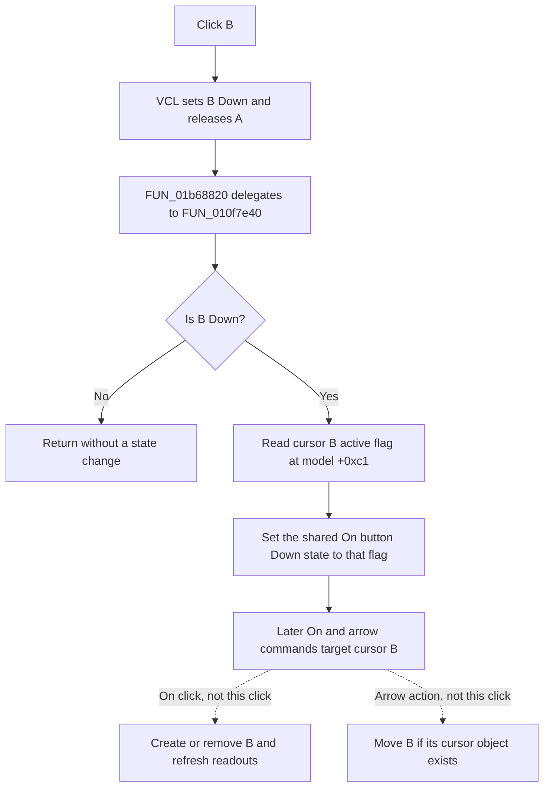

# Select cursor B

> Analysis status: Evidence-backed source review complete.

## Control

| Property | Recovered value |
| --- | --- |
| Form | DC_CharMeasWin (`DC Parameter Analyzer`) |
| Component path | DC_CharMeasWin.CursorBox.FCursorBSelectBtn |
| Control class | TSpeedButton |
| Caption | B |
| Hint | Not present in the recovered resource. |
| Group index | 1, shared with the A selector |
| Handler name | CursorBSelectBtnClick |
| Handler address | 01b68820 |
| Graph node | `resource:dfm:DC_CharMeasWin/DC_CharMeasWin.CursorBox.FCursorBSelectBtn` |
| Handler node | `function:01b68820` |
| Graph layer | UI |

## What the click changes

The A and B speed buttons have the same nonzero group index. The VCL speed-button path sets B to Down and releases A before it dispatches B's `OnClick` event. Because this group does not allow all buttons to be up, B remains selected when the user clicks an already selected B button.

The form handler then calls the common cursor-B selection helper. The helper acts only while B is Down. It reads cursor B's active flag at cursor-model offset `+0xc1` and copies that value to the Down state of the shared `On` button. Cursor A has the parallel active flag at `+0xc0` and a separate A-selection helper.

Thus B selection changes the target of later cursor commands and makes `On` show whether cursor B already exists. The click does not change B's active flag. It does not create, remove, or move a cursor, and it does not refresh the numeric readouts.

## Later activation and movement

The following effects belong to later controls, not to this click:

- A later click on `On` sees that B is selected. It changes the B active flag at `+0xc1`. The on branch creates or restores cursor B for the current curve/source with cursor selector value zero. The off branch removes cursor B. That path then refreshes the cursor readouts.
- The cursor movement path also uses the A selector's Down state as the cursor selector. A false A state selects cursor B at graph-object offset `+0xf8`; a true A state selects cursor A at `+0xf0`. If the selected cursor object is absent, the movement helper returns without a change.
- The common readout refresh reads A with selector one and B with selector zero. It writes each cursor's recovered identity and coordinate values. It writes the B-minus-A coordinate differences only when both cursors are present. Missing B data clears the B and difference fields.

Selection therefore does not copy cursor A's location to cursor B and does not change the curve that owns either cursor. It only changes which cursor later commands address.

## Click flow

## Repeated-click, no-data, error, and persistence boundaries

- A repeated click on selected B is idempotent. The group keeps B Down, and the handler reapplies the same B active flag to `On`.
- The click does not inspect curve samples or require an existing B cursor object. It only reads the form's cursor model and B active flag.
- If a later `On` action has no current curve/source pointer, the cursor-creation helper does not create B. If a later movement action has no B cursor object, the movement helper is a no-op.
- The handler shows no message and has no local exception handler or rollback. It assumes the form controls and cursor model are initialized.
- The path has no file, registry, preferences, or document-save call. Selection and the `On` display state are live form state only. Persistence is not proven.

## Glyph and resource evidence

The resource gives the control the text caption `B`; it does not give it a hint, image reference, or embedded glyph. The glyph manifest therefore has no extracted image for this button. The adjacent A button has caption `A`, and both buttons have `GroupIndex = 1`. These resource values identify the selector pair. The recovered handler and shared cursor code prove the state mapping.

## Source evidence

- DC Parameter Analyzer handler: [FUN_01b68820](../../../DecompiledSources/Tina16/functions/0000000001B68820__FUN_01b68820.c)
- Common cursor-B selection helper: [FUN_010f7e40](../../../DecompiledSources/Tina16/functions/00000000010F7E40__FUN_010f7e40.c)
- Cursor-A counterpart: [FUN_010f7e00](../../../DecompiledSources/Tina16/functions/00000000010F7E00__FUN_010f7e00.c)
- VCL speed-button mouse-up dispatch: [FUN_0082a320](../../../DecompiledSources/Tina16/functions/000000000082A320__FUN_0082a320.c)
- VCL speed-button Down setter and group notification: [FUN_0082a6c0](../../../DecompiledSources/Tina16/functions/000000000082A6C0__FUN_0082a6c0.c)
- Shared cursor On handler: [FUN_010f7c30](../../../DecompiledSources/Tina16/functions/00000000010F7C30__FUN_010f7c30.c)
- Cursor creation or restoration: [FUN_010e7c50](../../../DecompiledSources/Tina16/functions/00000000010E7C50__FUN_010e7c50.c)
- Cursor removal: [FUN_010e7ec0](../../../DecompiledSources/Tina16/functions/00000000010E7EC0__FUN_010e7ec0.c)
- Cursor movement: [FUN_010e8000](../../../DecompiledSources/Tina16/functions/00000000010E8000__FUN_010e8000.c)
- Cursor readout refresh: [FUN_010f6ef0](../../../DecompiledSources/Tina16/functions/00000000010F6EF0__FUN_010f6ef0.c)
- Cursor readout extraction and missing-cursor clearing: [FUN_010e8310](../../../DecompiledSources/Tina16/functions/00000000010E8310__FUN_010e8310.c)

The same common B helper is called by the B-selector handlers of the Scope, Signal Analyzer, XY Recorder, and DC Parameter Analyzer windows. In each form, the resource has the same A/B group and `B` caption. This repeated structure supports the shared B-state role.

## Direct calls

- `function:010f7e40` - If B is selected, copies cursor B's active flag to the shared `On` speed button.

## Evidence limits

- The recovered symbols do not contain the original field names for offsets `+0xc0`, `+0xc1`, `+0xf0`, and `+0xf8`. Their A/B roles come from the paired selectors, selector arguments, and repeated consumers.
- No direct click path identifies a persistent cursor-selection setting. The source proves only live form and graph-object state.
