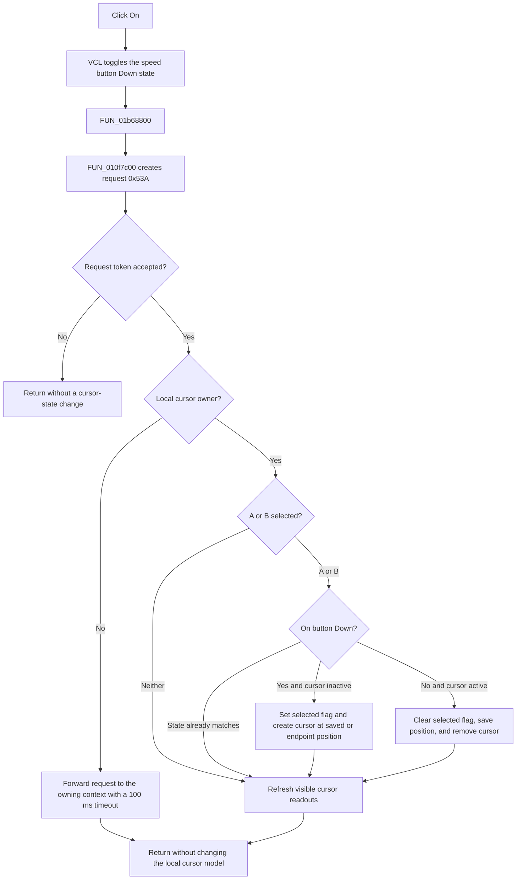

# Toggle the selected plot cursor

> Analysis status: Reviewed against the recovered resource, handler, shared cursor state machine, and cursor creation, removal, and readout helpers.

## Control

| Property | Recovered value |
| --- | --- |
| Form | DC_CharMeasWin (`DC Parameter Analyzer`) |
| Component path | DC_CharMeasWin.CursorBox.FCursorOnBtn |
| Control class | TSpeedButton |
| Caption | On |
| Hint | Not present in the recovered resource. |
| Glyph | Not present in the recovered resource. |
| Group behavior | `GroupIndex = 2`, `AllowAllUp = True` |
| Handler name | CursorOnBtnClick |
| Handler address | 01b68800 |
| Graph node | `resource:dfm:DC_CharMeasWin/DC_CharMeasWin.CursorBox.FCursorOnBtn` |
| Handler node | `function:01b68800` |
| Graph layer | UI |

## What happens when clicked

`FCursorOnBtn` enables or disables the currently selected measurement cursor. The adjacent `A` and `B` speed buttons form a separate selection group. Their handlers make this `On` button show the active state of the newly selected cursor; they do not create or remove a cursor. The VCL speed-button click path changes `FCursorOnBtn.Down` before it invokes `CursorOnBtnClick`. Because this button permits all buttons in its group to be up, repeated user clicks normally alternate the requested state between on and off.

The form-specific handler [FUN_01b68800](../../../DecompiledSources/Tina16/functions/0000000001B68800__FUN_01b68800.c) only calls [FUN_010f7c00](../../../DecompiledSources/Tina16/functions/00000000010F7C00__FUN_010f7c00.c). That wrapper creates internal request `0x53A` with an empty sequence token and passes it to [FUN_010f7c30](../../../DecompiledSources/Tina16/functions/00000000010F7C30__FUN_010f7c30.c). The state machine stamps and checks the request sequence before it changes cursor state.

For a local analyzer window, the state machine reads the A and B selection buttons and the new `On` button state:

- If A is selected, it applies the requested state to cursor A only.
- If B is selected, it applies the requested state to cursor B only.
- If neither selector is down, it does not change a cursor flag or object. It still runs the readout refresh.
- If the selected cursor flag already equals the requested state, it skips cursor creation or removal and still refreshes the readouts.

An on transition sets the selected cursor's active flag and calls [FUN_010e7c50](../../../DecompiledSources/Tina16/functions/00000000010E7C50__FUN_010e7c50.c). The helper creates cursor A in red or cursor B in blue on an available plotted curve. It restores the cursor's saved position when that position is valid. With no saved position, A starts at the curve's minimum x position and B starts at its maximum x position. The helper clamps the sample index to the available data range.

An off transition clears the selected cursor's active flag and calls [FUN_010e7ec0](../../../DecompiledSources/Tina16/functions/00000000010E7EC0__FUN_010e7ec0.c). The helper saves the cursor's current position, removes it from its curve and diagram, destroys the cursor object, and clears the diagram's cursor reference. The saved position remains in the live cursor-state object, so a later on transition in the same form instance can restore it.

## Click flow

## Readout effects

After every accepted local request, the state machine calls the cursor readout path [FUN_010f6ef0](../../../DecompiledSources/Tina16/functions/00000000010F6EF0__FUN_010f6ef0.c). This path updates only readout labels that are visible:

- For each existing cursor, it writes the curve or channel name and the x and y values to the A or B labels.
- For an absent cursor, it clears that cursor's channel, x, and y labels.
- When both cursors exist, it writes `DX = XB - XA` and `DY = YB - YA`.
- When either cursor is absent, it clears both delta labels.

The recovered resource defines these labels as `A:`, `XA:`, `YA:`, `B:`, `XB:`, `YB:`, `DX:`, and `DY:`. They start hidden in the DFM. The refresh can also snap a cursor x position to the configured step, clamp it to valid bounds, and save the adjusted position. The click path does not prove when another part of the application makes the labels visible.

## Initial, repeated, and exceptional cases

- The shared form initialization clears the A-active and B-active flags. The resource does not give either A or B an explicit initial `Down` value, so the initial selected cursor is not established here.
- A normal repeated click reverses the selected cursor's requested state because the VCL toggles this speed button before the handler runs.
- If the data context is null, or no matching plotted curve is available, the create helper can return after the active flag and button state were set. No cursor object is then available and its readouts remain blank. The click path has no rollback or user-visible error.
- If a stale nonzero request token does not match the form's sequence, the state machine returns without changing the model. The speed button can already have changed visually.
- In forwarding mode, the local form does not modify its cursor model. It sends request `0x53A` to the owning context with a 100 ms timeout. The wrapper does not inspect the send result, so a timeout or failure can leave the local button state different from the target state.
- A failure after a flag changes but before creation or removal completes can leave the flag, button, and diagram object out of agreement. The recovered path has no exception recovery or transaction.

## Persistence boundary

The click does not write a settings file, mark a document dirty, or save application preferences. Cursor flags and saved positions belong to the live cursor-state object. They can be reused by later clicks while that object exists, but the recovered click path does not prove persistence across closing and reopening the form.

## Evidence and limits

- [FUN_01b68800](../../../DecompiledSources/Tina16/functions/0000000001B68800__FUN_01b68800.c) is the resolved `CursorOnBtnClick` handler and delegates directly to the shared wrapper.
- [FUN_010f7c00](../../../DecompiledSources/Tina16/functions/00000000010F7C00__FUN_010f7c00.c) constructs request `0x53A` with a zero token.
- [FUN_010f7c30](../../../DecompiledSources/Tina16/functions/00000000010F7C30__FUN_010f7c30.c) validates or stamps the token, distinguishes local and forwarding modes, reads the selector and `Down` states, changes the selected active flag, and requests the readout refresh.
- [FUN_010e7c50](../../../DecompiledSources/Tina16/functions/00000000010E7C50__FUN_010e7c50.c) and [FUN_010e7ec0](../../../DecompiledSources/Tina16/functions/00000000010E7EC0__FUN_010e7ec0.c) establish cursor creation, endpoint defaults, saved-position reuse, removal, and position retention.
- The caption `On` supports the recovered toggle meaning, but there is no hint, action, image reference, or extracted glyph. No behavior is inferred from an image.
- Recovered field offsets establish the behavior but not all original Delphi field or method names. Names beyond the published handler are descriptive.
